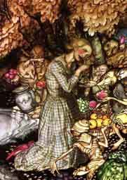

  
[Intangible Textual Heritage](../../../index.md)  [Legends and
Sagas](../../index)  [English Folklore](../index.md) 

------------------------------------------------------------------------

<table width="75%">
<colgroup>
<col style="width: 50%" />
<col style="width: 50%" />
</colgroup>
<tbody>
<tr class="odd">
<td width="50%" data-valign="TOP"></td>
<td width="50%" data-valign="TOP"><h1 id="english-fairy-and-other-folk-tales" data-align="CENTER">English Fairy and Other Folk Tales</h1>
<h2 id="by-edwin-sidney-hartland" data-align="CENTER">by Edwin Sidney Hartland</h2>
<h4 id="section" data-align="CENTER">[1890]</h4></td>
</tr>
</tbody>
</table>

------------------------------------------------------------------------

[Title Page](efft00.md)  

### Nursery Tales

[Jack the Giant Killer](efft01.md)  
[The Princess of Canterbury](efft02.md)  
[The Princess of Colchester](efft03.md)  
[Mr Fox](efft04.md)  
[Tom Tit Tot](efft05.md)  
[Jack and the Bean-stalk](efft06.md)  

### Historical and Local

[The Story of Sain Kenelm](efft07.md)  
[Wild Edric](efft08.md)  
[Lady Godiva](efft09.md)  
[The Legend of the Sons of the Conqueror](efft10.md)  
[The Lgend of Becket's Parents](efft11.md)  
[The Fause Fable of the Lord Lathom](efft12.md)  
[Whittington and his Cat](efft13.md)  
[The Pedlar of Swaffham](efft14.md)  
[The Lampton Worm](efft15.md)  
[Bomere Pool](efft16.md)  

### Giants

[The Origin of the Wrekin](efft17.md)  
[The Blinded Giant](efft18.md)  

### Fairies

[Worcestershire Fairies](efft19.md)  
[The Fairy Midwife](efft20.md)  
[The Adventure of Cherry of Zennor](efft21.md)  
[The Fairy Funeral](efft22.md)  
[The Piskies in the Cellar](efft23.md)  
[Edwin and Sir Topaz](efft24.md)  
[The Two Serving Damsels](efft25.md)  
[The Tulip Bed](efft26.md)  
[The Fisherman and the Piskies](efft27.md)  
[A Fairy Caught](efft28.md)  
[Colman Grey](efft29.md)  
[The King of the Cats](efft30.md)  
[A Myth of Midridge](efft31.md)  
[The Green Children](efft32.md)  
[The Fairy Banquet](efft33.md)  
[The Fairy Horn](efft34.md)  
[The Fairy Fair](efft35.md)  
[The Fairies' Caldron](efft36.md)  
[The Cauld Lad of Hilton](efft37.md)  
[The Fairy Thieves](efft38.md)  
[The Boggart](efft39.md)  
[Ainsel](efft40.md)  
[Legend of the Rollright Stones](efft41.md)  

### Goblins

[Dando and His Dogs](efft42.md)  
[The Demon Tregeagle](efft43.md)  
[The Pason and Clerk](efft44.md)  
[Outwitting the Bogie](efft45.md)  
[The Hunted Hare](efft46.md)  
[The Well of St. Ludgvan](efft47.md)  
[The Hedley Kow](efft48.md)  

### Witchcraft

[The Lord of Pengerswick](efft49.md)  
[The Witch and the Toad](efft50.md)  
[Witch and Hare](efft51.md)  
[The Hand of Glory](efft52.md)  
[Betty Chidley The Witch](efft53.md)  
[The Bag of Flour](efft54.md)  
[Kentsham Bell](efft55.md)  

### Ghosts

[A Bishop's Ghost](efft56.md)  
[A Clergyman's Ghost](efft57.md)  
[The Haunted House](efft58.md)  
[Ghost-Laying Stories](efft59.md)  
[The Roaring Bull of Bagbury](efft60.md)  
[The White Lady of Blenkinsopp](efft61.md)  
[The Haunted Widower](efft62.md)  
[The Ghost of Rosewarne](efft63.md)  
[The Lady with the Lantern](efft64.md)  
[Spectre-Dogs](efft65.md)  
[Billy B----'s Adventure](efft66.md)  

### Drolls

[The Wise Fools of Gotham](efft67.md)  
[The Three Wishes](efft68.md)  
[The Miller at the Professor's Examination](efft69.md)  
[Stupid's Mistaken Cries](efft70.md)  
[The Three Sillies](efft71.md)  
[Mr Vinegar](efft72.md)  
[Lazy Jack](efft73.md)  
[The History of Tom Thumb](efft74.md)  
