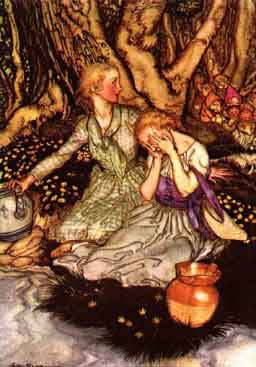

  
[Intangible Textual Heritage](../../../index.md)  [Legends and
Sagas](../../index)  [English Folklore](../index.md) 

------------------------------------------------------------------------

<table width="75%">
<colgroup>
<col style="width: 50%" />
<col style="width: 50%" />
</colgroup>
<tbody>
<tr class="odd">
<td width="50%" data-valign="TOP"></td>
<td width="50%" data-valign="TOP"><h1 id="english-fairy-tales" data-align="CENTER">English Fairy Tales</h1>
<h2 id="by-joseph-jacobs" data-align="CENTER">by Joseph Jacobs</h2>
<h4 id="section" data-align="CENTER">[1890]</h4></td>
</tr>
</tbody>
</table>

------------------------------------------------------------------------

[Title Page](eft00.md)  
[Preface](eft01.md)  
[Tom Tit Tot](eft02.md)  
[The Three Sillies](eft03.md)  
[The Rose-Tree](eft04.md)  
[The Old Woman and Her Pig](eft05.md)  
[How Jack Went to Seek his Fortune](eft06.md)  
[Mr Vinegar](eft07.md)  
[Nix Nought Nothing](eft08.md)  
[Jack Hannaford](eft09.md)  
[Binnorie](eft10.md)  
[Mouse and Mouser](eft11.md)  
[Cap O' Rushes](eft12.md)  
[Teeny-Tiny](eft13.md)  
[Jack and the Beanstalk](eft14.md)  
[The Story of the Three Little Pigs](eft15.md)  
[The Master and His Pupil](eft16.md)  
[Titty Mouse and Tatty Mouse](eft17.md)  
[Jack and His Golden Snuff-Box](eft18.md)  
[The Story of the Three Bears](eft19.md)  
[Jack the Giant-Killer](eft20.md)  
[Henny-Penny](eft21.md)  
[Childe Rowland](eft22.md)  
[Molly Whuppie](eft23.md)  
[The Red Ettin](eft24.md)  
[The Golden Arm](eft25.md)  
[The History of Tom Thumb](eft26.md)  
[Mr Fox](eft27.md)  
[Lazy Jack](eft28.md)  
[Johnny-Cake](eft29.md)  
[Earl Mar's Daughter](eft30.md)  
[Mr Miacca](eft31.md)  
[Whittington and His Cat](eft32.md)  
[The Strange Visitor](eft33.md)  
[The Laidly Worm of Spindleston Heugh](eft34.md)  
[The Cat and the Mouse](eft35.md)  
[The Fish and the Ring](eft36.md)  
[The Magpie's Nest](eft37.md)  
[Kate Crackernuts](eft38.md)  
[The Cauld Lad of Hilton](eft39.md)  
[The Ass, The Table and the Stick](eft40.md)  
[Fairy Ointment](eft41.md)  
[The Well of the World's End](eft42.md)  
[Master of all Masters](eft43.md)  
[The Three Heads of the Well](eft44.md)  
[Introductory Notes](eft45.md)  
[Notes](eft46.md)  
