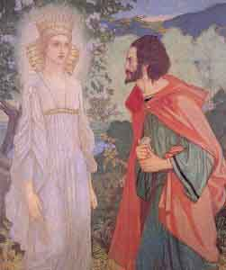

  
[Intangible Textual Heritage](../../../index.md)  [Sagas &
Legends](../../index)  [England](../index.md) 

------------------------------------------------------------------------

Also of interest: [Stories from the Faerie Queene](../sfq/index.md)

------------------------------------------------------------------------

<table width="75%">
<colgroup>
<col style="width: 50%" />
<col style="width: 50%" />
</colgroup>
<tbody>
<tr class="odd">
<td width="50%" data-valign="CENTER"></td>
<td width="50%" data-valign="CENTER"><h1 id="the-faerie-queene" data-align="CENTER">The Faerie Queene</h1>
<h2 id="by-edmund-spenser" data-align="CENTER">by Edmund Spenser</h2>
<h4 id="section" data-align="CENTER">[1596]</h4></td>
</tr>
</tbody>
</table>

------------------------------------------------------------------------

[Title Page](fq00.md)  
[Dedication](fq01.md)  

### Book 1

[The Legende of the Knight of the Red Crosse or Of Holinesse](fq02.md)  
[Canto I](fq03.md)  
[Canto II](fq04.md)  
[Canto III](fq05.md)  
[Canto IIII](fq06.md)  
[Canto V](fq07.md)  
[Canto VII](fq08.md)  
[Canto VIII](fq09.md)  
[Canto X](fq10.md)  
[Canto XI](fq11.md)  
[Canto XII](fq12.md)  

### Book 2

[The Legend of Sir Gvyon, or Of Temperaunce](fq13.md)  
[Canto I](fq14.md)  
[Canto II](fq15.md)  
[Canto III](fq16.md)  
[Canto IIII](fq17.md)  
[Canto V](fq18.md)  
[Canto VI](fq19.md)  
[Canto VII](fq20.md)  
[Canto VIII](fq21.md)  
[Canto IX](fq22.md)  
[Canto X](fq23.md)  
[Canto XI](fq24.md)  
[Canto XII](fq25.md)  

### Book 3

[The Legend of Britomartis or Of Chastitie](fq26.md)  
[Canto I](fq27.md)  
[Canto II](fq28.md)  
[Canto III](fq29.md)  
[Canto IIII](fq30.md)  
[Canto V](fq31.md)  
[Canto VI](fq32.md)  
[Canto VII](fq33.md)  
[Canto VIII](fq34.md)  
[Canto IX](fq35.md)  
[Canto X](fq36.md)  
[Canto XI](fq37.md)  
[Canto XII](fq38.md)  

### Book 4

[The Legend of Cambel and Telamond, or Of Friendship](fq39.md)  
[Canto I](fq40.md)  
[Canto II](fq41.md)  
[Canto III](fq42.md)  
[Canto IIII](fq43.md)  
[Canto V](fq44.md)  
[Canto VI](fq45.md)  
[Canto VII](fq46.md)  
[Canto VIII](fq47.md)  
[Canto IX](fq48.md)  
[Canto X](fq49.md)  
[Canto XI](fq50.md)  
[Canto XII](fq51.md)  

### Book 5

[The Legend of Artegall or Of Ivstice](fq52.md)  
[Canto I](fq53.md)  
[Canto II](fq54.md)  
[Canto III](fq55.md)  
[Canto IIII](fq56.md)  
[Canto V](fq57.md)  
[Canto VI](fq58.md)  
[Canto VII](fq59.md)  
[Canto VIII](fq60.md)  
[Canto IX](fq61.md)  
[Canto X](fq62.md)  
[Canto XI](fq63.md)  
[Canto XII](fq64.md)  

### Book 6

[The Legend of S. Calidore or Of Covrtesie](fq65.md)  
[Canto I](fq66.md)  
[Canto II](fq67.md)  
[Canto III](fq68.md)  
[Canto IIII](fq69.md)  
[Canto V](fq70.md)  
[Canto VI](fq71.md)  
[Canto VII](fq72.md)  
[Canto VIII](fq73.md)  
[Canto IX](fq74.md)  
[Canto X](fq75.md)  
[Canto XI](fq76.md)  
[Canto XII](fq77.md)  

### The Cantos of Mutabilitie

[The Cantos of Mutabilitie](fq78.md)  
[Canto VI](fq79.md)  
[Canto VII](fq80.md)  
[Canto VIII](fq81.md)  

### Letter to Raleigh and Commendatory Poems, &c.

[Letter to Raleigh and Commendatory Poems, &c.](fq82.md)  
[Commendatory Poems and Sonnets to Persons of Rank](fq83.md)  
