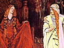
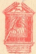
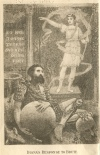

  
[Intangible Textual Heritage](../../../index.md)  [Legends and
Sagas](../../index)  [England](../index)  [Index](index)  [Next](gem01.md) 

------------------------------------------------------------------------

[Buy this Book at
Amazon.com](https://www.amazon.com/exec/obidos/ASIN/1406795151/internetsacredte.md)

------------------------------------------------------------------------

  
*Histories of the Kings of Britain, by Geoffry of Monmouth*, tr. by
Sebastian Evans, \[1904\], at Intangible Textual Heritage

------------------------------------------------------------------------

# THE TEMPLE CLASSICS

 

## GEOFFREY OF MONMOUTH

### TRANSLATED BY SEBASTIAN EVANS, LL.D.

#### MDCCCCIV. PUBLISHED BY J.M. DENT AND CO: ALDINE HOUSE, LONDON W.C.

#### \[1904\]

  [  
Click to enlarge](img/title.jpg.md)  
Title Page  

 
[  
Click to enlarge](img/front.jpg.md)  
Frontispiece  

Scanned, proofed and formatted by John Bruno Hare at Intangible Textual
Heritage, February 2008. This text is in the public domain in the United
States because it was published prior to 1923.

------------------------------------------------------------------------

[Next: Contents](gem01.md)
