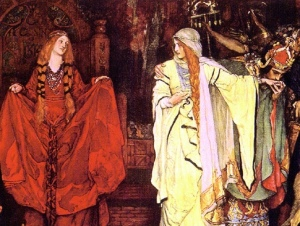

  
[Intangible Textual Heritage](../../../index)  [Legends and
Sagas](../../index)  [England](../index) 

------------------------------------------------------------------------

[Buy this Book at
Amazon.com](https://www.amazon.com/exec/obidos/ASIN/1406795151/internetsacredte)

------------------------------------------------------------------------

<table width="75%">
<colgroup>
<col style="width: 50%" />
<col style="width: 50%" />
</colgroup>
<tbody>
<tr class="odd">
<td width="50%" data-valign="TOP"> 
Detail from King Lear: Cordelia's Farewell, by Edwin Austin Abbey [1887-1909] (Public Domain Image)</td>
<td width="50%" data-valign="CENTER"><h1 id="geoffrey-of-monmouth" data-align="CENTER">Geoffrey of Monmouth</h1>
<h3 id="histories-of-the-kings-of-britain" data-align="CENTER">Histories of the Kings of Britain</h3>
<h2 id="tr.-by-sebastian-evans" data-align="CENTER">tr. by Sebastian Evans</h2>
<h4 id="section" data-align="CENTER">[1904]</h4></td>
</tr>
</tbody>
</table>

------------------------------------------------------------------------

[Contents](#contents)    [Start Reading](gem00)    [Page
Index](pageidx)    [Text \[Zipped\]](gemtxt.zip)   

------------------------------------------------------------------------

|                                                                                                                           |
|---------------------------------------------------------------------------------------------------------------------------|
|  |

Geoffrey of Monmouth's Histories of the Kings of Britain was a medieval
attempt to forge a national epic for the British people, shortly after
the Norman conquest. Geoffrey invented a mythical back-history for the
Britons, starting, as Virgil did, with a fugitive from the sack of Troy,
named Brute or Brutus. The Histories includes many traditional tales,
particularly a telling of the story of King Lear (who was originally a
Celtic God, Lyr). He also inserts actual historical events such as
Caesar's invasion of Britain.

Geoffrey of Monmouth is a primary source for the Arthurian legends, one
of the first published accounts. His Arthur has few of the romantic,
mystical and miraculous motifs of later versions. Notably missing are
the Round Table, the Grail, Guinevere's affair with Lancelot, Excalibur,
the Lady of the Lake, and the final journey to Avalon. Geoffrey's Arthur
is a national hero who unites a huge empire by the sword, and goes
toe-to-toe with the Roman Empire. The translator speculates in the
Epilogue that Arthur is meant to be an allegorical representation of
King Henry I.

Embedded in the Histories is The Prophecies of Merlin, which
retroactively predicts current events of Geoffrey's time. Also available
at this site is a bilingual edition of a later work which Geoffrey
composed on the same theme, [Vita Merlini](../vm/index), or Life of
Merlin. Also of interest is his description of the theft of Stonehenge
from Ireland: uncannily recognizing that the stones had been moved from
a long way away. This is the first appearance on the Internet of this
translation of Geoffrey's Histories.

--J.B. Hare, February 14th, 2008

------------------------------------------------------------------------

 [Title Page](gem00)  
[Contents](gem01)  
[Book I](gem02)  
[Book II](gem03)  
[Book III](gem04)  
[Book IV](gem05)  
[Book V](gem06)  
[Book VI](gem07)  
[Book VII](gem08)  
[Book VIII](gem09)  
[Book IX](gem10)  
[Book X](gem11)  
[Book XI](gem12)  
[Book XII](gem13)  
[The Translator's Epilogue](gem14)  
