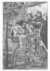

  
[Intangible Textual Heritage](../../../index.md) 
[Myths/Sagas](../../index)  [England](../index)  [Index](index.md) 
[Next](hml01.md) 

------------------------------------------------------------------------

[Buy this Book at
Amazon.com](https://www.amazon.com/exec/obidos/ASIN/1859580017/internetsacredte.md)

------------------------------------------------------------------------

# Hero-Myths and Legends of the British Race

## by Maud Isabel Ebbutt

#### London, G. G. Harrap and Company

#### \[1910\]

Scanned at Intangible Textual Heritage, December 2005. Proofed and
formatted by John Bruno Hare. This text is in the public domain in the
United States because it was published prior to January 1st, 1923. These
files may be used for any non-commercial purpose, provided this notice
of attribution is left intact in all copies.

[  
Click to enlarge](img/front.jpg.md)  
William of Cloudeslee and his Son  

\[Page [245](hml15.htm#page_245.md)\]

 

------------------------------------------------------------------------

[Next: Preface](hml01.md)
