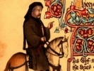

  
[Intangible Textual Heritage](../../../index)  [Legends and
Sagas](../../index)  [England](../index)  [Index](index) 
[Previous](mect28)  [Next](mect30) 

------------------------------------------------------------------------

  
*The Canterbury Tales and Other Works of Chaucer (Middle English)*, by
Geoffery Chaucer, \[14th cent.\], at Intangible Textual Heritage

------------------------------------------------------------------------

#### The Canterbury Tales

### The Shipman's Tale

 A marchant whilom dwelled at Seint-Denys,  
 That riche was, for which men helde hym wys.  
 A wyf he hadde of excellent beautee;  
 And compaignable and revelous was she,  
 Which is a thyng that causeth more dispence  
 Than worth is al the chiere and reverence  
 That men hem doon at festes and at daunces.  
 Swiche salutaciouns and contenaunces  
 Passen as dooth a shadwe upon the wal;  
10 But wo is hym
that payen moot for al!  
 The sely housbonde, algate he moot paye,  
 He moot us clothe, and he moot us arraye,  
 Al for his owene worshipe richely,  
 In which array we daunce jolily.  
 And if that he noght may, par aventure,  
 Or ellis list no swich dispence endure,  
 But thynketh it is wasted and ylost,  
 Thanne moot another payen for oure cost,  
 Or lene us gold, and that is perilous.  
20 This noble
marchaunt heeld a worthy hous,  
 For which he hadde alday so greet repair  
 For his largesse, and for his wyf was fair,  
 That wonder is; but herkneth to my tale.  
 Amonges alle his gestes, grete and smale,  
 Ther was a monk, a fair man and a boold --  
 I trowe a thritty wynter he was oold --  
 That evere in oon was drawynge to that place.  
 This yonge monk, that was so fair of face,  
 Aqueynted was so with the goode man,  
30 Sith that hir
firste knoweliche bigan,  
 That in his hous as famulier was he  
 As it is possible any freend to be.  
 And for as muchel as this goode man,  
 And eek this monk of which that I bigan,  
 Were bothe two yborn in o village,  
 The monk hym claymeth as for cosynage,  
 And he agayn; he seith nat ones nay,  
 But was as glad therof as fowel of day,  
 For to his herte it was a greet plesaunce.  
40 Thus been they
knyt with eterne alliaunce,  
 And ech of hem gan oother for t' assure  
 Of bretherhede whil that hir lyf may dure.  
 Free was daun John, and manly of dispence,  
 As in that hous, and ful of diligence  
 To doon plesaunce, and also greet costage.  
 He noght forgat to yeve the leeste page  
 In al that hous; but after hir degree,  
 He yaf the lord, and sitthe al his meynee,  
 Whan that he cam, som manere honest thyng,  
50 For which they
were as glad of his comyng  
 As fowel is fayn whan that the sonne up
riseth.  
 Na moore of this as now, for it suffiseth.  
 But so bifel, this marchant on a day  
 Shoop hym to make redy his array  
 Toward the toun of Brugges for to fare,  
 To byen there a porcioun of ware;  
 For which he hath to Parys sent anon  
 A messager, and preyed hath daun John  
 That he sholde come to Seint-Denys to pleye  
60 With hym and
with his wyf a day or tweye,  
 Er he to Brugges wente, in alle wise.  
 This noble monk, of which I yow devyse,  
 Hath of his abbot, as hym list, licence,  
 By cause he was a man of heigh prudence  
 And eek an officer, out for to ryde,  
 To seen hir graunges and hire bernes wyde,  
 And unto Seint-Denys he comth anon.  
 Who was so welcome as my lord daun John,  
 Oure deere cosyn, ful of curteisye?  
70 With hym
broghte he a jubbe of malvesye,  
 And eek another ful of fyn vernage,  
 And volatyl, as ay was his usage.  
 And thus I lete hem ete and drynke and pleye,  
 This marchant and this monk, a day or tweye.  
 The thridde day, this marchant up ariseth,  
 And on his nedes sadly hym avyseth,  
 And up into his countour-hous gooth he  
 To rekene with hymself, wel may be,  
 Of thilke yeer how that it with hym stood,  
80 And how that he
despended hadde his good,  
 And if that he encressed were or noon.  
 His bookes and his bagges many oon  
 He leith biforn hym on his countyng-bord.  
 Ful riche was his tresor and his hord,  
 For which ful faste his countour-dore he
shette;  
 And eek he nolde that no man sholde hym lette  
 Of his acountes, for the meene tyme;  
 And thus he sit til it was passed pryme.  
 Daun John was rysen in the morwe also,  
90 And in the
gardyn walketh to and fro,  
 And hath his thynges seyd ful curteisly.  
 This goode wyf cam walkynge pryvely  
 Into the gardyn, there he walketh softe,  
 And hym saleweth, as she hath doon ofte.  
 A mayde child cam in hire compaignye,  
 Which as hir list she may governe and gye,  
 For yet under the yerde was the mayde.  
 "O deere cosyn myn, daun John," she sayde,  
 "What eyleth yow so rathe for to ryse?"  
100 "Nece," quod
he, "it oghte ynough suffise  
 Fyve houres for to slepe upon a nyght,  
 But it were for an old appalled wight,  
 As been thise wedded men, that lye and dare  
 As in a fourme sit a wery hare,  
 Were al forstraught with houndes grete and
smale.  
 But deere nece, why be ye so pale?  
 I trowe, certes, that oure goode man  
 Hath yow laboured sith the nyght bigan  
 That yow were nede to resten hastily."  
110 And with that
word he lough ful murily,  
 And of his owene thought he wax al reed.  
 This faire wyf gan for to shake hir heed  
 And seyde thus, "Ye, God woot al," quod she.  
 "Nay, cosyn myn, it stant nat so with me;  
 For, by that God that yaf me soule and lyf,  
 In al the reawme of France is ther no wyf  
 That lasse lust hath to that sory pley.  
 For I may synge \`allas and weylawey  
 That I was born,' but to no wight," quod
she,  
120 "Dar I nat
telle how that it stant with me.  
 Wherfore I thynke out of this land to wende,  
 Or elles of myself to make an ende,  
 So ful am I of drede and eek of care."  
 This monk bigan upon this wyf to stare,  
 And seyde, "Allas, my nece, God forbede  
 That ye, for any sorwe or any drede,  
 Fordo youreself; but telleth me youre grief.  
 Paraventure I may, in youre meschief,  
 Conseille or helpe; and therfore telleth me  
130 Al youre
anoy, for it shal been secree.  
 For on my portehors I make an ooth  
 That nevere in my lyf, for lief ne looth,  
 Ne shal I of no conseil yow biwreye."  
 "The same agayn to yow," quod she, "I seye.  
 By God and by this portehors I swere,  
 Though men me wolde al into pieces tere,  
 Ne shal I nevere, for to goon to helle,  
 Biwreye a word of thyng that ye me telle,  
 Nat for no cosynage ne alliance,  
140 But verraily
for love and affiance."  
 Thus been they sworn, and heerupon they
kiste,  
 And ech of hem tolde oother what hem liste.  
 "Cosyn," quod she, "if that I hadde a space,  
 As I have noon, and namely in this place,  
 Thanne wolde I telle a legende of my lyf,  
 What I have suffred sith I was a wyf  
 With myn housbonde, al be he youre cosyn."  
 "Nay," quod this monk, "by God and Seint
Martyn,  
 He is na moore cosyn unto me  
150 Than is this
leef that hangeth on the tree!  
 I clepe hym so, by Seint Denys of Fraunce,  
 To have the moore cause of aqueyntaunce  
 Of yow, which I have loved specially  
 Aboven alle wommen, sikerly.  
 This swere I yow on my professioun.  
 Telleth youre grief, lest that he come
adoun;  
 And hasteth yow, and gooth youre wey anon."  
 "My deere love," quod she, "O my daun John,  
 Ful lief were me this conseil for to hyde,  
160 But out it
moot; I may namoore abyde.  
 Myn housbonde is to me the worste man  
 That evere was sith that the world bigan.  
 But sith I am a wyf, it sit nat me  
 To tellen no wight of oure privetee,  
 Neither abedde ne in noon oother place;  
 God shilde I sholde it tellen, for his
grace!  
 A wyf ne shal nat seyn of hir housbonde  
 But al honour, as I kan understonde;  
 Save unto yow thus muche I tellen shal:  
170 As helpe me
God, he is noght worth at al  
 In no degree the value of a flye.  
 But yet me greveth moost his nygardye.  
 And wel ye woot that wommen naturelly  
 Desiren thynges sixe as wel as I:  
 They wolde that hir housbondes sholde be  
 Hardy and wise, and riche, and therto free,  
 And buxom unto his wyf and fressh abedde.  
 But by that ilke Lord that for us bledde,  
 For his honour, myself for to arraye,  
180 A Sonday next
I moste nedes paye  
 An hundred frankes, or ellis I am lorn.  
 Yet were me levere that I were unborn  
 Than me were doon a sclaundre or vileynye;  
 And if myn housbonde eek it myghte espye,  
 I nere but lost; and therfore I yow preye,  
 Lene me this somme, or ellis moot I deye.  
 Daun John, I seye, lene me thise hundred
frankes.  
 Pardee, I wol nat faille yow my thankes,  
 If that yow list to doon that I yow praye.  
190 For at a
certeyn day I wol yow paye,  
 And doon to yow what plesance and service  
 That I may doon, right as yow list devise.  
 And but I do, God take on me vengeance  
 As foul as evere hadde Genylon of France."  
 This gentil monk answerde in this manere:  
 "Now trewely, myn owene lady deere,  
 I have," quod he, "on yow so greet a routhe  
 That I yow swere, and plighte yow my
trouthe,  
 That whan youre housbonde is to Flaundres
fare,  
200 I wol
delyvere yow out of this care;  
 For I wol brynge yow an hundred frankes."  
 And with that word he caughte hire by the
flankes,  
 And hire embraceth harde, and kiste hire
ofte.  
 "Gooth now youre wey," quod he, "al stille and
softe,  
 And lat us dyne as soone as that ye may;  
 For by my chilyndre it is pryme of day.  
 Gooth now, and beeth as trewe as I shal be."  
 "Now elles God forbede, sire," quod she;  
 And forth she gooth as jolif as a pye,  
210 And bad the
cookes that they sholde hem hye,  
 So that men myghte dyne, and that anon.  
 Up to hir housbonde is this wyf ygon,  
 And knokketh at his countour boldely.  
 "Quy la?" quod he. "Peter! it am I,"  
 Quod she; "What, sire, how longe wol ye
faste?  
 How longe tyme wol ye rekene and caste  
 Youre sommes, and youre bookes, and youre
thynges?  
 The devel have part on alle swiche
rekenynges!  
 Ye have ynough, pardee, of Goddes sonde;  
220 Com doun
to-day, and lat youre bagges stonde.  
 Ne be ye nat ashamed that daun John  
 Shal fasting al this day alenge goon?  
 What, lat us heere a messe, and go we dyne."  
 "Wyf," quod this man, "litel kanstow devyne  
 The curious bisynesse that we have.  
 For of us chapmen, also God me save,  
 And by that lord that clepid is Seint Yve,  
 Scarsly amonges twelve tweye shul thryve  
 Continuelly, lastynge unto oure age.  
230 We may wel
make chiere and good visage,  
 And dryve forth the world as it may be,  
 And kepen oure estaat in pryvetee,  
 Til we be deed, or elles that we pleye  
 A pilgrymage, or goon out of the weye.  
 And therfore have I greet necessitee  
 Upon this queynte world t' avyse me,  
 For everemoore we moote stonde in drede  
 Of hap and fortune in oure chapmanhede.  
 "To Flaundres wol I go to-morwe at day,  
240 And come
agayn, as soone as evere I may.  
 For which, my deere wyf, I thee biseke,  
 As be to every wight buxom and meke,  
 And for to kepe oure good be curious,  
 And honestly governe wel oure hous.  
 Thou hast ynough, in every maner wise,  
 That to a thrifty houshold may suffise.  
 Thee lakketh noon array ne no vitaille;  
 Of silver in thy purs shaltow nat faille."  
 And with that word his countour-dore he
shette,  
250 And doun he
gooth, no lenger wolde he lette.  
 But hastily a messe was ther seyd,  
 And spedily the tables were yleyd,  
 And to the dyner faste they hem spedde,  
 And richely this monk the chapman fedde.  
 At after-dyner daun John sobrely  
 This chapman took apart, and prively  
 He seyde hym thus: "Cosyn, it standeth so,  
 That wel I se to Brugges wol ye go.  
 God and Seint Austyn spede yow and gyde!  
260 I prey yow,
cosyn, wisely that ye ryde.  
 Governeth yow also of youre diete  
 Atemprely, and namely in this hete.  
 Bitwix us two nedeth no strange fare;  
 Farewel, cosyn; God shilde yow fro care!  
 And if that any thyng by day or nyght,  
 If it lye in my power and my myght,  
 That ye me wol comande in any wyse,  
 It shal be doon right as ye wol devyse.  
 "O thyng, er that ye goon, if it may be,  
270 I wolde prey
yow: for to lene me  
 An hundred frankes, for a wyke or tweye,  
 For certein beestes that I moste beye,  
 To stoore with a place that is oures.  
 God helpe me so, I wolde it were youres!  
 I shal nat faille surely of my day,  
 Nat for a thousand frankes, a mile way.  
 But lat this thyng be secree, I yow preye,  
 For yet to-nyght thise beestes moot I beye.  
 And fare now wel, myn owene cosyn deere;  
280 Graunt mercy
of youre cost and of youre cheere."  
 This noble marchant gentilly anon  
 Answerde and seyde, "O cosyn myn, daun John,  
 Now sikerly this is a smal requeste.  
 My gold is youres, whan that it yow leste,  
 And nat oonly my gold, but my chaffare.  
 Take what yow list; God shilde that ye
spare.  
 "But o thyng is, ye knowe it wel ynogh  
 Of chapmen, that hir moneie is hir plogh.  
 We may creaunce whil we have a name,  
290 But goldlees
for to be, it is no game.  
 Paye it agayn whan it lith in youre ese;  
 After my myght ful fayn wolde I yow plese."  
 Thise hundred frankes he fette forth anon,  
 And prively he took hem to daun John.  
 No wight in al this world wiste of this
loone  
 Savynge this marchant and daun John allone.  
 They drynke, and speke, and rome a while and
pleye,  
 Til that daun John rideth to his abbeye.  
 The morwe cam, and forth this marchant
rideth  
300 To
Flaundres-ward; his prentys wel hym gydeth  
 Til he came into Brugges murily.  
 Now gooth this marchant faste and bisily  
 Aboute his nede, and byeth and creaunceth.  
 He neither pleyeth at the dees ne daunceth,  
 But as a marchaunt, shortly for to telle,  
 He let his lyf, and there I lete hym dwelle.  
 The Sonday next the marchant was agon,  
 To Seint-Denys ycomen is daun John,  
 With crowne and berd al fressh and newe
yshave.  
310 In al the
hous ther nas so litel a knave,  
 Ne no wight elles, that he nas ful fayn  
 That my lord daun John was come agayn.  
 And shortly to the point right for to gon,  
 This faire wyf acorded with daun John  
 That for thise hundred frankes he sholde al
nyght  
 Have hire in his armes bolt upright;  
 And this acord parfourned was in dede.  
 In myrthe al nyght a bisy lyf they lede  
 Til it was day, that daun John wente his
way,  
320 And bad the
meynee "Farewel, have good day!"  
 For noon of hem, ne no wight in the toun,  
 Hath of daun John right no suspecioun.  
 And forth he rydeth hoom to his abbeye,  
 Or where hym list; namoore of hym I seye.  
 This marchant, whan that ended was the
faire,  
 To Seint-Denys he gan for to repaire,  
 And with his wyf he maketh feeste and
cheere,  
 And telleth hire that chaffare is so deere  
 That nedes moste he make a chevyssaunce,  
330 For he was
bounden in a reconyssaunce  
 To paye twenty thousand sheeld anon.  
 For which this marchant is to Parys gon  
 To borwe of certeine freendes that he hadde  
 A certeyn frankes; and somme with him he
ladde.  
 And whan that he was come into the toun,  
 For greet chiertee and greet affeccioun,  
 Unto daun John he first gooth hym to pleye;  
 Nat for to axe or borwe of hym moneye,  
 But for to wite and seen of his welfare,  
340 And for to
tellen hym of his chaffare,  
 As freendes doon whan they been met yfeere.  
 Daun John hym maketh feeste and murye
cheere,  
 And he hym tolde agayn, ful specially,  
 How he hadde wel yboght and graciously,  
 Thanked be God, al hool his marchandise,  
 Save that he moste, in alle maner wise,  
 Maken a chevyssaunce, as for his beste,  
 And thanne he sholde been in joye and reste.  
 Daun John answerde, "Certes, I am fayn  
350 That ye in
heele ar comen hom agayn.  
 And if that I were riche, as have I blisse,  
 Of twenty thousand sheeld sholde ye nat
mysse,  
 For ye so kyndely this oother day  
 Lente me gold; and as I kan and may,  
 I thanke yow, by God and by Seint Jame!  
 But nathelees, I took unto oure dame,  
 Youre wyf, at hom, the same gold ageyn  
 Upon youre bench; she woot it wel, certeyn,  
 By certeyn tokenes that I kan hire telle.  
360 Now, by youre
leve, I may no lenger dwelle;  
 Oure abbot wole out of this toun anon,  
 And in his compaignye moot I goon.  
 Grete wel oure dame, myn owene nece sweete,  
 And fare wel, deere cosyn, til we meete!"  
 This marchant, which that was ful war and
wys,  
 Creanced hath, and payd eek in Parys  
 To certeyn Lumbardes, redy in hir hond,  
 The somme of gold, and gat of hem his bond;  
 And hoom he gooth, murie as a papejay,  
370 For wel he
knew he stood in swich array  
 That nedes moste he wynne in that viage  
 A thousand frankes aboven al his costage.  
 His wyf ful redy mette hym atte gate,  
 As she was wont of oold usage algate,  
 And al that nyght in myrthe they bisette;  
 For he was riche and cleerly out of dette.  
 Whan it was day, this marchant gan embrace  
 His wyf al newe, and kiste hire on hir face,  
 And up he gooth and maketh it ful tough.  
380 "Namoore,"
quod she, "by God, ye have ynough!"  
 And wantownly agayn with hym she pleyde  
 Til atte laste thus this marchant seyde:  
 "By God," quod he, "I am a litel wrooth  
 With yow, my wyf, although it be me looth.  
 And woot ye why? By God, as that I gesse  
 That ye han maad a manere straungenesse  
 Bitwixen me and my cosyn daun John.  
 Ye sholde han warned me, er I had gon,  
 That he yow hadde an hundred frankes payed  
390 By redy
token; and heeld hym yvele apayed,  
 For that I to hym spak of chevyssaunce;  
 Me semed so, as by his contenaunce.  
 But nathelees, by God, oure hevene kyng,  
 I thoughte nat to axen hym no thyng.  
 I prey thee, wyf, ne do namoore so;  
 Telle me alwey, er that I fro thee go,  
 If any dettour hath in myn absence  
 Ypayed thee, lest thurgh thy necligence  
 I myghte hym axe a thing that he hath
payed."  
400 This wyf was
nat afered nor affrayed,  
 But boldely she seyde, and that anon,  
 "Marie, I deffie the false monk, daun John!  
 I kepe nat of his tokenes never a deel;  
 He took me certeyn gold, that woot I weel --  
 What! Yvel thedam on his monkes snowte!  
 For, God it woot, I wende, withouten doute,  
 That he hadde yeve it me bycause of yow  
 To doon therwith myn honour and my prow,  
 For cosynage, and eek for beele cheere  
410 That he hath
had ful ofte tymes heere.  
 But sith I se I stonde in this disjoynt,  
 I wol answere yow shortly to the poynt.  
 Ye han mo slakkere dettours than am I!  
 For I wol paye yow wel and redily  
 Fro day to day, and if so be I faille,  
 I am youre wyf; score it upon my taille,  
 And I shal paye as soone as ever I may.  
 For by my trouthe, I have on myn array,  
 And nat on wast, bistowed every deel;  
420 And for I
have bistowed it so weel  
 For youre honour, for Goddes sake, I seye,  
 As be nat wrooth, but lat us laughe and
pleye.  
 Ye shal my joly body have to wedde;  
 By God, I wol nat paye yow but abedde!  
 Forgyve it me, myn owene spouse deere;  
 Turne hiderward, and maketh bettre cheere."  
 This marchant saugh ther was no remedie,  
 And for to chide it nere but folie,  
 Sith that the thyng may nat amended be.  
430 "Now wyf," he
seyde, "and I foryeve it thee;  
 But, by thy lyf, ne be namoore so large.  
 Keep bet thy good, this yeve I thee in
charge."  
 Thus endeth my tale, and God us sende  
 Taillynge ynough unto oure lyves ende. Amen  
 "Wel seyd, by corpus dominus," quod oure
Hoost,  
 "Now longe moote thou saille by the cost,  
 Sire gentil maister, gentil maryneer!  
 God yeve the monk a thousand last quade
yeer!  
 A ha! Felawes, beth ware of swich a jape!  
440 The monk
putte in the mannes hood an ape,  
 And in his wyves eek, by Seint Austyn!  
 Draweth no monkes moore unto youre in.  
 "But now passe over, and lat us seke aboute,  
 Who shal now telle first of al this route  
 Another tale;" and with that word he sayde,  
 As curteisly as it had been a mayde,  
 "My lady Prioresse, by youre leve,  
 So that I wiste I sholde yow nat greve,  
 I wolde demen that ye tellen sholde  
450 A tale next,
if so were that ye wolde.  
 Now wol ye vouche sauf, my lady deere?"  
 "Gladly," quod she, and seyde as ye shal
heere.  

------------------------------------------------------------------------

[Next: The Prioress' Prologue](mect30)
