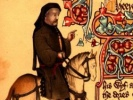

  
[Intangible Textual Heritage](../../../index.md)  [Legends and
Sagas](../../index)  [England](../index)  [Index](index.md) 
[Previous](mect63)  [Next](mect65.md) 

------------------------------------------------------------------------

  
*The Canterbury Tales and Other Works of Chaucer (Middle English)*, by
Geoffery Chaucer, \[14th cent.\], at Intangible Textual Heritage

------------------------------------------------------------------------

#### The Legend of Good Women

### Prologue G

 A thousand sythes have I herd men telle  
 That there is joye in hevene and peyne in
helle,  
 And I acorde wel that it be so;  
 But natheles, this wot I wel also,  
 That there ne is non that dwelleth in this
contre  
 That eyther hath in helle or hevene ybe,  
 Ne may of it non other weyes witen  
 But as he hath herd seyd or founde it writen;  
 For by assay there may no man it preve.  
10 But Goddes
forbode but men shulde leve  
 Wel more thyng than men han seyn with ye!  
 Men shal nat wenen every thyng a lye  
 For that he say it nat of yore ago.  
 God wot a thyng is nevere the lesse so  
 Thow every wyght ne may it nat yse.  
 Bernard the monk ne say nat al, parde!  
 Thanne mote we to bokes that we fynde,  
 Thourgh whiche that olde thynges ben in
mynde,  
 And to the doctryne of these olde wyse  
20 Yeven credence,
in every skylful wyse,  
 And trowen on these olde aproved storyes  
 Of holynesse, of regnes, of victoryes,  
 Of love, of hate, of othere sondry thynges,  
 Of which I may nat make rehersynges.  
 And if that olde bokes weren aweye,  
 Yloren were of remembrance the keye.  
 Wel oughte us thanne on olde bokes leve,  
 There as there is non other assay by preve.  
 And as for me, though that my wit be lite,  
30 On bokes for to
rede I me delyte,  
 And in myn herte have hem in reverence,  
 And to hem yeve swich lust and swich credence  
 That there is wel unethe game non  
 That fro my bokes make me to gon,  
 But it be other upon the halyday,  
 Or ellis in the joly tyme of May,  
 Whan that I here the smale foules synge,  
 And that the floures gynne for to sprynge.  
 Farwel my stodye, as lastynge that sesoun!  
40 Now have I
therto this condicioun,  
 That, of alle the floures in the mede,  
 Thanne love I most these floures white and
rede,  
 Swyche as men calle dayesyes in oure toun.  
 To hem have I so gret affeccioun,  
 As I seyde erst, whan comen is the May,  
 That in my bed there daweth me no day  
 That I n' am up and walkynge in the mede  
 To sen these floures agen the sonne sprede  
 Whan it up ryseth by the morwe shene,  
50 The longe day
thus walkynge in the grene.  
 And whan the sonne gynneth for to weste,  
 Thanne closeth it, and draweth it to reste,  
 So sore it is afered of the nyght,  
 Til on the morwe that it is dayes lyght.  
 This dayesye, of alle floures flour,  
 Fulfyld of vertu and of alle honour,  
 And evere ylike fayr and fresh of hewe,  
 As wel in wynter as in somer newe,  
 Fayn wolde I preysen, if I coude aryght;  
60 But wo is me,
it lyth nat in my myght.  
 For wel I wot that folk han here-beforn  
 Of makyng ropen, and lad awey the corn;  
 \[And\] I come after, glenynge here and
there,  
 And am ful glad if I may fynde an ere  
 Of any goodly word that they han left.  
 And if it happe me rehersen eft  
 That they han in here freshe songes said,  
 I hope that they wole nat ben evele apayd,  
 Sith it is seyd in fortheryng and honour  
70 Of hem that
eyther serven lef or flour.  
 For trusteth wel, I ne have nat undertake  
 As of the lef agayn the flour to make,  
 Ne of the flour to make ageyn the lef,  
 No more than of the corn agen the shef;  
 For, as to me, is lefer non, ne lother.  
 I am witholde yit with never nother;  
 I not who serveth lef ne who the flour.  
 That nys nothyng the entent of my labour.  
 For this werk is al of another tonne,  
80 Of olde story,
er swich strif was begonne.  
 But wherfore that I spak, to yeve credence  
 To bokes olde and don hem reverence,  
 Is for men shulde autoritees beleve,  
 There as there lyth non other assay by preve.  
 For myn entent is, or I fro yow fare,  
 The naked text in English to declare  
 Of many a story, or elles of many a geste,  
 As autours seyn; leveth hem if yow leste.  
 Whan passed was almost the month of May,  
90 And I hadde
romed, al the someres day,  
 The grene medewe, of which that I yow tolde,  
 Upon the freshe dayseie to beholde,  
 And that the sonne out of the south gan
weste,  
 And closed was the flour and gon to reste,  
 For derknesse of the nyght, of which she
dredde,  
 Hom to myn hous ful swiftly I me spedde,  
 And in a lytel herber that I have,  
 Ybenched newe with turves fresshe ygrave,  
 I bad men shulde me my couche make;  
100 For deynte of
the newe someres sake,  
 I bad hem strowe floures on my bed.  
 Whan I was layd, and hadde myn eyen hed,  
 I fel aslepe withinne an hour or two.  
 Me mette how I was in the medewe tho,  
 And that I romede in that same gyse,  
 To sen that flour, as ye han herd devyse.  
 Fayr was this medewe, as thoughte me,
overal;  
 With floures sote enbrouded was it al.  
 As for to speke of gomme, or herbe, or tre,  
110 Comparisoun
may non ymaked be;  
 For it surmountede pleynly alle odoures,  
 And of ryche beaute alle floures.  
 Forgeten hadde the erthe his pore estat  
 Of wynter, that hym naked made and mat,  
 And with his swerd of cold so sore hadde
greved.  
 Now hadde th' atempre sonne al that releved,  
 And clothed hym in grene al newe ageyn.  
 The smale foules, of the seson fayn,  
 That from the panter and the net ben skaped,  
120 Upon the
foulere, that hem made awhaped  
 In wynter, and distroyed hadde hire brod,  
 In his dispit hem thoughte it dide hem good  
 To synge of hym, and in here song despise  
 The foule cherl that for his coveytyse  
 Hadde hem betrayed with his sophistrye.  
 This was here song, "The foulere we defye,  
 \[And\] \[al\] \[his\] \[craft\]." \[And\]
\[some\] \[songen\] \[clere\]  
 \[Layes\] of love that joye it was to here,  
 In worshipe and in preysyng of hire make;  
130 And \[for\]
the newe blysful somers sake,  
 \[They\] sungen, "Blyssed be Seynt Valentyn!  
 \[For\] \[on\] his day I ches yow to be myn,  
 Withoute repentynge, myn herte swete!"  
 And therwithal here bekes gonne mete,  
 \[Yelding\] honour and humble obeysaunces;  
 And after diden othere observaunces  
 Ryht \[longing\] onto love and to nature;  
 So ech of hem \[doth\] \[wel\] to creature.  
 This song to herkenen I dide al myn entente,  
140 For-why I
mette I wiste what they mente,  
 Tyl at the laste a larke son above:  
 "I se," quod she, "the myghty god of Love.  
 Lo! yond he cometh! I se his wynges sprede."  
 Tho gan I loken endelong the mede  
 And saw hym come, and in his hond a quene  
 Clothed in real habyt al of grene.  
 A fret of goold she hadde next hyre her  
 And upon that a whit corone she ber  
 With many floures, and I shal nat lye;  
150 For al the
world, ryght as the dayesye  
 Ycorouned is with white leves lite,  
 Swiche were the floures of hire coroune
white.  
 For of o perle fyn and oryental  
 Hyre white coroun was ymaked al;  
 For which the white coroun above the grene  
 Made hire lyk a dayesye for to sene,  
 Considered ek the fret of gold above.  
 Yclothed was this myghty god of Love  
 Of silk, ybrouded ful of grene greves,  
160 A garlond on
his hed of rose-leves  
 Stiked al with lylye floures newe.  
 But of his face I can not seyn the hewe,  
 For sikerly his face shon so bryghte  
 That with the glem astoned was the syghte;  
 A furlong-wey I myhte hym not beholde.  
 But at the laste in hande I saw hym holde  
 Two firy dartes as the gleedes rede,  
 And aungellych hys winges gan he sprede.  
 And al be that men seyn that blynd is he,  
170 Algate me
thoughte he myghte wel yse;  
 For sternely on me he gan beholde,  
 So that his lokynge doth myn herte colde.  
 And by the hond he held the noble quene  
 Corouned with whit and clothed al in grene,  
 So womanly, so benygne, and so meke,  
 That in this world, thogh that men wolde
seke,  
 Half hire beaute shulde men nat fynde  
 In creature that formed is by kynde.  
 Hire name was Alceste the debonayre.  
180 I preye to
God that evere falle she fayre,  
 For ne hadde confort been of hire presence,  
 I hadde be ded, withouten any defence,  
 For dred of Loves wordes and his chere,  
 As, whan tyme is, hereafter ye shal here.  
 Byhynde this god of Love, upon this grene,  
 I saw comynge of ladyes nyntene  
 In real habyt, a ful esy pas,  
 And after hem come of wemen swich a tras  
 That, syn that God Adam \[had\] mad of
erthe,  
190 The thridde
part of wemen, ne the ferthe,  
 Ne wende I not by possibilite  
 Hadden evere in this \[wyde\] world ybe;  
 And trewe of love these wemen were echon.  
 Now whether was that a wonder thyng or non,  
 That ryght anon as that they gonne espye  
 This flour, which that I clepe the dayesye,  
 Ful sodeynly they stynten alle atones,  
 And knelede adoun, as it were for the nones.  
 And after that they wenten in compas,  
200 Daunsynge
aboute this flour an esy pas,  
 And songen, as it were in carole-wyse,  
 This balade, which that I shal yow devyse.  
 Hyd, Absalon, thy gilte tresses clere;  
 Ester, ley thow thy meknesse al adoun;  
 Hyd, Jonathas, al thyn frendly manere;  
 Penelope and Marcia Catoun,  
 Mak of youre wyfhod no comparisoun;  
 Hyde ye youre beautes, Ysoude and Eleyne:  
 Alceste is here, that al that may desteyne.  
210 Thy fayre
body, lat it nat apeere,  
 Laveyne; and thow, Lucresse of Rome toun,  
 And Polixene, that boughte love so dere,  
 Ek Cleopatre, with al thy passioun,  
 Hide ye youre trouth in love and youre
renoun;  
 And thow, Tysbe, that hast for love swich
peyne:  
 Alceste is here, that al that may desteyne.  
 Herro, Dido, Laodomya, alle in-fere,  
 Ek Phillis, hangynge for thy Demophoun,  
 And Canace, espied by thy chere,  
220 Ysiphile,
betrayed with Jasoun,  
 Mak of youre trouthe in love no bost ne
soun;  
 Nor Ypermystre or Adriane, ne pleyne  
 Alceste is here, that al that may disteyne.  
 Whan that this balade al ysongen was,  
 Upon the softe and sote grene gras  
 They setten hem ful softely adoun,  
 By order alle in compas, enveroun.  
 Fyrst sat the god of Love, and thanne this
queene  
 With the white corone, clad in grene,  
230 And sithen al
the remenant by and by,  
 As they were of degre, ful curteysly;  
 Ne nat a word was spoken in that place  
 The mountaunce of a furlong-wey of space.  
 I, lenynge faste by under a bente,  
 Abod to knowe what this peple mente,  
 As stille as any ston, til at the laste  
 The god of Love on me his eye caste  
 And seyde, "Who restith there?" And I
answerde  
 Unto his axynge, whan that I hym herde,  
240 And seyde,
"Sire, it am I," and cam hym ner,  
 And salewede hym. Quod he, "What dost thow
her  
 In my presence, and that so boldely?  
 For it were better worthi, trewely,  
 A worm to comen in my syght than thow."  
 "And why, sire," quod I, "and it lyke yow?"  
 "For thow," quod he, "art therto nothyng
able.  
 My servaunts ben alle wyse and honourable.  
 Thow art my mortal fo and me werreyest,  
 And of myne olde servauntes thow mysseyest,  
250 And hynderest
hem with thy translacyoun,  
 And lettest folk to han devocyoun  
 To serven me, and holdest it folye  
 To truste on me. Thow mayst it nat denye,  
 For in pleyn text, it nedeth nat to glose,  
 Thow hast translated the Romauns of the
Rose,  
 That is an heresye ageyns my lawe,  
 And makest wise folk fro me withdrawe;  
 And thynkest in thy wit, that is ful col,  
 That he nys but a verray propre fol  
260 That loveth
paramours to harde and hote.  
 Wel wot I therby thow begynnyst dote,  
 As olde foles whan here spiryt fayleth;  
 Thanne blame they folk, and wite nat what hem
ayleth.  
 Hast thow nat mad in Englysh ek the bok  
 How that Crisseyde Troylus forsok,  
 In shewynge how that wemen han don mis?  
 But natheles, answere me now to this;  
 Why noldest thow as wel \[han\] seyd
goodnesse  
 Of wemen, as thow hast seyd wikednesse?  
270 Was there no
good matere in thy mynde,  
 Ne in alle thy bokes ne coudest thow nat
fynde  
 Som story of wemen that were goode and
trewe?  
 Yis, God wot, sixty bokes olde and newe  
 Hast thow thyself, alle ful of storyes
grete,  
 That bothe Romayns and ek Grekes trete  
 Of sundry wemen, which lyf that they ladde,  
 And evere an hundred goode ageyn oon badde.  
 This knoweth God, and alle clerkes eke  
 That usen swiche materes for to seke.  
280 What seith
Valerye, Titus, or Claudyan?  
 What seith Jerome agayns Jovynyan?  
 How clene maydenes and how trewe wyves,  
 How stedefaste widewes durynge alle here
lyves,  
 Telleth Jerome, and that nat of a fewe,  
 But, I dar seyn, an hundred on a rewe,  
 That it is pite for to rede, and routhe,  
 The wo that they endure for here trouthe  
 For to hyre love were they so trewe  
 That, rathere than they wolde take a newe,  
290 They chose to
be ded in sondry wyse,  
 And deiden, as the story wol devyse;  
 And some were brend, and some were cut the
hals,  
 And some dreynt for they wolden not be fals;  
 For alle keped they here maydenhede,  
 Or elles wedlok, or here widewehede.  
 And this thing was nat kept for holynesse,  
 But al for verray vertu and clennesse,  
 And for men schulde sette on hem no lak;  
 And yit they were hethene, al the pak,  
300 That were so
sore adrad of alle shame.  
 These olde wemen kepte so here name  
 That in this world I trowe men shal nat
fynde  
 A man that coude be so trewe and kynde  
 As was the leste woman in that tyde.  
 What seyth also the epistel of Ovyde  
 Of trewe wyves and of here labour?  
 What Vincent in his Estoryal Myrour?  
 Ek al the world of autours maystow here,  
 Cristene and hethene, trete of swich matere;  
310 It nedeth nat
al day thus for to endite.  
 But yit, I seye, what eyleth the to wryte  
 The draf of storyes, and forgete the corn?  
 By Seynt Venus, of whom that I was born,  
 Althogh thow reneyed hast my lay,  
 As othere olde foles many a day,  
 Thow shalt repente it, so that it shal be
sene!"  
 Thanne spak Alceste, the worthyeste queene,  
 And seyde, "God, ryght of youre curteysye,  
 Ye moten herkenen if he can replye  
320 Ageyns these
poynts that ye han to hym meved.  
 A god ne sholde not thus been agreved,  
 But of his deite he shal be stable,  
 And therto ryghtful, and ek mercyable.  
 He shal nat ryghtfully his yre wreke  
 Or he have herd the tother partye speke.  
 Al ne is nat gospel that is to yow pleyned;  
 The god of Love hereth many a tale yfeyned.  
 For in youre court is many a losengeour,  
 And many a queynte totelere accusour,  
330 That tabouren
in youre eres many a thyng  
 For hate, or for jelous ymagynyng,  
 And for to han with you som dalyaunce.  
 Envye -- I preye to God yeve hire myschaunce!
--  
 Is lavender in the grete court alway,  
 For she ne parteth, neyther nyght ne day,  
 Out of the hous of Cesar; thus seyth Dante;  
 Whoso that goth, alwey she mot \[nat\]
wante.  
 This man to yow may wrongly ben acused,  
 There as by ryght hym oughte ben excusid.  
340 Or elles,
sire, for that this man is nyce,  
 He may translate a thyng in no malyce,  
 But for he useth bokes for to make,  
 And taketh non hed of what matere he take,  
 Therfore he wrot the Rose and ek Crisseyde  
 Of innocence, and nyste what he seyde.  
 Or hym was boden make thilke tweye  
 Of som persone, and durste it not withseye;  
 For he hath write many a bok er this.  
 He ne hath not don so grevously amys  
350 To translate
that olde clerkes wryte,  
 As thogh that he of maleys wolde endyte  
 Despit of love, and hadde hymself ywrought.  
 This shulde a ryghtwys lord han in his
thought,  
 And not ben lyk tyraunts of Lumbardye,  
 That usen wilfulhed and tyrannye.  
 For he that kyng or lord is naturel,  
 Hym oughte nat be tyraunt and crewel  
 As is a fermour, to don the harm he can.  
 He moste thynke it is his lige man,  
360 And that hym
oweth, of verray duetee,  
 Shewen his peple pleyn benygnete,  
 And wel to heren here excusacyouns,  
 And here compleyntes and petyciouns,  
 In duewe tyme, whan they shal it profre.  
 This is the sentence of the Philosophre,  
 A kyng to kepe his lyges in justice;  
 Withouten doute, that is his office.  
 And therto is a kyng ful depe ysworn  
 Ful many an hundred wynter herebeforn;  
370 And for to
kepe his lordes hir degre,  
 As it is ryght and skylful that they be  
 Enhaunsed and honoured, \[and\] most dere --  
 For they ben half-goddes in this world here
--  
 This shal he don bothe to pore \[and\]
ryche,  
 Al be that her estat be nat alyche,  
 And han of pore folk compassioun.  
 For lo, the gentyl kynde of the lyoun:  
 For whan a flye offendeth hym or byteth,  
 He with his tayl awey the flye smyteth  
380 Al esyly;
for, of his genterye,  
 Hym deyneth nat to wreke hym on a flye,  
 As doth a curre, or elles another best.  
 In noble corage oughte ben arest,  
 And weyen every thing by equite,  
 And evere han reward to his owen degre.  
 For, sire, it is no maystrye for a lord  
 To dampne a man withoute answere or word,  
 And, for a lord, that is ful foul to use.  
 And if so be he may hym nat excuse,  
390 \[But\] axeth
mercy with a sorweful herte,  
 And profereth hym, ryght in his bare sherte,  
 To been ryght at youre owene jugement,  
 Than ought a god, by short avisement,  
 Considere his owene honour and his trespas.  
 For syth no cause of deth lyth in this cas,  
 Yow oughte to ben the lyghter merciable;  
 Leteth youre yre, and beth somwhat tretable.  
 The man hath served yow of his konnynge,  
 And forthered \[wel\] youre lawe with his
makynge.  
400 Whil he was
yong, he kepte youre estat;  
 I not wher he be now a renegat.  
 But wel I wot, with that he can endyte  
 He hath maked lewed folk to delyte  
 To serven yow, in preysynge of youre name.  
 He made the bok that highte the Hous of
Fame,  
 And ek the Deth of Blaunche the Duchesse,  
 And the Parlement of Foules, as I gesse,  
 And al the love of Palamon and Arcite  
 Of Thebes, thogh the storye is knowen lite;  
410 And many an
ympne for your halydayes,  
 That highten balades, roundeles, vyrelayes;  
 And, for to speke of other besynesse,  
 He hath in prose translated Boece,  
 And Of the Wreched Engendrynge of Mankynde,  
 As man may in Pope Innocent yfynde;  
 And mad the lyf also of Seynt Cecile.  
 He made also, gon is a gret while,  
 Orygenes upon the Maudeleyne.  
 Hym oughte now to have the lesse peyne;  
420 He hath mad
many a lay and many a thyng.  
 Now as ye ben a god and ek a kyng,  
 I, youre Alceste, whilom quene of Trace,  
 I axe yow this man, ryght of youre grace,  
 That ye hym nevere hurte in al his lyve;  
 And he shal swere to yow, and that as blyve,  
 He shal no more agilten in this wyse,  
 But he shal maken, as ye wol devyse,  
 Of women trewe in lovynge al here lyve,  
 Wherso ye wol, of mayden or of wyve,  
430 And fortheren
yow as muche as he mysseyde  
 Or in the Rose or elles in Crisseyde."  
 The god of Love answerede hire thus anon:  
 "Madame," quod he, "it is so longe agon  
 That I yow knew so charytable and trewe,  
 That nevere yit sith that the world was newe  
 To me ne fond I betere non than ye;  
 That, if that I wol save my degre,  
 I may, ne wol, not warne youre requeste.  
 Al lyth in yow, doth with hym what yow
leste;  
440 And al
foryeve, withoute lenger space.  
 For whoso yeveth a yifte or doth a grace,  
 Do it by tyme, his thank is wel the more.  
 And demeth ye what he shal do therfore.  
 Go thanke now my lady here," quod he.  
 I ros, and doun I sette me on my kne,  
 And seyde thus, "Madame, the God above  
 Foryelde yow that ye the god of Love  
 Han maked me his wrathe to foryive,  
 And yeve me grace so longe for to live  
450 That I may
knowe sothly what ye be  
 That han me holpen and put in swich degre.  
 But trewely I wende, as in this cas,  
 Naught have agilt, ne don to love trespas.  
 For-why a trewe man, withoute drede,  
 Hath nat to parte with a theves dede;  
 Ne a trewe lovere oghte me nat to blame  
 Thogh that I speke a fals lovere som shame.  
 They oughte rathere with me for to holde  
 For that I of Criseyde wrot or tolde,  
460 Or of the
Rose; what so myn auctour mente,  
 Algate, God wot, it was myn entente  
 To forthere trouthe in love and it cheryce,  
 And to be war fro falsnesse and fro vice  
 By swich ensaumple; this was my menynge."  
 And she answerde, "Lat be thyn arguynge,  
 For Love ne wol nat counterpletyd be  
 In ryght ne wrong; and lerne this at me!  
 Thow hast thy grace, and hold the ryght
therto.  
 Now wol I seyn what penaunce thow shalt do  
470 For thy
trespas, and understond it here:  
 Thow shalt, whil that thow livest, yer by
yere,  
 The moste partye of thy tyme spende  
 In makynge of a gloryous legende  
 Of goode women, maydenes and wyves,  
 That were trewe in lovynge al here lyves;  
 And telle of false men that hem betrayen,  
 That al here lyf ne don nat but assayen  
 How manye wemen they may don a shame;  
 For in youre world that is now holden game.  
480 And thogh the
lesteth nat a lovere be,  
 Spek wel of love; this penaunce yeve I thee.  
 And to the god of Love I shal so preye  
 That he shal charge his servaunts by any
weye  
 To fortheren the, and wel thy labour quite.  
 Go now thy wey, thy penaunce is but lyte."  
 The god of Love gan smyle, and thanne he
seyde:  
 "Wostow," quod he, "wher this be wif or
mayde,  
 Or queen, or countesse, or of what degre,  
 That hath so lytel penaunce yiven the,  
490 That hast
deserved sorer for to smerte?  
 But pite renneth sone in gentil herte;  
 That mayst thow sen; she kytheth what she
is."  
 And I answerde, "Nay, sire, so have I blys,  
 No more but that I se wel she is good."  
 "That is a trewe tale, by myn hood!"  
 Quod Love, "and that thow knowest wel,
parde,  
 Yif it be so that thow avise the.  
 Hast thow nat in a bok, lyth in thy cheste,  
 The grete goodnesse of the queene Alceste,  
500 That turned
was into a dayesye;  
 She that for hire husbonde ches to dye,  
 And ek to gon to helle rather than he,  
 And Ercules rescued hire, parde,  
 And broughte hyre out of helle ageyn to
blys?"  
 And I answerde ayen, and seyde, "Yis,  
 Now knowe I hire. And is this goode Alceste,  
 The dayesye, and myn owene hertes reste?  
 Now fele I wel the goodnesse of this wif,  
 That bothe after hire deth and in hire lyf  
510 Hire grete
bounte doubleth hire renoun.  
 Wel hath she quit me myn affeccioun  
 That I have to hire flour, the dayesye.  
 No wonder is thogh Jove hire stellifye,  
 As telleth Agaton, for hyre goodnesse!  
 Hire white coroun bereth of it witnesse;  
 For also manye vertues hadde she  
 As smale flourys in hyre coroun be.  
 In remembraunce of hire and in honour  
 Cibella made the dayesye and the flour  
520 Ycoroned al
with whit, as men may se;  
 And Mars yaf to hire corone red, parde,  
 In stede of rubies, set among the white."  
 Therwith this queene wex red for shame a
lyte  
 Whan she was preysed so in hire presence.  
 Thanne seyde Love, "A ful gret neglygence  
 Was it to the, to write unstedefastnesse  
 Of women, sith thow knowest here goodnesse  
 By pref, and ek by storyes herebyforn.  
 Let be the chaf, and writ wel of the corn.  
530 Why noldest
thow han writen of Alceste,  
 And laten Criseide ben aslepe and reste?  
 For of Alceste shulde thy wrytynge be,  
 Syn that thow wost that calandier is she  
 Of goodnesse, for she taughte of fyn
lovynge,  
 And namely of wifhod the lyvynge,  
 And alle the boundes that she oughte kepe.  
 Thy litel wit was thilke tyme aslepe.  
 But now I charge the upon thy lyf  
 That in thy legende thow make of this wif  
540 Whan thow
hast othere smale mad byfore;  
 And far now wel, I charge the no more.  
 At Cleopatre I wol that thow begynne,  
 And so forth, and my love so shalt thow
wynne."  
 And with that word, of slep I gan awake,  
 And ryght thus on my Legende gan I make.  

------------------------------------------------------------------------

[Next: The Legends](mect65.md)
