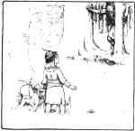

  
[Intangible Textual Heritage](../../../index)  [Legends and
Sagas](../../index)  [English Folklore](../index)  [Index](index) 
[Previous](meft25)  [Next](meft27) 

------------------------------------------------------------------------

# The Children in the Wood

 [  
Click to enlarge](img/024.jpg)

 

Now ponder well, you parents dear,  
These words which I shall write;  
A doleful story you shall hear,  
In time brought forth to light.  
A gentleman of good account,  
In Norfolk dwelt of late,  
Who did in honour far surmount  
Most men of his estate.

 

Sore sick he was and like to die,  
No help his life could save;  
His wife by him as sick did lie,  
And both possest one grave.  
No love between these two was lost,  
Each was to other kind;  
In love they lived, in love they died,  
And left two babes behind.

 

The one a fine and pretty boy  
Not passing three years old,  
The other a girl more young than he,  
And framed in beauty's mould.  
The father left his little son,  
As plainly did appear,  
When he to perfect age should come,  
Three hundred pounds a year;

 

And to his little daughter Jane  
Five hundred pounds in gold,  
To be paid down on marriage-day,  
Which might not be controlled.  
But if the children chanced to die  
Ere they to age should come,  
Their uncle should possess their wealth;  
For so the will did run.

 

'Now, brother,' said the dying man,  
'Look to my children dear;  
Be good unto my boy and girl,  
No friends else have they here;  
To God and you I recommend  
My children dear this day;  
But little while be sure we have  
Within this world to stay.

 

'You must be father and mother both,  
And uncle, all in one;  
God knows what will become of them  
When I am dead and gone.'  
With that bespake their mother dear;  
'O brother kind,' quoth she,  
'You are the man must bring our babes  
To wealth or misery.

 

'And if you keep them carefully,  
Then God will you reward;  
But if you otherwise should deal,  
God will your deeds regard.'  
With lips as cold as any stone,  
They kissed their children small:  
'God bless you both, my children dear!'  
With that the tears did fall.

 

These speeches then their brother spake  
To this sick couple there:  
'The keeping of your little ones,  
Sweet sister, do not fear;  
God never prosper me nor mine,  
Nor aught else that I have,  
If I do wrong your children dear  
When you are laid in grave!'

  
  
The parents being dead and gone,  
The children home he takes,  
And brings them straight unto his house  
Where much of them he makes.  
He had not kept these pretty babes  
A twelvemonth and a day,  
But, for their wealth, he did devise  
To make them both away.

 

He bargained with two ruffians strong,  
Which were of furious mood,  
That they should take these children young,  
And slay them in a wood.  
He told his wife an artful tale  
He would the children send  
To be brought up in London town  
With one that was his friend.

 

Away then went those pretty babes,  
Rejoicing at that tide,  
Rejoicing with a merry mind  
They should on cock-horse ride.  
They prate and prattle pleasantly,  
As they ride on the way,  
To those that should their butchers be  
And work their lives' decay:

 

So that the pretty speech they had  
Made Murder's heart relent;  
And they that undertook the deed  
Full sore now did repent.  
Yet one of them, more hard of heart,  
Did vow to do his charge,  
Because the wretch that hired him  
Had paid him very large.

 

The other won't agree thereto,  
So there they fall to strife;  
With one another they did fight  
About the children's life;  
And he that was of mildest mood  
Did slay the other there,  
Within an unfrequented wood;  
The babes did quake for fear!

 

He took the children by the hand,  
Tears standing in their eye,  
And bade them straightway follow him,  
And look they did not cry;  
And two long miles he led them on,  
While they for food complain:  
'Stay here,' quoth he, 'I'll bring you bread,  
When I come back again.'

 

These pretty babes, with hand in hand,  
Went wandering up and down;  
But never more could see the man  
Approaching from the town.  
Their pretty lips from blackberries  
Were all besmeared and dyed;  
And when they saw the darksome night,  
They sat them down and cried.

 

Thus wandered these poor innocents,  
Till death did end their grief;  
In one another's arms they died,  
As wanting due relief:  
No burial this pretty pair  
From any man receives,  
Till Robin Redbreast piously  
Did cover them with leaves.

 

And now the heavy wrath of God  
Upon their uncle fell;  
Yea, fearful fiends did haunt his house,  
His conscience felt an hell:  
His barns were fired, his goods consumed,  
His hands were barren made,  
His cattle died within the field,  
And nothing with him stayed.

 

And in a voyage to Portugal  
Two of his sons did die;  
And to conclude, himself was brought  
To want and misery:  
He pawned and mortgaged all his land  
Ere seven years came about.  
And now at last this wicked act  
Did by this means come out.

  
  
The fellow that did take in hand  
These children for to kill,  
Was for a robbery judged to die.  
Such was God's blessed will:  
Who did confess the very truth,  
As here hath been displayed:  
The uncle having died in jail,  
Where he for debt was laid.

You that executors be made,  
And overseers eke,  
Of children that be fatherless,  
And infants mild and meek,  
Take you example by this thing,  
And yield to each his right,  
Lest God with suchlike misery  
Your wicked minds requite.

------------------------------------------------------------------------

[Next: The Hobyahs](meft27)
