  
[Intangible Textual Heritage](../../../index)  [Legends and
Sagas](../../index)  [English Folklore](../index)  [Index](index) 
[Previous](meft26)  [Next](meft28) 

------------------------------------------------------------------------

# The Hobyahs

 

ONCE there was an old man and woman and a little girl, and they all
lived in a house made of hempstalks. Now the old man had a little dog
named Turpie and one night the Hobyahs came and said, 'Hobyah! Hobyah!
Hobyah! Tear down the hempstalks, eat up the old man and woman, and
carry off the little girl!' But little dog Turpie barked so that the

 

 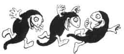

 

Hobyahs ran off; and the old man said, 'Little dog Turpie barks so that
I cannot sleep nor slumber, and if I live till

 

 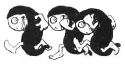

 

morning I will cut off his tail.' So in the morning the old man cut off
little dog Turpie's tail.

 

 

 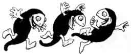

 

The next night the Hobyahs came again, and said, 'Hobyah! Hobyah!
Hobyah! Tear down the hempstalks, eat up the old man and woman, and
carry off the little girl!' But little dog Turpie barked so that the
Hobyahs ran off; and the old man said, 'Little dog Turpie

 

 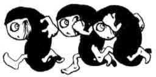

 

barks so that I cannot sleep nor slumber, and if I live till morning I
will cut off one of his legs.' So in the morning the old man cut off one
of little dog Turpie's legs.

 

The next night the Hobyahs came again, and said, 'Hobyah!

 

 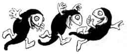

 

Hobyah! Hobyah! Tear down the hempstalks, eat up the old man and woman,
and carry off the little girl!' But little dog Turpie barked so that the
Hobyahs ran off; and the old man said, 'Little dog Turpie barks so that
I cannot sleep nor slumber, and if I live till morning I will cut off
another of his legs.' So in the morning the old man cut off another of
little dog Turpie's legs.

 

 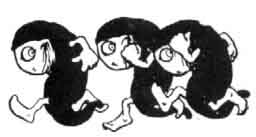

 

The next night the Hobyahs came again, and said 'Hobyah! Hobyah! Hobyah!
Tear down the hempstalks, eat up the old

 

 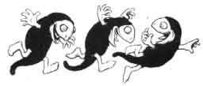

 

man and woman, and carry off the little girl!' But little dog Turpie
barked so that the Hobyahs ran off; and the old man said, 'Little dog
Turpie barks so that I cannot sleep nor slumber, and if I live till
morning I will cut off another of his legs.' So in the morning the old
man cut off another of little dog Turpie's legs.

 

 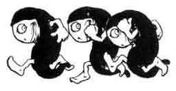

 

The next night the Hobyahs came again, and said 'Hobyah! Hobyah! Hobyah!
Tear down the hempstalks, eat up the old

 

 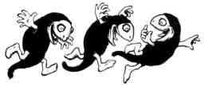

 

man and woman, and carry off the little girl!' But little dog Turpie
barked so that the Hobyahs ran off; and the old man said, 'Little dog
Turpie barks so that I cannot sleep nor slumber, and if I live till
morning I will cut off another of his legs.' So in the morning the old
man cut off another of little dog Turpie's legs.

 

 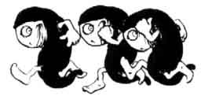

 

The next night the Hobyahs came again, and said 'Hobyah! Hobyah! Hobyah!
Tear down the hempstalks, eat up the old

 

 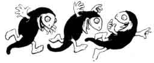

 

man and woman, and carry off the little girl!' But little dog Turpie
barked so that the Hobyahs ran off; and the old man said, 'Little dog
Turpie barks so that I cannot sleep nor slumber, and if I live till
morning I will cut off little dog Turpie's head.' So in the morning the
old man cut off little dog Turpie' s head.

 

 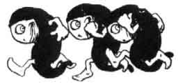

 

The next night the Hobyahs came again, and said 'Hobyah!

 

 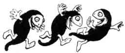

 

Hobyah! Hobyah! Tear down the hempstalks, eat up the old man and woman,
and carry off the little girl!' And when the Hobyahs found that little
do Turpie's head was off they tore down hempstalks, ate up the woman,
and carried the a bag.

 

 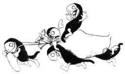

 

And when the Hobyahs came to their home they hung up the bag with the
little girl in it, and every Hobyah knocked on the top of the bag and
said, 'Look me! look me!' And then they went to sleep until the next
night, for the Hobyahs slept in the daytime.

  
 

 

The little girl cried a great deal, and a man with a big dog came that
way and heard her crying. When he asked her how she came there and she
told him, he put the dog in the bag and took the little girl to his
home.

 

 

 

The next night the Hobyahs took down the bag and knocked at the top of
it, and said 'Look me, look me!' and when they opened the bag the big
dog jumped out and ate them all up; so there are no Hobyahs now.

 

 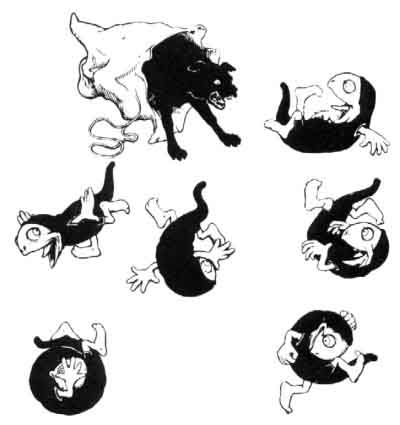

 

 

------------------------------------------------------------------------

[Next: A Pottle o' Brains](meft28)
