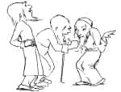
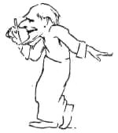

  
[Intangible Textual Heritage](../../../index)  [Legends and
Sagas](../../index)  [English Folklore](../index)  [Index](index) 
[Previous](meft43)  [Next](meft45) 

------------------------------------------------------------------------

# The Wise men of Gotham

 [  
Click to enlarge](img/056.jpg)

 

Of Buying of Sheep

 

THERE were two men of Gotham, and one of them was going to market to
Nottingham to buy sheep, and the other came from the market, and they
both met together upon Nottingham bridge.

'Where are you going?' said the one who came from Nottingham.

'Marry,' said he that was going to Nottingham, 'I am going to buy
sheep.'

'Buy sheep?' said the other. 'And which way will you bring them home?'

'Marry,' said the other, '1 will bring them over this bridge.'

'By Robin Hood,' said he that came from Nottingham, 'but thou shalt
not.'

'By Maid Marion,' said he that was going thither, 'but I will.'

'You will not,' said the one.

'I will.'

Then they beat their staves against the ground one against the other, as
if there had been a hundred sheep between them.

'Hold in,' said one; 'beware lest my sheep leap over the bridge.'

'I care not,' said the other; 'they shall not come this way.'

'But they shall,' said the other.

Then the other said: 'If that thou make much to do, I will put my
fingers in thy mouth.'

'Will you?' said the other.

Now, as they were at their contention, another man of Gotham came from
the market with a sack of meal upon a horse, and seeing and hearing his
neighbours at strife about sheep, though there were none between them,
said:

'Ah, fools! will you ever learn wisdom? Help me, and lay my sack upon my
shoulders.'

They did so, and he went to the side of the bridge, unloosened the mouth
of the sack, and shook all his meal out into the river.

'Now, neighbours,' he said, 'how much meal is there in my sack?'

'Marry,' said they, 'there is none at all.'

'Now, by my faith,' said he, 'even as much wit as is in your two heads
to stir up strife about a thing you have not.'

Which was the wisest of these three persons, judge yourself.

 

Of Hedging a Cuckoo

 [  
Click to enlarge](img/057.jpg)

Once upon a time the men of Gotham would have kept the Cuckoo so that
she might sing all the year, and in the midst of their town they made a
hedge round in compass and they got a Cuckoo, and put her into it, and
said, 'Sing there all through the year, or thou shalt have neither meat
nor water.' The Cuckoo, as soon as she perceived herself within the
hedge, flew away. 'A vengeance on her!' said they. 'We did not make our
hedge high enough.'

 

 

Of Sending Cheeses

 

There was a man of Gotham who went to the market at Nottingham to sell
cheese, and as he was going down the hill to Nottingham bridge, one of
his cheeses fell out of his wallet and rolled down the hill. 'Ah,
gaffer,' said the fellow, 'can you run to market alone? I will send one
after another after you.' Then he laid down his wallet and took out the
cheeses, and rolled them down the hill. Some went into one bush; and
some went into another.

'I charge you all to meet me near the marketplace'; and when the fellow
came to the market to meet his cheeses, he stayed there till the market
was nearly done: Then he went about to inquire of his friends and
neighbours, and other men, if they did see his cheeses come to the
market.

'Who should bring them?' said one of the market men.

'Marry, themselves,' said the fellow; 'they know the way well enough.'

He said, 'A vengeance on them all. I did fear, to see them run so fast,
that they would run beyond the market. I am now fully persuaded that
they must be now almost at York.'

Whereupon he forthwith hired a horse to ride to York, to seek his
cheeses where they were not, but to this day no man can tell him of his
cheeses.

Of Drowning Eels

 

When Good Friday came, the men of Gotham cast their heads together what
to do with their white herrings, their red herrings, their sprats, and
other salt fish. One consulted with the other, and agreed that such fish
should be cast into their pond (which was in the middle of the town),
that they might breed against the next year, and every man that had salt
fish left cast them into the pool.

'I have many white herrings,' said one.

'I have many sprats,' said another.

'I have many red herrings,' said the other.

'I have much salt fish. Let all go into the pond or pool, and we shall
fare like lords next year.'

At the beginning of next year following the men drew near the pond to
have their fish, and there was nothing but a great eel. 'Ah,' said they
all, 'a mischief on this eel, for he has eaten up all our fish.'

'What shall we do to him?' said one to the others.

'Kill him,' said one.

'Chop him into pieces,' said another.

'Not so,' said another; 'let us drown him.'

'Be it so,' said all. And they went to another pond, and cast the eel
into the pond. 'Lie there and shift for yourself, for no help thou shalt
have from us'; and they left the eel to drown.

 

Of Sending Rent

 [  
Click to enlarge](img/058.jpg)

Once on a time the men of Gotham had forgotten to pay their landlord.
One said to the other, 'Tomorrow is our pay-day, and what shall we find
to send our money to our landlord?'

The one said, 'This day I have caught a hare, and he shall carry it, for
he is light of foot.'

'Be it so,' said all; 'he shall have a letter and a purse to put our
money in, and we shall direct him the right way.' So when the letters
were written and the money put in a purse, they tied it round the hare's
neck, saying, 'First you go to Lancaster, then thou must go to
Loughborough, and Newarke is our landlord, and commend us to him and
there is his dues.'

The hare, as soon as he was out of their hands, ran on along the country
way. Some cried, 'Thou must go to Lancaster first.'

'Let the hare alone,' said another; 'he can tell a nearer way than the
best of us all. Let him go.'

Another said, 'It is a subtle hare, let her alone; she will not keep the
highway for fear of dogs.'

 

Of Counting

 

On a certain time there were twelve men of Gotham who went fishing, and
some went into the water and some on dry ground; and, as they were
coming back, one of them said, 'We have ventured much this day wading; I
pray God that none of us that did come from home be drowned.'

'Marry,' said one, 'let us see about that. Twelve of us came out,' and
every man did count eleven, and the twelfth man did never count himself.

'Alas!' said one to another, 'one of us is drowned.' They went back to
the brook where they had been fishing, and looked up and down for him
that was drowned, and made great lamentation. A courtier came riding by,
and he did ask what they were seeking, and why they were so sorrowful.
'Oh,' said they, 'this day we came to fish in this brook, and there were
twelve of us, and one is drowned.'

'Why,' said the courtier, 'count me how many of you there be,' and one
counted eleven and did not count himself. 'Well,' said the courtier,
'what will you give me if I find the twelfth man?'

'Sir,' said they, 'all the money we have.'

'Give me the money,' said the courtier; and he began with the first, and
gave him a whack over the shoulders that he groaned, and said, 'There is
one,' and he served all of them that they groaned; but when he came to
the last he gave him a good blow, saying, 'Here is the twelfth man.'

'God bless you on your heart,' said all the company; 'you have found our
neighbour.'

------------------------------------------------------------------------

[Next: Princess of Canterbury](meft45)
