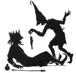

  
[Intangible Textual Heritage](../../../index)  [Legends and
Sagas](../../index)  [English Folklore](../index)  [Index](index) 
[Previous](meft44)  [Next](meft46) 

------------------------------------------------------------------------

# Princess of Canterbury

 [  
Click to enlarge](img/059.jpg)

THERE lived formerly in the County of Cumberland a nobleman who had
three sons, two of whom were comely and clever youths, but the other a
natural fool, named Jack, who was generally engaged with the sheep: he
was dressed in a parti-coloured coat, and a steeple-crowned hat with a
tassel, as became his condition. Now the King of Canterbury had a
beautiful daughter, who was distinguished by her great ingenuity and
wit, and he issued a decree that whoever should answer three questions
put to him by the princess should have her in marriage, and be heir to
the crown at his decease. Shortly after this decree was published, news
of it reached the ears of the nobleman's sons, and the two clever ones
determined to have a trial, but they were sadly at a loss to prevent
their idiot brother from going with them. They could not, by any means,
get rid of him, and were compelled at length to let Jack accompany them.
They had not gone far, before Jack shrieked with laughter, saying 'I've
found an egg.' 'Put it in your pocket,' said the brothers. A little
while afterwards, he burst out into another fit of laughter on finding a
crooked hazel stick, which he also put in his pocket; and a third time
he again laughed extravagantly because he found a nut. That also was put
with his other treasures.

When they arrived at the palace, they were immediately admitted on
mentioning the nature of their business, and were ushered into a room
where the princess and her suite were sitting. Jack, who never stood on
ceremony, bawled out, 'What a troop of fair ladies we've got here!'

'Yes,' said the princess, 'we are fair ladies, for we carry fire in our
bosoms.'

'Do you?' said Jack. 'Then roast me an egg,' pulling out the egg from
his pocket.

'How will you get it out again?' said the princess.

'With a crooked stick,' replied Jack, producing the hazel.

'Where did that come from?' said the princess.

'From a nut,' answered Jack, pulling out the nut from his pocket. 'I've
answered the three questions, and now I'll have the lady.' 'No, no,'
said the king, 'not so fast. You have still an ordeal to go through. You
must come here in a week's time and watch for one whole night with the
princess, my daughter. If you can manage to keep awake the whole night
long you shall marry her next day.'

'But if I can't?' said Jack.

'Then off goes your head,' said the king. 'But you need not try unless
you like.'

Well, Jack went back home for a week, and thought over whether he should
try to win the princess. At last he made up his mind. 'Well,' said Jack,
'I'll try my vorton; zo now vor the king's daughter, or a headless
shepherd!'

And taking his bottle and bag, he trudged to the court. In his way
thither, he was obliged to cross a river, and pulling off his shoes and
stockings, while he was passing over he observed several pretty fish
bobbing against his feet; so he caught some and put them into his
pocket. When he reached the palace he knocked at the gate loudly with
his crook, and having mentioned the object of his visit, he was
immediately conducted to the hail where the king's daughter sat ready
prepared to see her lovers. He was placed in a luxurious chair, and rich
wines and spices were set before him, and all sorts of delicate meats.
Jack, unused to such fare, ate and drank plentifully, so that he was
nearly dozing before midnight.

'Oh, shepherd,' said the lady, 'I have caught you napping!'

'Noa, sweet ally, I was busy a-feeshing.'

'A-fishing,' said the princess in the utmost astonishment: 'Nay,
shepherd, there is no fish-pond in the hail.'

'No matter vor that, I have been fishing in my pocket, and have just
caught one.'

'Oh me!' said she, 'let me see it.'

The shepherd slyly drew the fish out of his pocket and pretending to
have caught it, showed it her, and she declared it was the finest she
ever saw.

About half an hour afterwards, she said, 'Shepherd, do you think you
could get me one more?'

He replied, 'Mayhap I may, when I have baited my hook'; and after a
little while he brought out another, which was finer than the first, and
the princess was so delighted that she gave him leave to go to sleep,
and promised to excuse him to her father.

In the morning the princess told the king, to his great astonishment,
that Jack must not be beheaded, for he had been fishing in the hall all
night; but when he heard how Jack had caught such beautiful fish out of
his pocket, he asked him to catch one in his own. Jack readily undertook
the task, and bidding the king lie down, he pretended to fish in his
pocket, having another fish concealed ready in his hand, and giving him
a sly prick with a needle, he held up the fish, and showed it to the
king.

His majesty did not much relish the operation, but he assented to the
marvel of it, and the princess and Jack were united the same day, and
lived for many years in happiness and prosperity.

------------------------------------------------------------------------

[Next: Introductory Notes](meft46)
