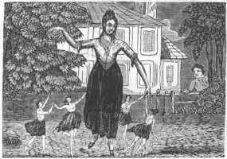

  
[Intangible Textual Heritage](../../../index.md)  [Sagas and
Legends](../../index)  [English Folklore](../index.md) 

------------------------------------------------------------------------

# Popular Romances of the West of England

## collected and edited by Robert Hunt

#### \[1903, 3rd edition\]

------------------------------------------------------------------------

[Title Page](prwe000.md)  
[Preface to the Third Edition](prwe001.md)  
[Introduction](prwe002.md)  

### VOLUME ONE

### The Giants

[The Age of the Giants](prwe003.md)  
[Corineus and Gogmagog](prwe004.md)  
[The Giants of the Mount](prwe005.md)  
[The Key of the Giant's Castle](prwe006.md)  
[The Rival Giants](prwe007.md)  
[The Giants of Trencrom, or Trecrobben](prwe008.md)  
[The Giants at Play](prwe009.md)  
[Holibun of the Cairn](prwe010.md)  
[The Giant of Nancledry](prwe011.md)  
[Trebiggan the Giant](prwe012.md)  
[The Lord of Pengerswick and the Giant of St. Michael's
Mount](prwe013.md)  
[The Giant of St. Michael's Mount loses his wife](prwe014.md)  
[Tom and the Giant Blunderbuss or, The Wheel and Exe Fight](prwe015.md)  
[Tom the Giant, his wife Jane and Jack the Tinkeard](prwe016.md)  
[How Tom and the Tinkeard found the Tin, and how it led to Morva
Fair](prwe017.md)  
[The Giant of Morva](prwe018.md)  
[The Giant Bolster](prwe019.md)  
[The Hack and Cast](prwe020.md)  
[The Giant Wrath, or Ralph](prwe021.md)  
[Ordulph the Giant](prwe022.md)  

### The Fairies

[The Elfin Creed of Cornwall](prwe023.md)  
[Nursing a Fairy](prwe024.md)  
[Changelings](prwe025.md)  
[The Lost Child](prwe026.md)  
[A Native Pigsey Story](prwe027.md)  
[The Night-Riders](prwe028.md)  
[The Fairy Tools, or Barker's Knee](prwe029.md)  
[The Piskies in the Cellar](prwe030.md)  
[The Spriggans of Trencrom Hill](prwe031.md)  
[The Fairy Miners - the Knockers](prwe032.md)  
[The Spriggan's Child](prwe033.md)  
[The Piskies' Changeling](prwe034.md)  
[The Pixies of Dartmoor](prwe035.md)  
[The Fairy Fair in Germoe](prwe036.md)  
[St Margery and the Piskies](prwe037.md)  
[The Fairy Revels on the "Gump" St Just](prwe038.md)  
[The Fairy Funeral](prwe039.md)  
[The Fairy Revel](prwe040.md)  
[Betty Stogs and Jan the Mounster](prwe041.md)  
[The Four-leaved Clover](prwe042.md)  
[The Fairy Ointment](prwe043.md)  
[How Joan Lost the Sight of her Eye](prwe044.md)  
[The Old Woman who turned her Shift](prwe045.md)  
[The Fairy Widower](prwe046.md)  
[The Small People's Gardens](prwe047.md)  
[St Levan Fairies](prwe048.md)  
[The Adventures of Cherry of Zennor](prwe049.md)  
[Anne Jeffries and the Fairies](prwe050.md)  
[The Piksie Threshers](prwe051.md)  
[The Muryan's Bank](prwe052.md)  

### Romances of Tregeagle

[The Demon Tregeagle](prwe053.md)  
[Jahn Tergagle the Steward](prwe054.md)  
[Dosmery Pool](prwe055.md)  
[The Wish Hounds](prwe056.md)  
[Chaney's Hounds](prwe057.md)  

### Romances of the Mermaids

[Morva or Morveth](prwe058.md)  
[Merrymaids and Merrymen](prwe059.md)  
[The Mermaid of Padstow](prwe060.md)  
[The Mermaid of Rock](prwe061.md)  
[The Mermaid of Seaton](prwe062.md)  
[The Old Man of Cury](prwe063.md)  
[The Mermaid's Vengence](prwe064.md)  

### Romances of the Rocks

[Cromlech and Druid Stones](prwe065.md)  
[The Logan or Loging Rock](prwe066.md)  
[Mincamber, Main-Amber or Ambrose's Stone](prwe067.md)  
[Zennor Coits](prwe068.md)  
[The Men-an-Tol](prwe069.md)  
[The Crick Stone in Morva](prwe070.md)  
[The Dancing Stones, the Hurlers &c](prwe071.md)  
[The Nine Maids, or Virgin Sisters](prwe072.md)  
[The Twelve-o'-clock Stone](prwe073.md)  
[The Men-Scryfa](prwe074.md)  
[Table-Men - The Saxon's Kings Visit to the Land's End](prwe075.md)  
[Merlyn's Prophecies](prwe076.md)  
[The Armed Knight](prwe077.md)  
[The Irish Lady](prwe078.md)  
[The Devil's Doorway](prwe079.md)  
[Piper's Hole, Scilly](prwe080.md)  
[The Devil's Coit &c](prwe081.md)  
[King Arthur's Stone](prwe082.md)  
[The Cock-Crow Stone](prwe083.md)  

### Romances of lost Cities

[Lost Lands](prwe084.md)  
[The Tradition of Lyonesse or Lethowsow](prwe085.md)  
[Cudden Point and the Silver Table](prwe086.md)  
[The Padstow "Hobby Horse"](prwe087.md)  
[St Michsel's Mount - The White Rock in the Wood](prwe088.md)  
[Gwavas Lake](prwe089.md)  
[The City of Langarrow or Langona](prwe090.md)  
[The Sands at Lelant and Phillack](prwe091.md)  
["The island" St Ives](prwe092.md)  
[The Chapel Rock, Perran-Porth](prwe093.md)  

### Romances of Fire Worship

[Fire Worship](prwe094.md)  
[Baal Fires](prwe095.md)  
[The Garrack Zans, or Holy Rock](prwe096.md)  
[Fire Ordeal for the Cure of Disease](prwe097.md)  
[Burning Animals Alive](prwe098.md)  

### Demons and Spectres

[The Hooting Cairn](prwe099.md)  
[Jago's Demon](prwe100.md)  
[Peter the Devil](prwe101.md)  
[Dando and his Dogs](prwe102.md)  
[The Devil and his Dandy-Dogs](prwe103.md)  
[The Spectral Coach](prwe104.md)  
[Sir Francis Drake and his Demon](prwe105.md)  
[The Parson and his Clerk](prwe106.md)  
[The Haunted Widower](prwe107.md)  
[The Spectre Bridegroom](prwe108.md)  
[Duffy and the Devil](prwe109.md)  
[The Lovers of Porthangwartha](prwe110.md)  
[The Ghost of Rosewarne](prwe111.md)  
[The Suicide's Spearman](prwe112.md)  
[The Suicide's Ghost](prwe113.md)  
[The "Ha-af" a Face](prwe114.md)  
[The Warning](prwe115.md)  
[Laying a Ghost](prwe116.md)  
[A Flying Spirit](prwe117.md)  
[The Execution and Wedding](prwe118.md)  
[The Lugger of Croft Pasco Pool](prwe119.md)  

### VOLUME TWO

### Legends of the Saints

[Legends of the Saints](prwe120.md)  
[The Crowza Stones](prwe121.md)  
[The Longstone](prwe122.md)  
[St Sennen and St Just](prwe123.md)  
[The Saint and Johana](prwe124.md)  
[The Saint's Path](prwe125.md)  
[The St Leven Stone](prwe126.md)  
[The Two Breams](prwe127.md)  
[St Keyne](prwe128.md)  
[St Dennis's Blood](prwe129.md)  
[St Kea's Boat](prwe130.md)  
[St German's Well](prwe131.md)  
[How St Piran reached Cornwall](prwe132.md)  
[St Peran, the Miner's Saint](prwe133.md)  
[The Discovery of Tin](prwe134.md)  
[St Neot, the Pigmy](prwe135.md)  
[St Neot and the Fox](prwe136.md)  
[St Neot and the Doe](prwe137.md)  
[St Neot and the Thieves](prwe138.md)  
[St Neot and the Fishes](prwe139.md)  
[Probus and Grace](prwe140.md)  
[St Nectan's Kieve and the Lonely Sisters](prwe141.md)  
[Theodore, King of Cornwall](prwe142.md)  

### Holy Wells

[Well Worship](prwe143.md)  
[The Well of St Constantine](prwe144.md)  
[The Well of St Ludgvan](prwe145.md)  
[Gulval Well](prwe146.md)  
[The Well of St Keyne](prwe147.md)  
[Maddern or Madron Well](prwe148.md)  
[The Well of Altar-Nun](prwe149.md)  
[St Gundred's Well at Roach Rock](prwe150.md)  
[St Cuthbert's or Cubert's Well](prwe151.md)  
[Rickety Children](prwe152.md)  
[Chapell Uny](prwe153.md)  
[Perran Well](prwe154.md)  
[Redruth Well](prwe155.md)  
[Holy Well at Little Conan](prwe156.md)  
[The Preservation of Holy Wells](prwe157.md)  

### Romances of Arthur

[Arthur Legends](prwe158.md)  
[The Battle of Vellan-druchan](prwe159.md)  
[Arthur at the Land's End](prwe160.md)  
[Traditions of the Danes in Cornwall](prwe161.md)  
[King Arthur in the Form of a Chough](prwe162.md)  
[The Cornish Chough](prwe163.md)  
[Slaughter Bridge](prwe164.md)  
[Camelford and King Arthur](prwe165.md)  
[Dameliock Castle](prwe166.md)  
[Carlian in Kea](prwe167.md)  

### Romances of Witches, Etc.

[The "Cunning Man"](prwe168.md)  
[Notes on Witchcraft](prwe169.md)  
[Ill-wishing](prwe170.md)  
[The "Peller"](prwe171.md)  
[Bewitched Cattle](prwe172.md)  
[How to become a Witch](prwe173.md)  
[Cornish Sorcerors](prwe174.md)  
[How Pengerswick became a Sorcerer](prwe175.md)  
[The Lord of Pengerswick an Enchanter](prwe176.md)  
[The Witch of Fraddam and Pengerswick](prwe177.md)  
[Trewa, the Home of Witches](prwe178.md)  
[Kenidzhak Witch](prwe179.md)  
[The Witches of the Logan Stone](prwe180.md)  
[Madgy Figgy's Chair](prwe181.md)  
[Old Mage Figgy and the Pig](prwe182.md)  
[Madame Noy and Old Joan](prwe183.md)  
[The Witch of Treva](prwe184.md)  
[How Mr Lenine gave up Courting](prwe185.md)  
[The Witch and the Toad](prwe186.md)  
[The Sailor Wizard](prwe187.md)  

### Traditions of Tinners

[Traditions of Tinners](prwe188.md)  
[The Tinner of Chryannor](prwe189.md)  
[Who are the Knockers ?](prwe190.md)  
[Miner's Superstitions](prwe191.md)  
[Christmas-Eve in the Mines](prwe192.md)  
[Warnings and "Tokens"](prwe193.md)  
[The Ghost on Horseback](prwe194.md)  
[The Black Dogs](prwe195.md)  
[Pitmen's Omens and Goblins](prwe196.md)  
[The Dead Hand](prwe197.md)  
[Dorcas, the Spirit of Polbreen Mine](prwe198.md)  
[Hingston Downs](prwe199.md)  

### Romances of Fishermen and Sailors

[The Pilot's Ghost Story](prwe200.md)  
[The Phantom Lights](prwe201.md)  
[Jack Harry's Lights](prwe202.md)  
[The Pirate Wrecker and the Death Ship](prwe203.md)  
[The Spectre Ship of Porthcuno](prwe204.md)  
[The Lady with the Lantern](prwe205.md)  
[The Drowned "Hailing their Names"](prwe206.md)  
[The Voice from the Sea](prwe207.md)  
[The Smuggler's Token](prwe208.md)  
[The Hooper of Sennen Cove](prwe209.md)  
[How to Eat Pilchards](prwe210.md)  
[Pilchards Crying for More](prwe211.md)  
[The Pressing-Stones](prwe212.md)  
[Whipping the Hake](prwe213.md)  

### Death Tokens and Superstitions

[The Death Token of the Vingoes](prwe214.md)  
[The Death Fetch of William Rufus](prwe215.md)  
[Sir John Arundell](prwe216.md)  
[Phantoms of the Dying](prwe217.md)  
[The White Hare](prwe218.md)  
[The Hand of a Suicide](prwe219.md)  
[The North Side of a Church](prwe220.md)  
[Popular Superstitions](prwe221.md)  

### Customs of Ancient Days

[Sanding the Step on New Year's Day](prwe222.md)  
[May-Day](prwe223.md)  
[Shrove Tuesday at St Ives](prwe224.md)  
["The Furry, " Helstone](prwe225.md)  
[Midsummer Superstitious Customs](prwe226.md)  
[Crying the Neck](prwe227.md)  
[Drinking the Apple-Trees on Twelfth-Night](prwe228.md)  
[Allhallows-Eve at St Ives](prwe229.md)  
[The Twelfth Cake](prwe230.md)  
[Oxen Pray on Christmas-Eve](prwe231.md)  
["St George" - The Christmas Plays](prwe232.md)  
[Geese-Dancing - Plough Monday](prwe233.md)  
[Christmas at St Ives](prwe234.md)  
[Lady Lovell's Courtship](prwe235.md)  
[The Game of Hurling](prwe236.md)  

### Sham Mayors

[The Mayor of Mylor](prwe237.md)  
[The Mayor of St Germans](prwe238.md)  
[The Mayor of Halgaver Moor](prwe239.md)  
[The Faction Fight at Cury Great Tree](prwe240.md)  
[Towednack Cuckoo Feast](prwe241.md)  
[The Duke of Restormel](prwe242.md)  

### Popular Superstitions

[Charming and Prophetic Power](prwe243.md)  
[Fortune Telling, Charms etc.](prwe244.md)  
[The Zennor Charmers](prwe245.md)  
[J - H - The Conjurer of St Columb](prwe246.md)  
[Cures for Warts](prwe247.md)  
[A Cure for Paralysis](prwe248.md)  
[A Cure for Rheumatism](prwe249.md)  
[Sundry Charms](prwe250.md)  
[The Club Moss](prwe251.md)  
[Moon Superstitions](prwe252.md)  
[Cures for Whooping Cough](prwe253.md)  
[Cure of Toothache](prwe254.md)  
[The Convalescent's Walk](prwe255.md)  
[Adders and the Milpreve](prwe256.md)  
[Snakes Avoid the Ash-Tree](prwe257.md)  
[To Charm a Snake](prwe258.md)  
[The Ash-Tree](prwe259.md)  
[Rhyme on the Even Ash](prwe260.md)  
[A Test of Innocency](prwe261.md)  
[The Bonfire Test](prwe262.md)  
[Lights Seen by the Converted](prwe263.md)  
[The Migratory Birds](prwe264.md)  
[Shooting Stars](prwe265.md)  
[The Sun Never Shines on the Perjured](prwe266.md)  
[Characteristic](prwe267.md)  
[The Mutton Feast](prwe268.md)  
[The Floating Grindstone](prwe269.md)  
[Celts- Flint Arrow-heads, etc.](prwe270.md)  
[The Horns on the Church Tower](prwe271.md)  
[Tea-Stalks and Smut](prwe272.md)  
[An Old Cornish Rhyme](prwe273.md)  
[To Choose a Wife](prwe274.md)  
[The Robin and the Wren](prwe275.md)  
[To Secure Good Luck for a Child](prwe276.md)  
[Innocency](prwe277.md)  
[Rain at Bridal or Burial](prwe278.md)  
[Crowing Hens etc.](prwe279.md)  
[The New Moon](prwe280.md)  
[Looking-Glasses](prwe281.md)  
[The Magpie](prwe282.md)  
[The Month of May Unlucky](prwe283.md)  
[On the Births of Children](prwe284.md)  
[On Washing Linen](prwe285.md)  
[Itching Ears](prwe286.md)  
[The Spark on the Candle](prwe287.md)  
[The Blue Vein](prwe288.md)  
[The Croaking of the Raven](prwe289.md)  
[Whistling](prwe290.md)  
[Meeting on the Stairs](prwe291.md)  
[Treading on Graves](prwe292.md)  
[A Loose Garter](prwe293.md)  
[To Cure the Hiccough](prwe294.md)  
[The Sleeping Foot](prwe295.md)  
[The Horse-Shoe](prwe296.md)  
[The Black Cat's Tail](prwe297.md)  
[Unlucky Things](prwe298.md)  
[The Limp Corpse](prwe299.md)  
["By Hook or by Crook"](prwe300.md)  
[Weather Signs](prwe301.md)  
[Weather at Liskeard](prwe302.md)  
[The First Butterfly](prwe303.md)  
[Peculiar Words and Phrases](prwe304.md)  

### Miscellaneous Stories

[The Bells of Forrabury Church](prwe305.md)  
[The Tower of Minster Church](prwe306.md)  
[Temple Moors](prwe307.md)  
[The Legend of Tamara](prwe308.md)  
[The Church and the Barn](prwe309.md)  
[The Penryn Tragedy](prwe310.md)  
[Goldsithney Fair and the Glove](prwe311.md)  
[The Harlyn Pie](prwe312.md)  
[Packs of Wool The Foundation of the Bridge of Wadebridge](prwe313.md)  
[The Last Wolf in England](prwe314.md)  
[Churches Built in Performance of Vows](prwe315.md)  
[Bolait, The Field of Blood](prwe316.md)  
[Woeful Moor, and Bodrigan's Leap](prwe317.md)  
[Pengerswick Castle](prwe318.md)  
[The Clerks of Cornwall](prwe319.md)  
[A Fairy Caught](prwe320.md)  
[The Lizard People](prwe321.md)  
[Prussia Cove and Smugglers' Holes](prwe322.md)  
[Cornish Teeny-Tiny](prwe323.md)  
[The Spaniard at Penryn](prwe324.md)  
[Boyer, Mayor of Bodmin](prwe325.md)  
[Thomasine, Bonaventure](prwe326.md)  
[The Last of the Killigrews](prwe327.md)  
[Saint Gerennius](prwe328.md)  
[Cornish Dialogue](prwe329.md)  

### Appendix

[Bellerian](prwe330.md)  
[The Poem of the Wrestling](prwe331.md)  
[Shara and Sheela](prwe332.md)  
[The Hag's Bed near Fermoy](prwe333.md)  
[The Giant of Nancledry; and Trebiggan the Giant](prwe334.md)  
[Geese Dancing - Guise Dancing - Guizards](prwe335.md)  
[Wayland Smith](prwe336.md)  
[The Wonderful Cobbler of Wellington](prwe337.md)  
[H](prwe338.md)  
[St Piran's-Day and Picrous-Day](prwe339.md)  
[Moses Pitt's Letter Respecting Anne Jeffries](prwe340.md)  
[The Bargest, or Spectre Hound](prwe341.md)  
[The Mermaid's Revenge](prwe342.md)  
[Rock Masses, Celtic](prwe343.md)  
[Ambrosiae Petrae](prwe344.md)  
[Padstow Hobby Horse](prwe345.md)  
[The City of Langarrow or Langona - Perran Churches](prwe346.md)  
[St Piran - Perran Zabuloe](prwe347.md)  
[St Chiwidden](prwe348.md)  
[The Discoverer of Tin](prwe349.md)  
[St Neot](prwe350.md)  
[The Sisters of Glen-Neot](prwe351.md)  
[Millington of Pengerswick](prwe352.md)  
[Pengerswick](prwe353.md)  
[Saracen](prwe354.md)  
[The Tinner of Chyannor](prwe355.md)  
[Merry Sean Lads](prwe356.md)  
[The North Side of a Church](prwe357.md)  
[Peculiar Words and Phrases](prwe358.md)  
[The Harlyn Pie](prwe359.md)  
