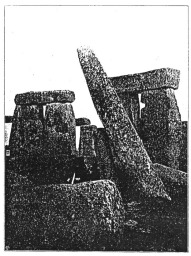

  
[Intangible Textual Heritage](../../../index)  [Legends and
Sagas](../../index)  [England](../index) 

------------------------------------------------------------------------

<table width="75%">
<colgroup>
<col style="width: 50%" />
<col style="width: 50%" />
</colgroup>
<tbody>
<tr class="odd">
<td width="50%" data-valign="TOP"></td>
<td width="50%" data-valign="CENTER"><h1 id="stonehenge-and-other-british-stone-monuments-astronomically-considered" data-align="CENTER">Stonehenge and Other British Stone Monuments Astronomically Considered</h1>
<h2 id="by-norman-lockyer" data-align="CENTER">by Norman Lockyer</h2>
<h4 id="section" data-align="CENTER">[1909]</h4></td>
</tr>
</tbody>
</table>

------------------------------------------------------------------------

[Contents](#contents)    [Start Reading](sac00)

------------------------------------------------------------------------

After centuries of speculation the origin, purpose, and construction of
Stonehenge is still a mystery. Out of the hundreds of books on the
subject, a few stand out. Lockyer's careful survey of the monument and
other Northern European megaliths is one of these. Lockyer, who had
spotless academic credentials, raised some of the themes which would
dominate mainstream theories of Stonehenge during the 20th century,
particularly his focus on archaeo-astronomy. Lockyer's primary
hypothesis, that Stonehenge and other megalithic constructions were
ancient observatories, is still considered plausible. He also noted the
vast alignments of sites which covered the landscape, both in Britain
and in northern France, anticipating [Afred Watkins'](../ebt/index)
discovery of ley lines by over a decade.

On the other hand, his conclusion that Stonehenge was constructed by
immigrants from the Near East was, even then, controversial. The use of
large stones to construct monuments was global in nature over a long
period of history. Lockyer rolls out the well-known folklore evidence
for Celtic tree, well, and stone worship, which had parallels in ancient
Near Eastern paganism. However, the people who constructed Stonehenge
were pre-Celtic, and their religious beliefs are still a matter for
speculation. This isn't to say that his hypothesis is implausible, just
that there is no concrete evidence to support it.

Production notes: this text was scanned from a print-on-demand edition
of this book, due to the unavailability of an original. For this reason,
due to speckling, the OCR stage introduced a great deal of spurious
punctuation which had to be edited out, and some problems of this nature
may still remain, even though due care was taken in proofing. In
addition, the scanned illustrations are not of the highest quality.
Hopefully this will be remedied at some point--J.B. Hare.

------------------------------------------------------------------------

 [Title Page](sac00)  
[Preface](sac01)  
[Contents](sac02)  
[List of Illustrations](sac03)  
[Chapter I. Introductory](sac04)  
[Chapter II. The Astronomical Divisions of the Year](sac05)  
[Chapter III. The Agricultural Divisions of the Year](sac06)  
[Chapter IV. The Various New-Year Days](sac07)  
[Chapter V. Conditions and Traditions at Stonehenge](sac08)  
[Chapter VI. General Architecture of Stonehenge](sac09)  
[Chapter VII. Astronomical Observations at Stonehenge in 1901](sac10)  
[Chapter VIII. Archeological Observations at Stonehenge, 1901](sac11)  
[Chapter IX. Was There an Earlier Circle?](sac12)  
[Chapter X. The May and June Worships in Brittany](sac13)  
[Chapter XI. Astronomical Hints For Archæologists](sac14)  
[Chapter XII. Astronomical Hints for Archæologists—Continued](sac15)  
[Chapter XIII. Stenness](sac16)  
[Chapter XIV. The Hurlers](sac17)  
[Chapter XV. The Dartmoor Avenues](sac18)  
[Chapter XVI. The Dartmoor Avenues (continued)](sac19)  
[Chapter XVII. Stanton Drew](sac20)  
[Chapter XVIII. Folklore and Tradition](sac21)  
[Chapter XIX. Sacred Fires](sac22)  
[Chapter XX. Sacred Trees](sac23)  
[Chapter XXI. Holy Wells And Streams](sac24)  
[Chapter XXII. Where Did the British Worship Originate?](sac25)  
[Chapter XXIII. The Similarity of the Semitic and British
Worships](sac26)  
[Chapter XXIV. The May-Year in South-West Cornwall](sac27)  
[Chapter XXV. The Merry Maidens Circle](sac28)  
[Chapter XXVI. The Tregaseal Circles](sac29)  
[Chapter XXVII. Some Other Cornish Monuments](sac30)  
[Chapter XXVIII. The Clock-Stars in Egypt and Britain](sac31)  
[Chapter XXIX. A Short History of Sun Temples](sac32)  
[Chapter XXX. The Life of the Astronomer-Priests](sac33)  

### Appendices

[I. Details of the Theodolite Observations at Stonehenge](sac34)  
[II: Hints on Making, and Method of Reducing, the Field
Observations](sac35)  

 

[Index](sac36)  
