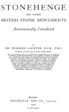

  
[Intangible Textual Heritage](../../../index)  [Legends and
Sagas](../../index)  [England](../index)  [Index](index)  [Next](sac01) 

------------------------------------------------------------------------

*Stonehenge and Other British Stone Monuments Astronomically
Considered*, by Norman Lockyer, \[1906\], at Intangible Textual Heritage

------------------------------------------------------------------------

# STONEHENGE

##### AND OTHER

### BRITISH STONE MONUMENTS

## Astronomically Considered

###### BY

## SIR NORMAN LOCKYER, K.C.B., F.R.S.

###### DIRECTOR OF THE SOLAR PHYSICS OBSERVATORY

###### HON. LLD., GLASGOW; HON. SC.D., CAMBRIDGE; CORRESPONDENT OF THE INSTITUTE OF FRANCE; CORRESPONDING MEMBER OF THE IMPERIAL ACADEMY OF SCIENCES OF ST. PETERSBURG; THE SOCIETY FOR THE PROMOTION OF NATIONAL INDUSTRY OF FRANCE; THE ROYAL ACADEMY OF SCIENCE, GÖTTINGEN; THE FRANKLIN INSTITUTE, PHILADELPHIA; THE ROYAL MEDICAL SOCIETY OF BRUSSELS; SOCIETY OF ITALIAN SPECTROSCOPISTS; THE ROYAL ACADEMY OP PALERMO; THE NATURAL HISTORY SOCIETY OF GENEVA; OF THE ASTRONOMICAL SOCIETY OF MEXICO; MEMBER OF THE ROYAL ACADEMY OF LYNCEI, ROME; AND THE AMERICAN PHILOSOPHICAL SOCIETY, PHILADELPHIA; HONORARY MEMBER OF THE ACADEMY OF NATURAL SCIENCE OF CATANIA; PHILOSOPHICAL SOCIETY OF YORK; LITERARY AND PHILOSOPHICAL SOCIETY OF MANCHESTER; ROYAL CORNWALL POLYTECHNIC INSTITUTION; AND LEHIGH UNIVERSITY

#### London

#### MACMILLAN AND CO., LIMITED

#### \[1906\]

Scanned at Intangible Textual Heritage, January 2007. Proofed and
formatted by John Bruno Hare. This text is in the public domain in the
United States because it was published prior to January 1st, 1923. These
files may be used for any non-commercial purpose, provided this notice
of attribution is left intact in all copies.

[  
Click to enlarge](img/title.jpg)  
Title Page  

------------------------------------------------------------------------

[Next: Preface](sac01)
