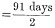

  
[Intangible Textual Heritage](../../../index.md)  [Legends and
Sagas](../../index)  [England](../index)  [Index](index.md) 
[Previous](sac05)  [Next](sac07.md) 

------------------------------------------------------------------------

*Stonehenge and Other British Stone Monuments Astronomically
Considered*, by Norman Lockyer, \[1906\], at Intangible Textual Heritage

------------------------------------------------------------------------

p. 17

### CHAPTER III

### THE AGRICULTURAL DIVISIONS OF THE YEAR

THE early peoples have been very much misrepresented, and held to leave
been uninstructed, by several writers who have not considered what they
were really driving at. It was absolutely essential for early man,
including the inhabitants of Britain as it was then—townless,
uncivilised—that the people should know something about the proper time
for performing their agricultural operations. We now go into a shop and
for a penny buy an almanack which gives us everything we want to know
about the year, the month and the day, and that is the reason why so few
of us care about astronomy: we can get all we want from astronomy for a
penny or twopence. But these poor people, unless they found out the time
of the year and the month and the day for themselves, or got some one to
tell them—and their priests were the men who knew, and they were priests
because they knew—had absolutely no means of determining when their
various agricultural operations should take place. So that we find all
over the world temples erected in the very first flush of civilisation.

On this a point comes in of very considerable

p. 18

interest. If we study the civilisations in Egypt, we find that, so far
as we know, one of the first peoples who used this principle of
orientation for agricultural purposes was some tribe that came down the
Nile about 6400 years B.C. They used the star Canopus, and their
determination was that of the autumnal equinox, which practically was
the time when the Nile began to go down, and when their sowing might
begin. There was another race who, instead of being interested in the
sun, and therefore in agriculture, at the time of the autumnal equinox,
were interested in the year about the time of Easter as well. This race
built the Pyramids about four thousand years B.C. There was an interval
of about two or three thousand years between these races. As we shall
see there were others, who at Thebes started the solstitial worship—that
is to say, the worship of the sun at midsummer—and at Memphis in May, so
as to enable them to go on with their agricultural operations with
greater certainty. We must not forget that first of all the farmers
tried to plough and sow by the moon. We can see how hopeless agriculture
must have been under such conditions. The month, indeed, was the only
unit of time employed, even of human life. We hear of people who lived
1200 years; that means 1200 months—there is no question whatever about
that now.

When we study the history of our own country—when we come back from
Egypt to Britain, leaving alone Greece and Rome—we find that in various
times in our country we have had a year, a farmer's year, beginning in
the month of May; we have had another farmer's

p. 19

year beginning in the month of August; we have had another farmer's year
beginning at the longest day; and it appears that the year beginning at
the longest day was really the last year to be introduced. So that while
we have in Stonehenge a solstitial temple—that is to say, a temple to
make observations of the length of the year by observing the rise of the
sun on the longest day of the year—in other parts of England there were
other temples observing the sun, not on the 21st of June, but early in
May and early in August.

Now, as I have indicated, the priest-astronomers in these temples could
only have won and kept the respect of the agricultural population with
whom alone they were surrounded in early times, and by whom they were
supported, by being useful to them in some way or another. This could
only have been in connection with what we may term generally the
*farming* operations necessary at different times of the year, whether
in the shape of preparing the ground or gathering the produce. For this
they must have watched the stars.

A very large part of mythology has sprung out of the temple cults,
prayer, sacrifices and thanksgiving connected with these farming
operations in different lands and ages.

I wish to show next that by studying the orientation of temples erected
to watch the stars and sunrise and sunset at times other than the
solstices or equinoxes, an immense amount of information may be gained
if we endeavour to find the way in which the problem must have been
attacked before the year was thoroughly established, and when it was
still a question of grass-

p. 20

or corn-kings or gods who had to be propitiated; and we may even be
enabled to understand why the particular divisions of the year were
chosen.

In a solstitial temple the sun makes its appearance only once a year,
when it reaches its greatest north or south declination; but in the
temples dealing with lower declinations the sun appears twice, once on
its journey from the summer to the winter solstice, and again on its
return.

The first difficulty of the inquiry in the direction I have indicated
arises from the fact that the products of different countries vary, and
that identical farming operations have to be carried on at different
times in these countries. We must, then, begin with some one country,
and as the record is fullest for Greece I will begin with it.

The first thing we find is that the chief points in the farmer's year in
Greece are about as far from the fixed points in the astronomical year
as they well can be.

In the Greek information. so admirably collated by M. Ruelle in the
article on the calendar in Daremberg and Saglio's monumental
"Dictionnaire des Antiquités [Grecques](errata.htm#1.md) et Romaines," the
earlier Gregorian dates on which the seasons were reckoned to commence
in ancient Greece were as follows:—

|                     |     |     |     |     |              |
|---------------------|-----|-----|-----|-----|--------------|
| Summer              | ... | ... | ... | ... | May 6.       |
| Autumn (φθινόπωρον) |     |     | ... | ... | August 11.   |
| Winter              | ... | ... | ... | ... | November 10. |
| Spring              | ... | ... | ... | ... | February 7.  |

I may also add from the same source that in the calendars of the Latins
the dates become:—

p. 21

|        |     |     |     |     |             |
|--------|-----|-----|-----|-----|-------------|
| Summer | ... | ... | ... | ... | May 9.      |
| Autumn | ... | ... | ... | ... | August 8.   |
| Winter | ... | ... | ... | ... | November 9. |
| Spring | ... | ... | ... | ... | February 7. |

Now we see at once that these dates are, roughly, half-way between the
solstices and equinoxes.

This, then, at once brings us back to the orientation problem, which was
to fix by means of a temple in the ordinary way dates nearer to these
turning-points in the local farmer's years than those fixed by the
solstitial and equinoctial temples.

It must be borne in mind that it is not merely a question of stately
piles such as Karnak and the Parthenon in populous centres, but of the
humblest dolmen or stone circle, in scattered agricultural communities;
which was as certainly used for orientation purposes, that is, for
recording the lapse of time at night or return of some season important
to the tiller of the soil. The advent of the season thus determined
could be announced to outlying districts by fire signals at night.

I have already pointed out that any temple, dolmen or cromlech oriented
to a sunrise or sunset at any dates between the solstices will receive
the sunlight twice a year.

If the temple is pointed nearly solstitially the two dates at which the
sun appears in it will be near the solstice; similarly, for a temple
pointed nearly equinoctially the dates will be near the equinox; but if
the ancients wished to divide the ninety-one days’ interval between the
solstice and equinox, a convenient method of doing this would he to
observe the sun at the half-time interval, such that the same temple
would serve on both

p. 22

occasions. This could be done by orienting the temple to the sun's place
on the horizon when it had the declination 16° 20´ on its upward and
downward journey, or, in other words, was, *in days*, half-way between
the equinox and solstice. Thus, for the 45 days ( .md) from March 22,
we have in—

|       |     |     |     |     |           |
|-------|-----|-----|-----|-----|-----------|
| March | ... | ... | ... | ... | 9         |
| April | ... | ... | ... | ... | 30        |
| May   | ... | ... | ... | ... | <u> 6</u> |
|       |     |     |     |     | 45        |

What, then, are the non-equinoctial, non-solstitial days of the year
when the sun has this declination?

They are, in the sun's journey from the vernal equinox to the summer
solstice and back again,

|                    |     |     |     |                         |
|--------------------|-----|-----|-----|-------------------------|
| May 6 and August 8 | ... | ... | ... | Sun's decl. N. 16° 20'. |

Similarly, for the journey to the winter solstice and return we have

|                           |     |                         |
|---------------------------|-----|-------------------------|
| November 8 and February 4 | ... | Sun's decl. S. 16° 20´. |

We get, then, a year symmetrical with the astronomical year, which can
be indicated with it as in [Fig. 7](#img_fig07.md); a year roughly halving
the intervals between the chief dates of the astronomical year.

With regard to the dates shown I have already pointed out that farming
operations would not occur at the same time in different lands; that
ploughing and seed time and harvest would vary with crops and latitudes;
and I must now add that when we wish to

p. 23

determine the exact days of the month we have to struggle with all the
difficulties introduced by the various systems adopted by different
ancient nations to bring together the reckoning of months by the moon
and of years by the sun.

In more recent times there is an additional difficulty owing to the
incomplete reconstruction of the calendar by Julius Cæsar, who gave us
the Julian year. Thus,

[  
Click to enlarge](img/fig07.jpg.md)  
FIG. 7.—The astronomical and vegetation divisions of the year.  

while the spring equinox occurred on March 21 at the time of the Council
of Nice, in 325 A.D., by the year 1751 the dating of the year on which
it took place had slipped back to the 10th. Hence the Act 24 George II.
c. 23, by which September 2, 1752, was followed by September 14 instead
of by the 3rd, thus regaining the eleven days lost. This change from the
so-called "old style" to the "new style" is responsible for a great deal
of confusion.

p. 24

Another cause of trouble was the forsaking by the Jews of the solar
year, with which they commenced, in favour of the Babylonian lunar year,
which has been continued for the purposes of worship by Christians,
giving us "movable feasts" to such an extent that Easter Day, which once
invariably marked the spring equinox, may vary from March 22 to April
25, and Whit Sunday from May 10 to June 13. It is at once obvious that
no fixed operations of Nature can be indicated by such variable dates as
these.

Hence in what follows I shall only deal with the months involved; these
amply suffice for a general statement, but a discussion as to exact
dates may come later.

To sum up, then, the astronomer-priests had (1) to watch the time at
night by observing a star rising near the north point of the horizon.
This star would act as a warner of sunrise at some time of the year.

\(2\) To watch for the rising or setting of other stars in various
azimuths warning sunrise at the other critical times of the May or
Solstitial years.

\(3\) To the sunrise and sunset.

\(4\) To mark all rising or setting places of the warning stars and sun
by sight-lines from the circle.

------------------------------------------------------------------------

[Next: Chapter IV. The Various New-Year Days](sac07.md)
