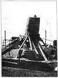
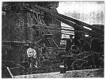
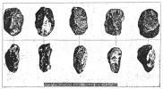
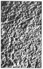
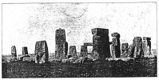

  
[Intangible Textual Heritage](../../../index)  [Legends and
Sagas](../../index)  [England](../index)  [Index](index) 
[Previous](sac10)  [Next](sac12) 

------------------------------------------------------------------------

*Stonehenge and Other British Stone Monuments Astronomically
Considered*, by Norman Lockyer, \[1906\], at Intangible Textual Heritage

------------------------------------------------------------------------

p. 69

### CHAPTER VIII

### ARCHEOLOGICAL OBSERVATIONS AT STONEHENGE, 1901

SOON after Mr. Penrose and myself had made our astronomical survey of
Stonehenge in 1901, some archæological results of the highest importance
were obtained by Professor Gowland. The operations which secured them
were designed and carried out in order to re-erect the leaning stone
which threatened to fall, a piece of work recommended to Sir Edmund
Antrobus by the Society of Antiquaries of London and other learned
bodies, and conducted at his desire and expense.

They were necessarily on a large scale, for the great monolith, "the
leaning stone," is the largest in England, the Rudston monolith
excepted. It stood behind the altar stone, over which it leant at an
angle of 65 degrees, resting at one point against a small stone of
sycnite. Halfway up it had a fracture one-third across it; the weight of
stone above this fracture was a dangerous strain on it, so that both
powerful machinery and great care and precautions had to be used.
Professor Gowland was charged by the Society of Antiquaries with the
conduct of the excavations necessary in the work. The engineering
operations were planned by Mr. Carruthers, and Mr. Detmar Blow was
responsible for the local superintendence.

p. 70

[  
Click to enlarge](img/fig16.jpg)  
FIG. 16.—The arrangements for raising the stone, looking north-east.  

p. 71

[  
Click to enlarge](img/fig17.jpg)  
FIG. 17.—The cradle and supports, looking west.  

Mr. Blow thus describes the arrangements (*Journal* Institute of British
Architects, 3rd series, ix., January, 1902):—

p. 72

"A strong cradle of 12-inch square baulks of timber was bolted round the
stone, with packing and felt, to prevent any marking of the stone. To
the cradle were fixed two 1-inch steel eyebolts to receive the blocks
for two six-folds of 6-inch ropes. These were secured and wound on to
two strong winches fifty feet away, with four men at each winch. When
the ropes were thoroughly tight, the first excavation was made as the
stone was raised on its west side."

The method employed by Professor Gowland in the excavation should be a
model for all future work of the kind.

Above each space to be excavated was placed a frame of wood, bearing on
its long sides the letters A to H, and on its short sides the letters R
M L, each letter being on a line one foot distant from the next. By this
means the area to be excavated was divided into squares each having the
dimension of a square foot. A long rod divided into 6-inch spaces,
numbered from 1 to 16, was also provided for indicating the depth from
the datum line of anything found. In this way a letter on the long sides
of the frame, together with one on the short sides, and a number on the
vertical rod, indicated the position of any object found in any part of
the excavation.

Excavations were necessary because to secure the stone for the future
the whole of the adjacent soil had to be removed down to the rock level,
so that it could be replaced by concrete.

All results were registered by Professor Lowland in relation to a datum
line 337.4 feet above sea level. The material was removed in buckets,
and carefully sifted through a series of sieves 1-inch, ½-inch, ¼-inch,
and

p. 73

[  
Click to enlarge](img/fig18.jpg)  
FIG. 18—The frame used to locate the finds  

p. 74

\[paragraph continues\] ⅛-inch mesh, in
order that the smallest object might not be overlooked.

From the exhaustive account of his work given by Professor Gowland to
the Society of Antiquaries (*Archaeologia*, lviii.), I gather three
results of the highest importance from the point of view I am
considering. These were, first, the finding of an enormous number of
implements; secondly, the disposition and relative quantities of the
chippings of the sarsen and blue stones; and thirdly, the discovery of
the method by which the stones were originally erected.

I will take the implements first. This, in a condensed form, is what
Professor Gowland says about them:—

More than a hundred flint implements were found, and the greater number
occurred in the stratum of chalk rubble which either directly overlaid
or was on a level with the bed rock. They may all be arranged generally
in the following classes

*Class I*.—Axes roughly chipped and of rude forms, but having
well-defined, more or less sharp cutting edges.

*Class II*.—Hammerstones, with more or less well-chipped, sharp curved
edges. Most may be correctly termed hammer-axes. They are chipped to an
edge at one end, but at the other are broad and thick, and in many
examples terminated there by a more or less flat surface. In some the
natural coating of the flint is left untouched at the thick end.

*Class III*.—Hammerstones, more or less rounded. Some specimens appear
to have once had distinct working edges, but they are now much blunted
and battered by use.

p. 75

In addition to the above flint implements were found about thirty
hammerstones, consisting of large pebbles or small boulders of the hard
quartzite variety of sarsen. Some have been roughly broken into
convenient forms for holding in the hand, whilst a few have been rudely
trimmed into more regular shapes. They vary in weight from about a pound
up to six and a half pounds. To these we have to add mauls, a more
remarkable kind of hammerstone than those just enumerated. They are
ponderous boulders of the quartzite variety of sarsen with their
broadest sides more or less flat. Their weights range from about 40 lb.
to 64 lb.

How came these flints and stones where they were found? Prof. Gowland
gives an answer which everybody will accept. The implements must be
regarded as the discarded tools of the builders of Stonehenge, dumped
down into the holes as they became unfit for use, and, in fact, used to
pack the monoliths as they were erected. We read:—"Dealing with the
cavity occupied by No. 55 before its fall, the mauls were found wedged
in below the front of its base to act together with the large blocks of
sarsen as supports" (p. 54). Nearly all bear evidence of extremely rough
usage, their edges being jagged and broken, just as we should expect to
find after such rough employment. We evidently have to deal with
builders doing their work in the Stone and not in the Bronze age. But
was the age Palæolithic or Neolithic?

Prof. Gowland writes:—

"Perhaps the most striking features of the flint implements is their
extreme rudeness, and that there

p. 76

is not a single ground or polished specimen among them. This, at first
sight and without due consideration, might be taken to indicate an
extremely remote age. But in this connection it must be borne in mind
that in the building of such a stupendous structure as Stonehenge, the
tools required must have been numbered by thousands. The work, too, was
of the roughest character, and for such only rude tools were required.
The highly finished and polished implements which we are accustomed to
consider, and rightly so, as characteristic of Neolithic man, would find
no place in such work. They required too much labour and time for their
manufacture, and, when made, could not have been more effective than the
hammer-axes and hammer-stones found in the excavations, which could be
so easily fashioned by merely rudely shaping the natural flints, with
which the district abounds, by a few well directed blows of a sarsen
pebble."

On this ground Prof. Gowland is of opinion that, notwithstanding their
rudeness, they may be legitimately ascribed to the Neolithic age, and,
it may be, near its termination, that is, before the Bronze age, the
commencement of which has been placed at 1400 B.C. by Sir John Evans for
Britain, though he is inclined to think that estimate too low, and 2000
B.C. by Montelius for Italy.

Prof. Gowland guardedly writes:—

"The occurrence of stone tools does not alone prove with absolute
certainty that Stonehenge belongs to the Neolithic age, although it
affords a strong presumption in favour of that view. But, and this is
important, had bronze been in general or even moderately extensive

p. 77

[  
Click to enlarge](img/fig19.jpg)  
FIG. 19.—Some of the Flint Implements  

p. 78

use when the stones were set up, it is in the highest degree probable
that some implement of that metal would have been lost within the area
of the excavations, and if so lost, it would certainly have been found
together with the stone tools. Further, the employment of deer's horn
picks for the extensive excavations made in the chalk around the base of
the monoliths also tends to support the view that bronze implements
cannot have been in common use. If they had it would seem not
unreasonable to assume that they would have been employed, as they would
have been so much more effective for such work than the picks of deer's
horn.

"Again, the chippings of the stones of Stonehenge in two of the Bronze
age barrows [1](#fn_14) in its neighbourhood
show that it is of earlier date than they."

And finally:—

"In my opinion, the date when copper or bronze was first known in
Britain is a very remote one, as no country in the world presented
greater facilities for their discovery. The beginning of their
application to practical uses should, I think, be placed at least as far
back as 1800 B.C., and that date I am inclined to give, until further
evidence is forthcoming, as the approximate date of the erection of
Stonehenge."

Now the date arrived at by Mr. Penrose and myself on astronomical
grounds was about 1700 B.C. It is not a little remarkable that
independent astronomical and archæological inquiries conducted in the
same year

p. 79

should have come so nearly to the same conclusion. If a general
agreement be arrived at regarding it, we have a firm basis for the study
of other similar ancient monuments in this country.

I have previously in this book referred to the fact that the trilithons
of the naos and the stones of the outer circle are all built up of
so-called "sarsen" stones. To describe their geological character, I
cannot do better than quote, from Mr. Cunnington's "Geology of
Stonehenge," [1](#fn_15) their origin according
to Prestwich.

“Among the *Lower Tertiaries* (the Eocene of Sir Charles Lyell) are
certain sands and mottled clays, named by Mr. Prestwich the Woolwich and
Reading beds, from their being largely developed at these places, and
from these he proves the sarsens to have been derived; although they are
seldom found *in situ*, owing to the destruction of the stratum to which
they belonged. They are large *masses of sand concreted together* by a
siliceous cement, and when the looser portions of the stratum were
washed away, the blocks of sandy rocks were left scattered over the
surface of the ground.

“At Standen, near Hungerford, large masses of sarsen are found,
consisting almost *entirely* of flints, formed into conglomerate with
the sand. Flints are also common in some of the large stones forming the
ancient temple of Avebury.

"The abundance of these remains, especially in some of the valleys of
North Wilts, is very remarkable. Few persons who have not seen them can
form an adequate

p. 80

idea of the extraordinary scene presented to the eye of the spectator,
who standing on the brow of one of the hills near Clatford, sees
stretching for miles before him, countless numbers of these enormous
stones, occupying the middle of the valley, and winding like a mighty
stream towards the south."

These stones, then, may be regarded as closely associated with the local
geology.

The exact nature of the stones, called "blue stones," can best be
gathered from a valuable "Note" by Prof. Judd which accompanies Prof.
Gowland's paper. These blue stones are entirely unconnected with the
local geology; they must, therefore, represent boulders of the Glacial
drift, or they must have been brought by man, from distant localities.
Prof. Judd inclines to the first opinion.

The distinction between these two kinds of stone are well shown by Prof.
Gowland:—

“The large monoliths of the outer circle, and the trilithons of the
horse-shoe are all sarsens. \[See general plan, [Fig.
15](sac09.htm#img_fig15).\] These sarsens in their composition are
sandstones, consisting of quartz-sand, either fine or coarse,
occasionally mixed with pebbles and angular bits of flint, all more or
less firmly cemented together with silica. They are the relics of the
concretionary masses which had become consolidated in the sandstone beds
that once overlaid the chalk of the district, and had resisted the
destructive agencies by which the softer parts of the beds were removed
in geological times. They range in structure from a granular rock
resembling loaf sugar in internal appearance to one of

p. 81

great compactness similar to and sometimes passing into quartzite.

“The monoliths and trilithons all consist of the granular rock. The
examples of the compact quartzite variety, of which many were found in
the excavations, were almost without exception either hammerstones that
glad been used in shaping: and dressing the monoliths, or fragments
which had been broken from off them in these operations.

“The small monoliths, the so-called 'blue stones,' which form the inner
circle and the inner horse-shoe, are, with the undermentioned
exceptions, all of diabase more or less porphyritic. Two are porphyrite
(formerly known as felstone or hornstone). Two are argillaceous
sandstone.

“Mr. William Cunnington, in his valuable paper, 'Stonehenge Notes,'
records the discovery of two stumps of 'blue stones' now covered by the
turf. One of these lies in the inner horseshoe between Nos. 61 and 62,
and 9 feet distant from the latter. It is diabase. The other is in the
inner circle between Nos. 32 and 33, 10 feet from the former, and
consists of a soft calcareous altered tuff, afterwards designated for
the sake of brevity fissile rock.

"The altar stone is of micaceous sandstone."

I now come to the second point, to which I shall return in the next
chapter.

In studying the material obtained from the excavations, it was found in
almost every case that the number of chippings and fragments of blue
stone largely exceeded that of the sarsens; more than this, diabase

p. 82

\[paragraph continues\] (blue stone) and
sarsen were found together in the layer overlying the solid chalk (p.
15). Chippings of diabase were the most abundant, but there were few
large pieces of it. Sarsen, on the other hand, occurred most abundantly
in lumps (p. 20); very few small chips of

[  
Click to enlarge](img/fig20.jpg)  
FIG. 20.—Showing the careful tooling of the Sarsens.  

sarsen were found (p. 42). Hence Prof. Gowland is of opinion that the
sarsen blocks were roughly hewn, where they were found (p. 40); the
local tooling, executed with the small quartzite hammers and mauls,
would produce not chips but dust.

p. 83

Finally, I reach the third point of importance from the present
standpoint; the excavations produced clear evidence touching the mode of
erection. Prof. Gowland's memoir deals only with the leaning stone, but
I take

[  
Click to enlarge](img/fig21.jpg)  
FIG. 21.—Face of rock against which a stone was made to rest.  

it for granted that the same method was employed throughout: the method
was this.

\(1\) The ground in the site a stone was to occupy was removed, the
chalk rock being cut into in such a manner as to leave a ledge, on which
the base of the stone was to rest, *and a perpendicular face rising from
it, against which as a buttress* one side would bear when set up. From
the bottom of this hole an inclined plane was cut to the surface down
which the monolith which

p. 84

had already been dressed was slid until its base rested on the ledge.

\(2\) It was then gradually raised into a vertical position by means
first of levers and afterwards of ropes. The levers would be long trunks
of trees, to one end of which a number of ropes was attached (this
method is still employed in Japan); so that the weights and pulling
force of many men might be exerted on them. The stronger ropes were
probably of hide or hair, but others of straw, or of withes of hazel or
willow, may have been in use for minor purposes.

\(3\) As the stone was raised, it was packed up with logs of timber and
probably also with blocks of stone placed beneath it.

\(4\) After its upper end had reached a certain elevation, ropes were
attached to it, and it was then hauled by numerous men into a vertical
position, *so that its back rested against the perpendicular face of the
chalk which had been prepared for it*. During this part of the
operation, struts of timber would probably be placed against its sides
to guard against slip, a precaution taken when the leaning stone was
raised and until the foundation was properly set.

As regards the raising of the lintels, and imposts, and the placing of
them on the tops of the uprights, there would be even less difficulty
than in the erection of the uprights themselves.

It could be easily effected by the simple method practised in Japan for
placing heavy blocks of stone in position. The stone, when lying on the
ground, would be raised a little at one end by means of long wooden
levers. A packing of logs would then be placed under

p. 85

[  
Click to enlarge](img/fig22.jpg)  
FIG. 22.—The leaning stone upright before the struts were removed.  

the end so raised, the other extremity of the stone would be similarly
raised and packed, and the raising and packing at alternate ends would
be continued

p. 86

[  
Click to enlarge](img/fig23.jpg)  
FIG. 23.—Stonehenge, 1905.  

p. 87

until the block had gradually reached the height of the uprights. It
would then be simply pushed forward by levers until it rested upon them.

It is not often that an engineering operation has been made so
subservient to the interests of science as the one we have dealt with in
this chapter. It is satisfactory to know not only that much new
knowledge has been acquired by Professor Gowland and his coadjutors, but
that the famous leaning stone has now been set upright in such fashion
that it will remain upright for hundreds of years. May the other leaning
stones soon receive the same treatment.

------------------------------------------------------------------------

### Footnotes

[78:1](sac11.htm#fr_14) Sir Richard Colt Hoare,
*Ancient history of South Wiltshire*, p. 127. (London, 1812); W.
Stukeley, *Stonehenge*, p. 46. (London, 1740).

[79:1](sac11.htm#fr_15) Wilts. *Archaeological
and Natural History Magazine*, xxi. pp. 141-149.

------------------------------------------------------------------------

[Next: Chapter IX. Was There an Earlier Circle?](sac12)
