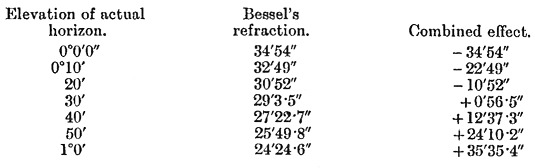
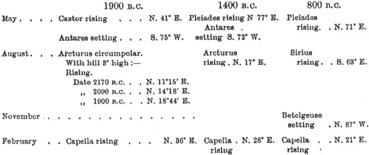
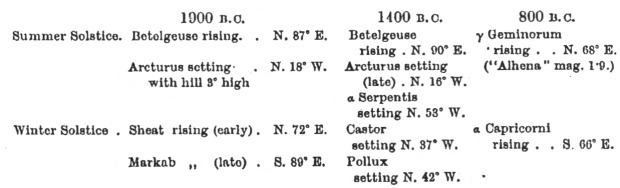

  
[Intangible Textual Heritage](../../../index.md)  [Legends and
Sagas](../../index)  [England](../index)  [Index](index.md) 
[Previous](sac13)  [Next](sac15.md) 

------------------------------------------------------------------------

*Stonehenge and Other British Stone Monuments Astronomically
Considered*, by Norman Lockyer, \[1906\], at Intangible Textual Heritage

------------------------------------------------------------------------

p. 107

### CHAPTER XI

### ASTRONOMICAL HINTS FOR ARCHÆOLOGISTS

THE foregoing chapters will have shown that in dealing with the ancient
monuments from an astronomical point of view, we have to consider
chiefly the direction of the sight-lines, whether they are marked as in
Brittany by long rows of stones—alignments; as at Stonehenge by an
avenue; as in some of our British circles, by two or more circles the
direction being indicated from the central stone of one to the central
stone of the other, or finally by a single standing stone or barrow.

It is important then that before we proceed further in our inquiries we
should consider how a meaning is got out of these directions, and I
propose to devote this chapter to this question, so that the full use of
the "azimuths" already referred to and others which are to follow may be
fully understood.

There is another matter, at which I hinted on pp.
[36](sac08.htm#page_36) and [42](sac08.htm#page_42.md). We have to inquire
whether there are any stones or barrows marking the direction of the
rising or setting of stars, as well as those which deal with the rising
and setting of the sun at different times of the year, which we have
already found at Stonehenge and in Brittany. To face this question we
have to consider the stellar as well as

p. 108

solar conditions of observations, and as the former are the simpler I
will begin with them, especially as now there is no question whatever
that the rising and setting of stars were provided for.

In continuation of my work in Egypt in 1891, and Mr. Penrose's in Greece
in 1892, I have recently endeavoured to see whether there are any traces
in Britain of star observations, including those connected with the
worship of the sun at certain times of the year. We both discovered that
stars, far out of the sun's course, especially in Egypt, were observed
in the dawn as heralds of sunrise—"warning-stars"—so that the priests
might have time to prepare the sunrise sacrifice. To do this properly
the star should rise while the sun is still about 10° below the horizon.
There is also reason to believe that stars rising not far from the north
point were also used as clock-stars to enable the time to be estimated
during the night in the same way as the time during the day could be
estimated by the position of the sun.

I stated (*Dawn of Astronomy*, p. 319) that Spica was the star the
heliacal rising of which heralded the sun on .May-day 3200 B.C. in the
temple of Menu at Thebes. Sirius was associated with the summer solstice
at about the same time.

Mr. Penrose found this May-day worship continued at Athens on
foundations built in 1495 B.C. and 2020 B.C., on which the Hecatompedon
and older Erechtheum respectively were subsequently built, the warning
star being now no longer Spica, but the cluster of the Pleiades rising,
or Antares setting, in the dawn.

It is generally known that Stonehenge is associated with the solstitial
year, and I have suggested that it was

p. 109

originally connected with the May year; but the probable date of its
re-dedication, 1680 B.C., was determined by Mr. Penrose and myself by
the change of obliquity.

Now if Stonehenge or any other British stone circle could be proved to
have used observations of warning stars, the determination of the date
when such observations were made would be enormously facilitated. Mr.
Penrose and myself were content to think that our date might be within
200 years of the truth, whereas if we could use the rapid movement of
stars in declination brought about by the precession of the equinoxes,
instead of the slow change of the sun's declination brought about by the
change of the value of the obliquity, a possible error of 200 years
would be reduced to one of 10 years.

In spite of this enormous advantage, no one so far as I know has yet
made any inquiry to connect star observations with any of the British
circles.

I have recently obtained clear evidence that some circles in different
parts of Britain were used for night work and also in relation to the
May year, which we know was general over the whole of Europe in early
times, and which still determines the quarter-days in Scotland.

If the Egyptian and Greek practice were continued here, we should expect
then to find some indications of the star observations utilised at the
temple of Min and at the Hecatompedon for the beginning, or the other
chief months, of the May year.

I have found them, and I will now show the method employed.

To begin with, if we assume that the astronomer-priests

p. 110

here did attempt such observations, what is the most likely way in which
they would have gone to work?

The easiest way for the astronomer-priests to conduct such observations
in a stone circle would be to erect a stone or barrow indicating the
direction of the place on the horizon at which the star would rise as
seen from the centre of the circle. If the dawn the star was to herald
occurred in the summer, the stone or barrow itself might be visible if
not too far away, but there was a reason why they should not be too
close; in a solemn ceremonial the less seen of the machinery the better.

Doubtless such stones and barrows would be rendered obvious in the dark
by a light placed on or near them. Cups which could hold oil or grease
are known in connection with such stones, and a light thus fed would
suffice in the open if there were no wind; but in windy weather a
cromlech or some similar shelter must have been provided for it.

Now if these standing stones or barrows were ever erected and still
remain, accurate plans—not the slovenly plans with which Ferguson and
too many others have provided us, giving us either no indication of the
north or any other point, or else a rough compass bearing without taking
the trouble to state the variation at the time and place—will help us.

I have already pointed out that much time has been lost in the
investigation of our stone circles, for the reason that in many cases
the exact relations of the monuments to the chief points of the horizon,
and therefore to the place of sunrise at different times of the year,
have not been considered; and when they were, the observations

p. 111

were made only with reference to the magnetic north, which is different
at different places, and besides is always varying; few indeed have
tried to get at the real astronomical conditions of the problem. The
first, I think, was Mr. Jonathan Otley, who in 1849 showed the
"orientation" of the Keswick circle "according to the solar meridian,"
giving true solar bearings throughout the year.

In my opinion the most accurate plans conceivable, in the absence of a
long and minute local inquiry, are the 25-inch maps of the Ordnance
Survey, on which, I have it on the authority of Colonel Johnston the
distinguished Director, each stone may be taken to be shown with a limit
of error of 6 feet. With a large circular protractor azimuths can be
read to one minute of arc, and in critical cases the true azimuth of the
side lines, which are not necessarily meridians as latitudes are not
marked, can be found on inquiry at the Ordnance Office, Southampton.

Having then true azimuths, the next question concerns. the declinations
of the stars which may have been observed.

The work of Stockwell in America, Danckworth in Germany, [1](#fn_18.md) and Dr. W. J. S. Lockyer in England, has
provided us with tables of the changing declinations of stars throughout
past time, or enough of it for our purpose.

An accurate determination on the 25-inch map of either the *azimuth*
(angular distance from the N. or S. points) or *amplitude* (angular
distance from the E. or W. points).

p. 112

of the stone or barrow as seen from the centre of the stone circle will
enable us to determine the declination of the star at the time when it
was observed.

I give a diagram which enables this determination to be made with the
greatest ease for any monuments between Land's End and John o’ Groats,
whether the direction is recorded by amplitude or azimuth; the
declination is read at the side from the value of either indicated, say,
by a dot, at the proper latitude.

This, of course, only gives us a first approximation. The angular height
of the point on the horizon to which the alignment or sight-line is
directed by the stone or barrow from the centre of the circle must be
most accurately determined, otherwise the declinations may be one or two
degrees out.

In the absence of measurements it is convenient to assume, in the first
instance, that the horizon is half a degree high, as with this elevation
refraction is compensated, as the following table will show:

 

In the absence of theodolite observations the actual elevation of the
horizon can be roughly found by a study of the contour lines on the
1-inch map. The following heights will agree with the previous
assumption of hills ½° high:

|          |     |       |      |        |     |     |      |
|----------|-----|-------|------|--------|-----|-----|------|
| Distance | 1   | mile  |      | Height | =   | 46  | feet |
| „        | 2   | miles |      | „      | =   | 92  | „    |
| „        | 4   | „     |      | „      | =   | 184 | „    |
| „        | 8   | „     |      | „      | =   | 368 | „    |
| „        | 10  | „     |      | „      | =   | 460 | „    |

p. 113

[  
Click to enlarge](img/fig33.jpg.md)  
FIG. 33.—Diagram from finding declination from given amplitudes of
azimuth in British latitudes  

p. 114

I also give other diagrams showing the changing declinations of the
brightest stars, those which would naturally, be observed, between the
years 150 A.D. and 2150 B.C. These have been plotted from the
calculations of the authorities I have named.

Fig. 34 deals with the Northern stars. The stars are numbered as
follows:—

|         |                               |         |                            |
|---------|-------------------------------|---------|----------------------------|
| Number. | Name of star.                 | Number. | Name of star.              |
| 1       | β Ursae Minoris.              | 14      | α Coronae.                 |
| 2       | α Ursae Minoris (Polaris).    | 15      | α Geminorum (Castor).      |
| 3       | α Draconis.                   | 16      | β Geminorum (Pollux).      |
| 4       | α Ursae Majoris (Dubhe).      | 17      | α Boötes (Arcturus).       |
| 5       | γ Ursae Majoris.              | 18      | β Leonis.                  |
| 6       | η Ursae Majoris (Benetnasch). | 19      | α Leonis (Regulus).        |
| 7       | γ Draconis.                   | 20      | α Andromedae.              |
| 8       | β Cassiopeiae.                | 21      | η Tauri (Alcyone).         |
| 9       | α Cassiopeiae.                | 22      | α Tauri (Aldebaran).       |
| 10      | α Persei.                     | 23      | α Canis Minoris (Procyon). |
| 11      | α Aurigae (Capella).          | 24      | α Aquilae.                 |
| 12      | α Cygni.                      | 25      | α Orionis (Betelgeuse).    |
| 13      | α Lyrae (Vega).               | 26      | α Virginia (Spica).        |

On [Fig. 35](#img_fig35.md), dealing with the Southern stars, the names are
given along the curves.

 

Now supposing that we have our plans; that we have determined the
azimuth of the sight lines; and have found the declination of the star
observed; we may find more than one star occupying that declination at
various dates.

Which of these stars, then, must we consider?

Obviously those most conveniently situated for enabling the time to be
estimated during the night, or those which could have been used as
warning stars.

The warning stars can be conveniently picked up by using a precessional
globe. From it we gather that about 1900, 1400 and 800 B.C. they were as
follows for the critical

p. 115

[  
Click to enlarge](img/fig34.jpg.md)  
FIG. 34.—Declinations of Northern Stars from 250 A.D. to 2150 B.C.  

p. 116

[  
Click to enlarge](img/fig35.jpg.md)  
FIG. 35.—Declinations of Southern Stars from 250 A.D. to 2150 B.C.  

α Ceti, α Aquarii, β Orionis, α Capricorni, α Canis Majoris, α Scorpii,
α Columbæ, α Pisces Austr., η Argos, α Centauri, α Argûs, α Crucis, α
Gruis, and α Eridani.

p. 117

times of the May year, *i.e.* May, August, November, February:—

 

For the solstices, that is, June and, December, the following stars
might be used as warners:—

 

It is obvious that a star used all the year round for night work will
warn the sunrise at some one of the yearly festivals.

When the stars having the same declinations *are considered from this
point of view, the star actually used, and* therefore the date of its
use, may generally be gathered. I shall show subsequently that some of
the stars in the above lists were actually observed in British as well
as in Grecian temples.

------------------------------------------------------------------------

### Footnotes

[111:1](sac14.htm#fr_18.md) Dr. O. Danckworth,
*Vierteljahrschrift der Astronomischen Gesellschaft*, 16 Jahrgang 1881,
p. 9. Dr: Stockwell's results have been communicated to me by letter.
Some, but not all, of Dr. Lockyer's calculations appeared in *The Dawn
of Astronomy*.

------------------------------------------------------------------------

[Next: Chapter XII. Astronomical Hints for
Archæologists—Continued](sac15.md)
