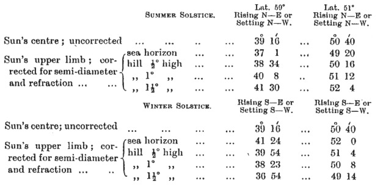

  
[Intangible Textual Heritage](../../../index.md)  [Legends and
Sagas](../../index)  [England](../index)  [Index](index.md) 
[Previous](sac14)  [Next](sac16.md) 

------------------------------------------------------------------------

*Stonehenge and Other British Stone Monuments Astronomically
Considered*, by Norman Lockyer, \[1906\], at Intangible Textual Heritage

------------------------------------------------------------------------

p. 118

### CHAPTER XII

### ASTRONOMICAL HINTS FOR ARCHÆOLOGISTS—*Continued*.

I NEXT come to the Sun observations.

First we must consider the astronomical differences between the rising
of a star and of the sun, by which we generally mean that small part of
the sun's limb first visible.

It is frequently imagined that for determining the exact place of
sunrise or sunset in connection with these ancient monuments we have to
deal with the sun's centre, as we should do with the sun half risen. As
a matter of fact, we must consider that part of the sun's limb which
first makes its appearance above the horizon; the first glimpse of the
upper limb of the sun is in question, say, when the visible limb is 2´
high; and we must carefully take the height of the hills over which it
rises into account.

The accompanying diagram will at once show the difference between the
rising conditions we have now to consider. It deals with the summer
solstice, as being the most precise case, in Lat. 59° N.

At this time the position of the sun, *that is of the sun's centre*, as
given in the "Nautical Almanac," is represented by the double circle on
the sea horizon.

p. 119

[  
Click to enlarge](img/fig36.jpg.md)  
The Conditions of “Sunrise” at the Summer Solstice in Lat. 50° N.  

p. 120

The azimuth of this position is N. 39° 16´ E. This is the equivalent of
the declination of a star, but it will be seen that the real azimuths we
want are very different. The dotted circles represent the actual
position of the sun with regard to the horizon, the continuous circles
the apparent positions caused by the lifting-up effect of refraction. We
have the positions in azimuth of the apparent sun as it appears on a sea
horizon, and when the horizon is formed by hills up to 1½° in vertical
height.

To make this quite clear I give a table which has been computed by Mr.
Rolston, of the Solar Physics Observatory, showing azimuths with hills
up to 1½° high for lat. 59° N., and 51° N. nearly the latitude of
Stonehenge, of the sun's upper limb for the summer solstice:—

 

The first important thing we learn from the table is that although at
both solstices the azimuths of the rising and setting of the sun's
centre are the same, these azimuths of the upper limb at the summer and
winter solstices differ in a high northern latitude by some 5°. The
difference arises, of course, from the

p. 121

[  
Click to enlarge](img/fig37.jpg.md)  
FIG. 37.—The Azimuths of the Sunrise (upper limb) at the Summer
Solstice.  
The values given in the table have been plotted, and the effect of the
height of the hills on the azimuth is shown. The range of latitude given
enables the diagram to be used in connection with the solstitial
alignments at Carnak, Le Ménac, and other monuments in Brittany.  

p. 122

fact that the limb is some 16´ from the sun's centre, so that
considering the sun's centre as a star with fixed declination, at rising
the limb appears before the centre, and at setting it lags behind it.

It will also be seen that at sunrise hills increase the azimuth from N.,
and refraction reduces it; while at setting, hills reduce the azimuth
from S. and refraction increases it.

This diagram and table should fully explain the variation of azimuth at
sunrise caused by the fact that from our present point of view we do not
deal with the sun as a star.

To make the foregoing applicable for monuments in all latitudes between
Brittany and the Orkneys, I give still another diagram, [Fig.
37](#img_fig37.md), also prepared for me by Mr. Rolston which will enable
any archæologist to determine approximately, *for the present time*, the
azimuth of sunrise at the summer solstice, without waiting for the 21st
of June in any year actually to observe it.

As before stated, I have dealt with the solstice in this chapter because
it affords us the most precise case. I hope to be able to deal with the
May year sun in the same way later on.

------------------------------------------------------------------------

[Next: Chapter XIII. Stenness](sac16.md)
