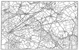

  
[Intangible Textual Heritage](../../../index.md)  [Legends and
Sagas](../../index)  [England](../index)  [Index](index.md) 
[Previous](sac29)  [Next](sac31.md) 

------------------------------------------------------------------------

*Stonehenge and Other British Stone Monuments Astronomically
Considered*, by Norman Lockyer, \[1906\], at Intangible Textual Heritage

------------------------------------------------------------------------

p. 287

### CHAPTER XXVII

### SOME OTHER CORNISH MONUMENTS

*Boscawen-un; N. Lat*. 50° 5´ 20″

MY wife and I visited Boscawen-un on a pouring day, when it was
impossible to make any observations. Mr. Horton Bolitho, who was with
us, introduced us to the tenant of Boscawen-noon—Mr. Hannibal Rowe—who
very kindly, in spite of the bad weather, took us to the circle and the
stone cross to. the N.E. of it.

Lukis thus described, this monument: [1](#fn_117.md)—

“The enclosed ground on which this circle stands is uncultivated and
heathy, and slopes gently to the south. Twenty years ago a hedge ran
across it and bisected the circle.

“This monument is composed of nineteen standing stones, and is of an
oval form, the longer diameter being 80 feet and the shorter 71 feet 6
inches, One of the stones is a block of quartz 4 feet high, and the
rest, which are of granite, vary from 2 feet 9 inches to 4 feet 7 inches
in height. On the west side there is a gap,

p. 288

[  
Click to enlarge](img/fig59.jpg.md)  
FIG59.—Photograph of the Ordnance Map.  

p. 289

whence it is probable that a stone has been removed. Within the area, 9
feet to the south-west from the centre, is a tall monolith, 8 feet out
of the ground, which inclines to the north-east, and is 3 feet 3 inches
out of the perpendicular.

“In 1594 Camden describes this monument as consisting of nineteen
stones; 12 feet from each other, with one much larger than the rest in
the centre: It must have been much in the same condition then as now. As
he does not say that the monolith enclosed within it was inclined, it is
possible that it was upright at that time.

“Dr. Stukeley's supposition was that it originally stood upright, and
that 'somebody digging by it to find treasure disturbed it.'

“On the north-east side there are two fallen stones which Dr. Borlase,
in 1749, imagined to have formed part of a Cromlech. It is more probable
that they are the fragments of a second pillar, which was placed to the
north-east of the centre, and as far from it as the existing one is.
There are instances, I believe, of two pillars occupying similar
positions within a circle. One of the stones, that marked C in my plan,
on the eastern side of the ring, was prostrate in the Doctor's time.

"At a short distance to the south-east and south-west there are cairns,
which have been explored."

For this monument I have used the 6-inch map, as the circle lies nearly
at the centre, and all the outstanding stones are within its limits. The
heights of the sky-line were measured by: Mr. H. Bolitho at a subsequent
visit with a miner's dial; the resulting

p. 290

declinations have been calculated by Mr. Rolston. A theodolite survey
will doubtless revise some of them:—

<table data-border="0">
<colgroup>
<col style="width: 11%" />
<col style="width: 11%" />
<col style="width: 11%" />
<col style="width: 11%" />
<col style="width: 11%" />
<col style="width: 11%" />
<col style="width: 11%" />
<col style="width: 11%" />
<col style="width: 11%" />
</colgroup>
<tbody>
<tr class="odd">
<td data-valign="top">
Marks.
</td>
<td colspan="2" data-valign="top">
Az.
</td>
<td colspan="2" data-valign="top">
Hills.
</td>
<td colspan="2" data-valign="top">
Dec.
</td>
<td data-valign="top">
Star.
</td>
<td data-valign="top">
Date.
</td>
</tr>
<tr class="even">
<td data-valign="top">
1. F. Stone cross
</td>
<td data-valign="top">
N. 43°
</td>
<td data-valign="top">
15´ E.
</td>
<td data-valign="top">
2°
</td>
<td data-valign="top">
 7´
</td>
<td data-valign="top">
+29°
</td>
<td data-valign="top">
26´
</td>
<td data-valign="top">
Capella
</td>
<td data-valign="top">
2250
</td>
</tr>
<tr class="odd">
<td data-valign="top">
2. P. Fine menhir
</td>
<td data-valign="top">
N. 53
</td>
<td data-valign="top">
30  E.
</td>
<td data-valign="top">
1
</td>
<td data-valign="top">
15
</td>
<td data-valign="top">
22 
</td>
<td data-valign="top">
58
</td>
<td data-valign="top">
Solstitial sun
</td>
<td data-valign="top">
—
</td>
</tr>
<tr class="even">
<td data-valign="top">
3. B. Blind Fiddler
</td>
<td data-valign="top">
N. 54
</td>
<td data-valign="top">
30  E.
</td>
<td data-valign="top">
1
</td>
<td data-valign="top">
15
</td>
<td data-valign="top">
22 
</td>
<td data-valign="top">
24
</td>
<td data-valign="top">
„
</td>
<td data-valign="top">
—
</td>
</tr>
<tr class="odd">
<td data-valign="top">
4. Two largo menhirs
</td>
<td data-valign="top">
N. 66
</td>
<td data-valign="top">
50  E.
</td>
<td data-valign="top">
1
</td>
<td data-valign="top">
 0
</td>
<td data-valign="top">
14 
</td>
<td data-valign="top">
55
</td>
<td data-valign="top">
May sun
</td>
<td data-valign="top">
—
</td>
</tr>
<tr class="even">
<td data-valign="top">
5. Stone cross
</td>
<td data-valign="top">
N. 78
</td>
<td data-valign="top">
 0  E.
</td>
<td data-valign="top">
1
</td>
<td data-valign="top">
 0 (?)
</td>
<td data-valign="top">
+8 
</td>
<td data-valign="top">
 8
</td>
<td data-valign="top">
Pleiades 
(May)
</td>
<td data-valign="top">
1480
</td>
</tr>
<tr class="odd">
<td data-valign="top">
6. Stone
</td>
<td data-valign="top">
S. 66
</td>
<td data-valign="top">
30  E.
</td>
<td data-valign="top">
1
</td>
<td data-valign="top">
 0 (?)
</td>
<td data-valign="top">
14 
</td>
<td data-valign="top">
32
</td>
<td data-valign="top">
November sun
</td>
<td data-valign="top">
—
</td>
</tr>
<tr class="even">
<td data-valign="top">
7. Stone
</td>
<td data-valign="top">
N. 83
</td>
<td data-valign="top">
30  W.
</td>
<td data-valign="top">
1
</td>
<td data-valign="top">
 0 (?)
</td>
<td data-valign="top">
+4 
</td>
<td data-valign="top">
36
</td>
<td data-valign="top">
Pleiades 
(September)
</td>
<td data-valign="top">
2120
</td>
</tr>
</tbody>
</table>

[  
Click to enlarge](img/fig60.jpg.md)  
FIG. 60.—Showing azimuths in Lat. N. 50° for the summer solstice
sunrise, with different heights of hills for 1905 A.D. and 1680 B.C.  

p. 291

I gather from a report which Mr. H. Bolitho has been good enough to send
me that modern hedges and farming operations have changed the conditions
of the sight-lines, so that 1 and 3 are just invisible from the circle.
This is by no means the only case in which the sighting stone has just
been hidden over the brow of a hill and in which signals from an
observer on the brow itself have been suggested, or a *via sacra* to the
brow from the circle; there are many monoliths in this direction which
certainly never belonged to the circle.

From the menhir P (No. 2) a fine view is obtained from N. to S. through
E., so that the Blind Fiddler and the two large menhirs, and almost the
circle, are visible. The curious shapes of 1 and 2 are noted, the east
face vertical and the west boundary curved, like several sighting stones
on Dartmoor.

The circle itself has several peculiarities. In the first place, as
shown by Lukis, it is not circular, the diameters being about 85 and 65
feet; the minor axis reins through the pillar stone in the centre and
the "fallen stones" of Dr. Borlase towards the "stone cross" (which is
no cross but a fine menhir) in Az. N. 43°. 15´ E. This would suggest
that this was the original alignment in 2250 B.C., but against, this is
the fact that the two stones of the circle between which the "fallen
stones" lie are more carefully squared than the rest. It is true,
however, that this might have been done afterwards, and this seems
probable, for they are closer together than the other circle stones.

The one quartz stone occupies an azimuth S. 66° W. It was obviously
placed in a post of honour. As a

p. 292

matter of fact, from it the May sun was seen to rise over the centre of
the circle.

As there are both at Tregaseal and Boscawen-un alignments suggesting the
observation of the summer solstice sunrise, it is desirable here to
refer to the azimuths as calculated. For this purpose [Fig.
60](#img_fig60.md) has been prepared, which shows these for lat. 50° both
at the present day and at the date of the restoration at Stonehenge.

My readers should compare this with Fig. 36, which gives the solstice
sunrise conditions of Stenness in Lat. N. 59°. Such a comparison will
show how useless it is to pursue these inquiries without taking the
latitude and the height of the sky-line into account.

"*Stripple Stones*" (lat. 50° 32´ 50″ N., long. 4° 37´ W.)

This is a very remarkable circle consisting of 5 erect and 11 prostrate
stones situated on a circular level platform 175 feet in diameter on the
boggy south slope of Hawk's Tor on the Hawkstor Downs in the parish of
Blisland. The circle itself is about 148 feet in diameter, and the whole
monument is, in Lukis's opinion, the most interesting and remarkable in
the country. Surrounding the platform is a ditch 11 feet wide, and
beyond that a penannular vallum about 10 feet in width. The peculiarity
of the vallum is that it has three bastions situate on the north-east,
north-west, and east sides. It is to the north-east bastion that I wish
to refer.

Sighting from the huge monolith, which is now

p. 293

prostrate but originally marked the centre of the circle, along a line
bisecting the arc of this bastion we find that the azimuth of the
sight-line is N. 25´ E.; the angular elevation of the horizon from the
1-inch Ordnance map appears to be about 0° 22´. From these values,
proceeding as in the former cases, we find

|                                       |           |         |           |
|---------------------------------------|-----------|---------|-----------|
| Alignment.                            | Decl.     | Star.   | Date.     |
| Centre of circle to centre of bastion | 35° 1´ N. | Capella | 1250 B.C. |

indicating that this alignment was formed for the same purpose as that
which dominated the erection of the "Pipers."

"*Nine Maidens*" (lat. 50° 28´ 20″ N., long. 4° 54´ 35″ W.)

In this monument we find a very different type from those considered
previously.

The Nine Maidens are simply 9 stones in a straight line 262 feet in
length at the present day; possibly, as suggested by Lukis, it may have
extended originally to the monolith known as "The Fiddler," situated
some 800 yards away in a north-easterly direction. Measuring the azimuth
of the alignment on Lukis's plan, and finding the horizon elevations
from the 1-inch Ordnance map, we have the following:—

|           |        |            |         |           |
|-----------|--------|------------|---------|-----------|
| Az.       | Hills. | Decl.      | Star.   | Date.     |
| N. 28° E. | 0° 0´  | 37° 47´ N. | Capella | 1480 B.C. |

It may be remarked that here we have a date for the use of Capella
intermediate between those obtained for the "Pipers" and the "Stripple
Stones" respectively.

------------------------------------------------------------------------

### Footnotes

[287:1](sac30.htm#fr_117.md) *Prehistoric Stone
Monuments of the British Isles: Cornwall*. W. C. Lukis. P. 1.

------------------------------------------------------------------------

[Next: Chapter XXVIII. The Clock-Stars in Egypt and Britain](sac31.md)
