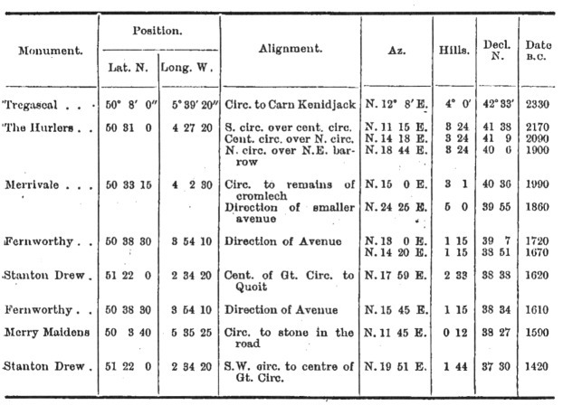
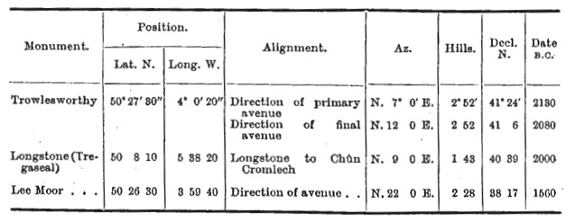
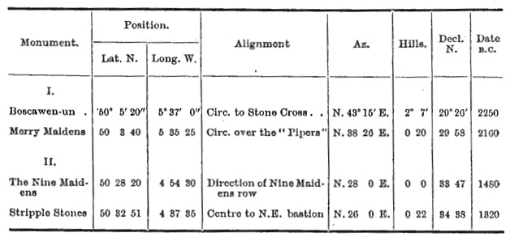
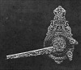

  
[Intangible Textual Heritage](../../../index.md)  [Legends and
Sagas](../../index)  [England](../index)  [Index](index.md) 
[Previous](sac30)  [Next](sac32.md) 

------------------------------------------------------------------------

*Stonehenge and Other British Stone Monuments Astronomically
Considered*, by Norman Lockyer, \[1906\], at Intangible Textual Heritage

------------------------------------------------------------------------

p. 294

### CHAPTER XXVIII

### THE CLOCK-STARS IN EGYPT AND BRITAIN.

I HAVE now finished my astronomical reconnaissance of the British
monuments. I trust I have shown how important it is that my holiday task
should be followed by a serious inquiry by other workers so that the
approximate values with which I have had to content myself for want of
time may be replaced by others to which the highest weight can be
attached. This means at each circle reversed observations with a
six-inch theodolite and determination of azimuths by means of
observations of the sun if necessary.

I propose in the present chapter to bring together the general results
already obtained in cases where the inquiry has been complete enough to
warrant definite conclusions to be drawn.

The first result to be gathered from the observations, and one to which
I attach the highest importance, is that the practice, so long employed
in Egypt, of determining time at night by the revolution of a star round
the pole, was almost universally followed in the British circles. This
practice was to watch a first-magnitude

p. 295

star, which I named a "clock-star," [1](#fn_118.md) of such a declination that it just
dipped below the northern horizon so that it was visible for almost the
whole of its path. Doubtless this same method of determining the flow of
time during the night watches was also employed in Babylonia, [2](#fn_119.md) but there, alas! the temples, or, in
other words, the astronomical observatories, have disappeared, so that
only the Egyptian practice remains for us to study.

*Egypt*.

Let us, before we proceed, consider some results which have been
gathered from the study of the Egyptian observations.

One of the earliest temples in Egypt concerning which we have historical
references to check the orientation results was built to carry on these
night observations at Denderah, lat. N. 26° 10´. The star observed was α
Ursae Majoris, decl. N. 58° 52´, passing 5° below the northern horizon;
date (assuming horizon 1° high) about 4950 B.C., *i.e.*, in the times of
the Shemsu Heru, before Mena, as is distinctly stated in the
inscriptions.

After α Ursae Majoris had become circumpolar in the latitude of
Denderah, γ Draconis, which had ceased to be circumpolar, and so
fulfilled the conditions to which I have referred, replaced it. Its
declination was 58° 52´ N. about 3100 B.C., and it, therefore, could
have been watched rising in the axis. prolonged of the old temple in the
time of Pepi, who restored it then, no doubt on

p. 296

account of the advent of the new star; and is stated to have deposited a
copy of the old plan in a cavity in the new walls.

Here, then, we have two dates, given by orientation of a clock-star
temple entirely agreeing with the most recent views of Egyptian
chronology.

In Dr. Budge's *History of Egypt* (iii. 14) the story of the rebuilding
of the temple at Annu by Usertsen (2433 B.C., Brugsch) is given from an
ancient roll. Supposing this temple built parallel with the faces of the
remaining obelisk, γ Draconis would rise in its axis prolonged 2500
B.C., proving that Usertsen did at Annu what Pepi previously did at
Denderah, and that the same reason for restoration and even the same
star were in question. [1](#fn_120.md)

When the clock-star ceased to be visible in the chief temple other
subsidiary temples were subsequently built to watch it. Thus γ Draconis
was watched at Thebes from 3500 B.C. to the times of the Ptolemys by
temples oriented successively from that of Mut Az. N. 72° 30´ E. to 68°
30´, 63° 30´, and 62°. [2](#fn_121.md)

It is worth while to show that what we know now of the Egyptian methods
of observation enables us to carry the matter further, while we gather
at the same time that in consequence of the difference of latitude the
method employed in Egypt could not be followed in Britain.

I showed in the *Dawn of Astronomy* that several ancient shrines
consisted of two temples at right angles

p. 297

to each other (see [Fig. 13](sac09.htm#img_fig13).md), one axis pointing
high N.E. to observe the clock-star--the worship of Set—the other low
N.W. to observe either the sun by itself, or in association with some
important star of the same declination as the sun.

The temples of Mut and Menu (or Min), and of Amen, with the associated
temple M. of Lepsius, at Karnak, are the best extant examples of this
principle of temple building.

There is evidence that both at Annu and Memphis the same principle was
followed, but at Annu one obelisk alone remains, and at Memphis one
temple; from these, however, Captain Lyons and myself have obtained
sufficient data to enable the original directions of the temple-systems
to be gathered.

At Denderah, if such a N.W. temple ever existed it has disappeared, but
as the monument stands there are still two temples at right angles to
each other, but the second one faces S.E. instead of N.W.

This premised, I will now give, in anticipation of another one dealing
with the British monuments, a list of the most ancient star temples in
Egypt, with their azimuths and the first-magnitude clock-stars which
could have been observed in them at different dates. These dates have
been approximately determined by the use of a precessional globe, an
horizon of 1° elevation being assumed. As I have shown, the present
views of Egyptian chronology and the inscriptions carry us back to α
Ursae Majoris, at Denderah. But there is a suggestion at Luxor, and
perhaps also at Abydos, that Vega was used before that star, though
there are, so far as I know, no temple traces of Arcturus.

p. 298

<table data-border="1">
<colgroup>
<col style="width: 12%" />
<col style="width: 12%" />
<col style="width: 12%" />
<col style="width: 12%" />
<col style="width: 12%" />
<col style="width: 12%" />
<col style="width: 12%" />
<col style="width: 12%" />
</colgroup>
<tbody>
<tr class="odd">
<td data-valign="top">
Temple.
</td>
<td data-valign="top">
N. Lat.
</td>
<td data-valign="top">
Az. 
N.E.
</td>
<td data-valign="top">
N. 
Decl.
</td>
<td data-valign="top">
Vega.
</td>
<td data-valign="top">
Arcturus.
</td>
<td data-valign="top">
α Ursae 
Majoris.
</td>
<td data-valign="top">
γ 
Draconis.
</td>
</tr>
<tr class="even">
<td data-valign="top">
Annu
</td>
<td data-valign="top">
30° 10´
</td>
<td data-valign="top">
14°  0´
</td>
<td data-valign="top">
57° 25´
</td>
<td data-valign="top">
6250
</td>
<td data-valign="top">
5550
</td>
<td data-valign="top">
*5200
</td>
<td data-valign="top">
*2500
</td>
</tr>
<tr class="odd">
<td data-valign="top">
Memphis
</td>
<td data-valign="top">
29  50
</td>
<td data-valign="top">
12  45
</td>
<td data-valign="top">
58  20
</td>
<td data-valign="top">
6450
</td>
<td data-valign="top">
6000
</td>
<td data-valign="top">
 5000
</td>
<td data-valign="top">
 2850
</td>
</tr>
<tr class="even">
<td data-valign="top">
Denderah
</td>
<td data-valign="top">
26  10
</td>
<td data-valign="top">
18  30
</td>
<td data-valign="top">
58  52
</td>
<td data-valign="top">
6550
</td>
<td data-valign="top">
6200
</td>
<td data-valign="top">
*4950
</td>
<td data-valign="top">
*3100
</td>
</tr>
<tr class="odd">
<td data-valign="top">
Thebes (Mut)
</td>
<td data-valign="top">
25  40
</td>
<td data-valign="top">
17  30
</td>
<td data-valign="top">
59  46
</td>
<td data-valign="top">
6700
</td>
<td data-valign="top">
6700
</td>
<td data-valign="top">
 4800
</td>
<td data-valign="top">
*3500
</td>
</tr>
<tr class="even">
<td data-valign="top">
Tell-el-Amarna
</td>
<td data-valign="top">
27  40
</td>
<td data-valign="top">
13   0
</td>
<td data-valign="top">
60  12
</td>
<td data-valign="top">
6800
</td>
<td data-valign="top">
6800
</td>
<td data-valign="top">
 4750
</td>
<td data-valign="top">
 3700
</td>
</tr>
<tr class="odd">
<td data-valign="top">
Nagada
</td>
<td data-valign="top">
26  10
</td>
<td data-valign="top">
12   0
</td>
<td data-valign="top">
61  16
</td>
<td data-valign="top">
7000
</td>
<td data-valign="top">
4600
</td>
<td data-valign="top">
 4000
</td>
<td data-valign="top">
 7400
</td>
</tr>
</tbody>
</table>

There is a very great difference between determining the date of a
temple erected to the rising or setting of a particular star, and of one
erected to the rising or setting of the sun on a particular day of the
year. In the latter case no date. can be given unless we have reason to
believe that both the sun and a star rose or set at the same point of
the horizon at the same date; in other words, the sun and star had the
same declination, and the rising or setting of both could be seen in the
same temple.

I assumed, without historical data, that this view was acted on in
Egypt, at the temple of Menu; Mr. Penrose found, with historical data,
that it was actually acted on in Greece at the Parthenon. To show that
we are at all justified in this view we must study the association of
gods with temple worship, and look for temples in different azimuths
erected at different times if the god is a star; and we can run the star
home if the dates fall in with the star's precessional change. Thus
there is reason for supposing that the god Ptah and the star Capella
were associated. There is a temple of Ptah at Memphis, Az. N. 77° 15´
W., hills 50´, decl. N. 11°, star Capella, date 5200. In the rectangular
system at Memphis, then, α Ursae Majoris

p. 299

was watched in one temple and Capella in the other at that date. There
is also evidence that the god Menu was associated with the star Spica.
In the temple system of Mut at Thebes, in 3200 B.C., γ Draconis was used
as a clock-star in one temple, while the setting of Spica was watched in
the other.

If a temple is erected to. the sun with no specially named cult, it may
be a sun-temple pure and simple, not connected with star worship because
there was no star with the, proper declination at the time.

In Greece temple-building was carried on at a much later time, so late
that perhaps water clocks were available, so that we should not expect
to find many clock-star temples in that country. As a. matter of fact
there is only one, of which the data, according to Mr. Penrose, are as
follows:—

|                                          |          |            |       |
|------------------------------------------|----------|------------|-------|
|                                          | N. Decl. | Star.      | Date. |
| Thebes, The City of the Dragon . . . . . | +54° 28' | γ Draconis | 1160  |

It will be seen that the star used in Greece was the last clock-star
traced in the Egyptian temples.

*Britain*.

I now come to Britain. So far as my inquiries have gone, these
clock-star observations were introduced into these islands about 2300
B.C.

In my statement concerning them I will deal with the astronomical
conditions for lat. 50° N., as it is in Cornwall that the evidence is
most plentiful and conclusive.

In that latitude and at that time Arcturus, decl. N.

p. 300

\[paragraph continues\] 41°, was just
circumpolar with a sea horizon, and therefore neither rose nor set.
Capella, decl. N. 31°, when northing was 9° below the horizon, so that
it rose and set in azimuths N. 37°. E. and N. 37° W. respectively; it
was therefore invisible for a long time and was an awkward clock-star in
consequence.

[  
Click to enlarge](img/fig61.jpg.md)  
FIG. 61.—Arcturus and Capella as clock-stars in Britain.  
AB= sea horizon. A´B´ =horizon 3° high.  

Fig. 61 represents diagrammatically the conditions named, the
circumpolar paths of Arcturus and Capella being sho*wn by the smaller
and larger circle respectively. A B represents the actual sea horizon
and* A´ B´ a locally raised horizon 3° high, whilst the dotted portion
of the larger circle represents the non--visible part of Capella's
apparent path.

What the British astronomer-priests did, therefore, in

p. 301

the majority of cases was to set up their temples in a locality where
the N.E. horizon was high, so that Arcturus rose and set over it and was
invisible for only a short time, as shown in the diagram by the raised
horizon A' B'.

The two lists following contain the names of the monuments where I
suggest Arcturus was used as a clock-star. In the first, the angular
elevation of the sky-line as seen from the circle in each case has been
actually measured, and the date of the alignment is, therefore, fairly
trustworthy; but in the second list the elevations have been estimated
from the differences of contour shown on the one-inch Ordnance map, and
the dates must be accepted as open to future revision.

ARCTURUS AS A CLOCK-STAR.

I.

 

p. 302

II\.

 

In some cases, for one reason or another, this arrangement was not
carried out, and Capella, in spite of the objection I have stated, was
used in the following circles

CAPELLA AS A CLOCK-STAR.

 

At the Merry Maidens, however, with nearly a sea horizon, when Arcturus
ceased to be circumpolar and rose in Azimuth N. 11° 45´ E., it replaced
Capella, and was used as a clock-star after 1600 B.C.

In this system of night observation we have the germ of the use in later
times of an instrument called the "night-dial," specimens of which,
dating from the fourteenth century, can be seen in our museums. The
introduction.

p. 303

of graduated circles permitted the employment of circumpolar stars, and
the "guards" of the Little Bear or the "pointers" of the Great Bear,
were thus used.

[  
Click to enlarge](img/fig62.jpg.md)  
FIG. 62.—A “night-dial.”  

\[paragraph continues\] There was a disc
with a central aperture through which the pole star could be observed;
the disc could be adjusted for every night in the year; an arm was then
moved round so that the direction of the pointers (or the guards) with
regard to the vertical could be measured; on a second concentric circle
the time of night could be read off.

------------------------------------------------------------------------

### Footnotes

[295:1](sac31.htm#fr_118.md) *Dawn of Astronom*y,
1894, p. 343.

[295:2](sac31.htm#fr_119.md) Jensen, *Kosmologie
der Babylonier*, p. 147.

[296:1](sac31.htm#fr_120.md) *Dawn of Astronomy*,
p. 215.

[296:2](sac31.htm#fr_121.md) *Ibid*., p. 214.

------------------------------------------------------------------------

[Next: Chapter XXIX. A Short History of Sun Temples](sac32.md)
