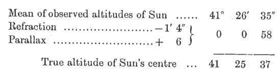
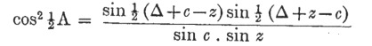
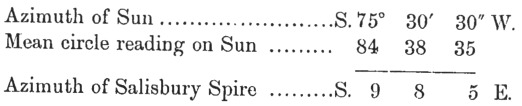
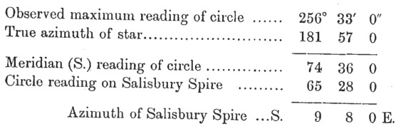
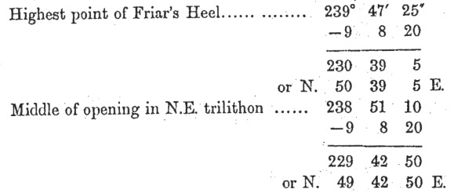
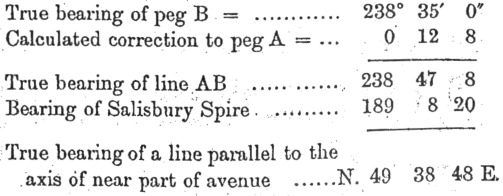
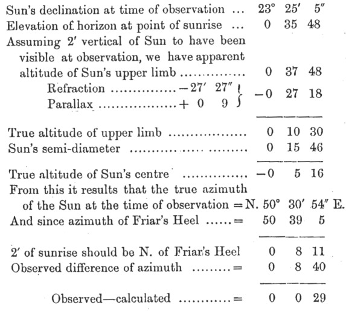

  
[Intangible Textual Heritage](../../../index.md)  [Legends and
Sagas](../../index)  [England](../index)  [Index](index.md) 
[Previous](sac33)  [Next](sac35.md) 

------------------------------------------------------------------------

*Stonehenge and Other British Stone Monuments Astronomically
Considered*, by Norman Lockyer, \[1906\], at Intangible Textual Heritage

------------------------------------------------------------------------

p. 325

# APPENDICES

### I. DETAILS OF THE THEODOLITE OBSERVATIONS AT STONEHENGE

THE instrument chiefly employed was a six-inch transit theodolite by
Cooke with verniers reading to 20″ in altitude and azimuth. Most of the
observations were made at two points very near the axis, which may be
designated by *a*, *b*. Station *a* was at a distance of 61 feet to the
south-west of the centre of the temple, and *b* 364 feet to the
north-east. The distance from the centre of Stonehenge to Salisbury
Spire being 41,981 feet, the calculated corrections for parallax at the
points of observation with reference to Salisbury Spire are:—

|         |     |     |         |
|---------|-----|-----|---------|
| Station | *a* | \+  | 4´ 12″. |
| „       | *b* | \-  | 25 20.  |

\(1\) *Relative Azimuths*.—Theodolite at station *a*—

|                                                           |     |     |     |
|-----------------------------------------------------------|-----|-----|-----|
| Salisbury Spire                                           | 0°  | 0´, | 0″  |
| N. side of opening in N.E. trilithon of the external ring | 237 | 27  | 40  |
| Tree in middle of clump on Sidbury Hill                   | 237 | 40  | 20  |
| Highest point of Friar's Heel                             | 239 | 47  | 25  |
| S. side of opening in N.E. trilithon                      | 240 | 14  | 40  |
| Middle       „       „       „                            | 238 | 51  | 10  |

\(2\) *Absolute Azimuths*.—All the azimuths were referred to that of
Salisbury Spire, the azimuth of which was determined by observations of
the Sun and Polaris.

p. 326

(*a*) *Observation of Sun, June* 23, 1901, 3.30-3.40 P.M.

 

Latitude = 51° 10´ 42″. Sun's declination = 23° 26´ 43″. Using the
formula

 

where A = azimuth from south, Δ = polar distance, *c* = co-latitude, and
*z* = zenith distance,

we get

 

(*b*) *Observations of Polaris*.—June 23, 1901. Time of greatest
easterly elongation, calculated by formula cos *h*= tan φ cot δ, is
G.M.T. 1.34 A.M.

Azimuth at greatest easterly elongation, calculated by the formula

sin A = cos δ sec φ,

is 181° 57´ 0″ from south.

 

The mean of the two determinations gives for the azimuth of Salisbury
Spire S. 9° 8´ 2″ E. This result agrees, well with the value of the
azimuth communicated by the Ordnance Survey Office, namely, 9° 4´ 8″
from the centre of the circle, which

p. 327

being corrected by + 4´ 12″ for the position of station *a*, is
increased to 9° 8´ 20″.

Hence, from the point of observation *a*, 9° 3´ 20″ has been adopted as
the azimuth of Salisbury Spire.

We thus get the following absolute values of the principal azimuths from
the point *a* :

 

The difference of 8½´ between this and the assumed axis 49° 34´ 18″ is
so slight that considering the indirect method which has
[necessarily](errata.htm#3.md) been employed in determining the axis of the
temple from the position of the leaning stone, and the want of
verticality, parallelism and straightness of the inner surfaces of the
opening in the N.E. trilithon, we are justified in adopting the azimuth
of the avenue as that of the temple.

Next, with regard to the determination of the azimuth of the avenue as
indicated by the line of pegs to which reference is made on [p.
65](sac10.htm#page_65.md). The small angle between the nearest pegs A and B
(which are supposed to be parallel to the axis of the avenue), observed
from station *a*, was measured, and the corresponding calculated
correction was applied to the ascertained true bearing of the more
distant peg B.

Thus

 

p. 328

The mean of the three independent determinations by another observer was
49° 39´ 6″.

The calculated bearing of the more distant part of the axis of the
avenue determined in the same manner by observations from station *b* is
49° 32´ 54″. The mean of the two, namely, 49° 35´ 51″, justifies the
adoption of the value 49° 34´ 18″ as given by the Ordnance Survey for
the straight line from Stonehenge to Sidbury Hill.

\(3\) *Observation of Sunrise*.—On the morning of June 25, 1901, sunrise
was observed from station *a*, and a setting made as nearly as possible
on the middle of the visible segment as soon as could be done after the
Sun appeared.

The telescope was then set on the highest point of the Friar's Heel, and
the latter was found to be 8´ 40″ south of the Sun.

 

The observation thus agrees with calculation, if we suppose, about 2´ of
the Sun's limb to have been above the horizon when it was made, and
therefore substantially confirms the azimuth above given of the Friar's
Heel and generally the data adopted.

------------------------------------------------------------------------

[Next: II: Hints on Making, and Method of Reducing, the Field
Observations](sac35.md)
