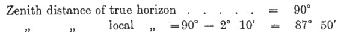

  
[Intangible Textual Heritage](../../../index.md)  [Legends and
Sagas](../../index)  [England](../index)  [Index](index.md) 
[Previous](sac34)  [Next](sac36.md) 

------------------------------------------------------------------------

*Stonehenge and Other British Stone Monuments Astronomically
Considered*, by Norman Lockyer, \[1906\], at Intangible Textual Heritage

------------------------------------------------------------------------

p. 329

### II: HINTS ON MAKING, AND METHOD OF REDUCING, THE FIELD OBSERVATIONS.

IT will probably be found useful if I give here a few hints as to the
precautions which must be taken in making the field observations and an
example of their reduction to an astronomical. basis.

For the *azimuths* of the sight-lines the investigator of
these-monuments cannot do better than use the 25-inch, or 6-inch, maps
published by the Ordnance Survey. Their accuracy is of a very high order
and is not likely to be exceeded, even if approached, by any casual
observer having to make his own special arrangements for correct time
before he can begin his surveying work.

In some eases, however, it may be found that the Survey has not included
every outstanding stone which may be found by an investigator on making
a careful search many of the stones are covered by gorse, &c., and are
not, therefore, easily found.

In such cases the azimuth of some object that is marked on the map
should be taken as a reference line and the difference of azimuth
between that and the unmarked objects determined. By this means the
azimuths of all the sight-lines may be obtained. When using the 25-inch
maps for determining azimuths it must be borne in mind that the
side=lines are not, necessarily, due north and south. The
Director-General of the Ordnance Survey, Southampton, will probably on
application state the Correction to be applied to the azimuths on this
account, and this should be-applied, of course, to each of the values
obtained.

If for any reason it is found necessary or desirable to make
observations of the azimuths independently of the Ordnance Survey, full
instructions as to the method of procedure may be found in an
inexpensive instruction book [1](#fn_132.md)
issued by the Board of Education: The instructions given on p. 49, § 3,
are most

p. 330

generally applicable, and the form on [p. 76](sac11.htm#page_76.md) will be
found very handy for recording and reducing the observations.

In making observations of the angular elevation of the horizon a good
theodolite is essential. Both verniers should be read, the mean taken,
and then the telescope should be reversed in its Ys, reset, and both
readings taken again. One setting and reading are of little use.

The Ordnance Survey maps may also be employed in a preliminary
reconnaissance to obtain approximate values of the horizon elevations.
This may be done by measuring the distances and contour-lines shown on
the one-inch maps. This method, however, is only very roughly
approximate owing to the fact that sharp but very local elevations close
to the monuments may not appear on these maps and yet be of sufficient
magnitude to cause large errors in the results.

Where trees, houses, &c., top the horizon, they should, of course; be
neglected and the elevation of the ground level, at that spot, taken.
Should the top of the azimuth mark (stone, &c.) show above the actual
horizon, its elevation should be recorded and not that of the horizon.

Having measured the angular elevation of the horizon along the
sight-line, it is necessary to convert this into actual zenith distance
and to apply the refraction correction before the computations of
declination can be made.

The process of doing this and of calculating the declination will be
gathered from the examples given below:—

*Data*.

Monument:—E. circle Tregeseal, lat. 50° 8″ N. *i.e.* colat = 39° 52´.

Alignment. Centre of circle to Longstone.

Az. (from 25″ Ordnance Map). N. 66° 38´ E.

Elevation of horizon (measured) 2° 10.´

Reference to the May-Sun-curve, given on [p. 263](sac27.htm#page_263.md),
indicates that this is probably an alignment to the sunrise on May
morning. Therefore, in determining the zenith distance, the correction
for the sun's semi-diameter (16´) must be taken into account, allowing
that 2´ of the sun's disc was above the horizon when the observation was
made.

p. 331

*Zenith Distance:*—

 

Bessel's tables show that refraction, at altitude 2° 10´, raises sun
17´. If 2´ of sun's limb is above horizon, sun's centre is 14´ below.

∴ True zenith distance of sun's centre=87° 50´ + 17´ + 14´ =88° 21´.

*Declination:*—

Having obtained the zenith distance, and the azimuth, the latitude being
known, the N.P.D. (North Polar Distance) of the sun may be found by the
following equations:—

|       |                         |
|-------|-------------------------|
| \(1\) | tan θ = tan *z*. cos A, |

where θ is the subsidiary angle which must be determined for the purpose
of computation, *z* is the true zenith distance, and A is the distance
from the *North* point.

|       |                                                                                         |
|-------|-----------------------------------------------------------------------------------------|
| \(2\) |    [1](#fn_133.md), |

where Δ is the N.P.D. of the celestial object, and *c* is the colatitude
(90° - lat.) of the place of observation.

In the example taken this gives us—

 

Reference to the Nautical Almanac shows that this is the sun's
declination on May 5 and August 9. We may therefore conclude that the
Long-stone was erected to mark the May sunrise, as seen from the
Tregeseal Circle.

Had we been dealing with a star, instead of the sun, the only
modification necessary in the process  of calculating the declination
would have been . to omit the semi-diameter correction of 14´.

Having obtained a declination, we must refer to the curves given on pp.
[115](sac14.htm#page_115.md)-6 in order to see if, there is any star which,
fits it, and to find the date.

p. 332

Take, for example, the case of the apex of Cam Kenidjack, as seen from
the Tregeseal circle—

Az. = N. 12° 8´ E.; hill=4° 0.´ lat.=50° 8´.

This gives us a declination of 42° 33´ N., and a reference to the
stellar-declination curves (p. [115](sac14.htm#page_115)-6.md) shows that
Arcturus had that declination in 2330 B.C. From the table given on [p.
117](sac14.htm#page_117.md), we see that at that epoch Arcturus acted as
warning-star for the August sun.

In cases where the elevation of the horizon is 30´, or in preliminary
examinations, where it may be assumed as 30´, the refraction exactly
counterbalances the hill, and therefore the true zenith distance at the
moment of star-rise is 90°. Hence the N.P.D. of the star may be found
from the following simple equation

|       |                     |
|-------|---------------------|
| \(3\) | cos Δ = cos A cos λ |

where Δ and A have the same significance as before and λ is the
*latitude* of the place of observation.

------------------------------------------------------------------------

### Footnotes

[329:1](sac35.htm#fr_132.md) *Demonstrations and
Practical Work in Astronomical Physics at the Royal: College of Science,
South Kensington*. Wyman and Sons, 1*s*.

[331:1](sac35.htm#fr_133) cos (c - θ.md) = cos -
(c - θ).

------------------------------------------------------------------------

[Next: Index](sac36.md)
