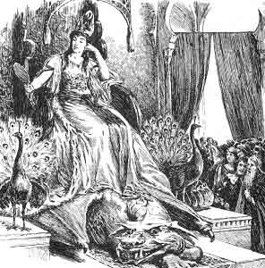

  
[Intangible Textual Heritage](../../../index)  [Sagas &
Legends](../../index)  [England](../index) 

------------------------------------------------------------------------

<table width="75%">
<colgroup>
<col style="width: 50%" />
<col style="width: 50%" />
</colgroup>
<tbody>
<tr class="odd">
<td width="50%" data-valign="CENTER"></td>
<td width="50%" data-valign="CENTER"><h1 id="stories-from-the-faerie-queene" data-align="CENTER">Stories from the Faerie Queene</h1>
<h2 id="by-mary-macleod" data-align="CENTER">by Mary Macleod</h2>
<h4 id="section" data-align="CENTER">[1916]</h4></td>
</tr>
</tbody>
</table>

------------------------------------------------------------------------

[Contents](#contents)    [Start Reading](sfq00)

------------------------------------------------------------------------

Spenser's [The Faerie Queene](../fq/index) is one of the masterpieces of
English poetry, and certainly part of the literary pedigree that
culminated in [Tolkien](../../../ring/index). However, the original text
is very difficult to follow for modern readers because of the archaic
language and spelling. To the rescue comes Mary Macleod. Her late
Victorian retelling in straightforward modern English allows one to plow
through Spenser's intricate and allegorical plot. If you are planning to
read the Faerie Queene, or want to understand the narrative but don't
have the time or patience to tangle with an epic poem in early modern
English, you've come to the right place.

------------------------------------------------------------------------

 [Title Page](sfq00)  
[Introduction](sfq01)  
[Contents](sfq02)  
[Illustrations](sfq03)  

### The Red Cross Knight

[The Court of the Queen](sfq04)  
[The Wood of Error](sfq05)  
[The Knight deceived by the Magician](sfq06)  
[The Knight forsakes Una](sfq07)  
[Holiness fights Faithless, and makes Friends with False
Religion](sfq08)  
[Una and the Lion](sfq09)  
[In the Hands of the Enemy](sfq10)  
[The House of Pride](sfq11)  
[The Battle for the Shield](sfq12)  
[Una and the Woodland Knight](sfq13)  
[The False Pilgrim](sfq14)  
[Giant Pride](sfq15)  
[Prince Arthur](sfq16)  
[The Wondrous Bugle and the Mighty Shield](sfq17)  
[The Knight with the Hempen Rope](sfq18)  
[In the Cave of Despair](sfq19)  
[How the Red Cross Knight came to the House of Holiness](sfq20)  
[The City of the Great King](sfq21)  
[The Last Fight](sfq22)  
[''Ease after War''](sfq23)  

### ''The Good Sir Guyon''

[Sir Guyon meets the Magician](sfq24)  
[Friend or Foe?](sfq25)  
[The Story of the Knight and the Lady](sfq26)  
[The Three Sisters](sfq27)  
[Braggadochio](sfq28)  
[Fury's Captive](sfq29)  
[The Anger of Fire](sfq30)  
[The Idle Lake](sfq31)  
[The Realm of Pluto](sfq32)  
[The Cave of Mammon](sfq33)  
[The Champion of Chivalry](sfq34)  
[The House of Temperance](sfq35)  
[The Rock of Reproach and the Wandering Islands](sfq36)  
[Sea-Monsters and Land-Monsters](sfq37)  
[The Bower of Bliss](sfq38)  

### The Legend of Britomart

[How Sir Guyon met a Champion mightier than himself](sfq39)  
[How Britomart fought with Six Knights](sfq40)  
[How it fared with Britomart in Castle Joyous](sfq41)  
[How Britomart looked into the Magic Mirror](sfq42)  
[How Britomart went to the Cave of the Magician Merlin](sfq43)  
[How Britomart set forth on her Quest](sfq44)  
[How Britomart came to the Castle of the Churl Malbecco](sfq45)  
[How Britomart walked through Fire](sfq46)  
[What Britomart saw in the Enchanted Chamber](sfq47)  
[How Britomart rescued a Fair Lady from a Wicked Enchanter](sfq48)  
[What Strange Meetings befell on the Way](sfq49)  
[How Sir Satyrane proclaimed a Great Tournament](sfq50)  
[What befell on the First and Second Days of the Tournament](sfq51)  
[How Britomart did Battle for the Golden Girdle](sfq52)  
[How the Golden Girdle was awarded to the False Florimell](sfq53)  
[How Sir Scudamour came to the House of Care](sfq54)  
[How the ''Savage Knight'' met the ''Knight with the Ebony
Spear''](sfq55)  
[How Britomart ended her Quest](sfq56)  

### The Squire of Low Degree

[The Giant with Flaming Eyes](sfq57)  
[''For his Friend's Sake''](sfq58)  
[The Giant's Daughter](sfq59)  

### The Adventures of Sir Artegall

[The Sword of Justice and the Iron Man](sfq60)  
[The Adventure of the Saracen's Bridge](sfq61)  
[The Giant with the Scales](sfq62)  
[Borrowed Plumes, and the Fate of the Snowy Lady](sfq63)  
[How the Good Horse Brigadore knew his own Master](sfq64)  
[The Adventure of the Two Brothers and the Coffer](sfq65)  
[Radigund, Queen of the Amazons](sfq66)  
[How Sir Artegall threw away his Sword](sfq67)  
[The House of Guile](sfq68)  
[The Battle of Queen Radigund and Britomart](sfq69)  
[The Adventure of the Damsel, the Two Knights, and the Sultan's
Horses](sfq70)  
[The Adventure at the Den of Deceit](sfq71)  
[The Adventure of the Tyrant Grantorto](sfq72)  

### Sir Calidore, Knight of Courtesy

[The Quest of the Blatant Beast](sfq73)  
[The Proud Discourteous Knight](sfq74)  
[Coridon and Pastorella](sfq75)  
[In the Brigands' Den](sfq76)  
[The Beast with a Thousand Tongues](sfq77)  
