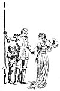
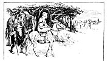

  
[Intangible Textual Heritage](../../../index.md)  [Sagas &
Legends](../../index)  [England](../index)  [Index](index.md) 
[Previous](sfq03)  [Next](sfq05.md) 

------------------------------------------------------------------------

p. 1

# The Red Cross Knight

"*Right faithful true he was in deed and word*"

### The Court of the Queen

<table data-align="LEFT">
<colgroup>
<col style="width: 100%" />
</colgroup>
<tbody>
<tr class="odd">
<td data-valign="CENTER"><a href="img/00100.jpg"> 
Click to enlarge</a></td>
</tr>
</tbody>
</table>

ONCE upon a time, in the days when there were still such things as
giants and dragons, there lived a great Queen. She reigned over a rich
and beautiful country, and because she was good and noble every one
loved her, and tried also to be good. Her court was the most splendid
one in the world, for all her knights were brave and gallant, and each
one thought only of what heroic things he could do, and how best he
could serve his royal lady.

The name of the Queen was Gloriana, and each of her twelve chief knights
was known as the Champion of some virtue. Thus Sir Guyon was the
representative of *Temperance*, Sir Artegall of *Justice*, Sir Calidore
of *Courtesy*, and others took up the cause of *Friendship*,
*Constancy*, and so on.

Every year the Queen held a great feast, which

p. 2

lasted twelve days. Once, on the first day of the feast, a stranger in
poor clothes came to the court, and, falling before the Queen, begged a
favour of her. It was always the custom at these feasts that the Queen
should refuse nothing that was asked, so she bade the stranger say what
it was he wished. Then he besought that, if any cause arose which called
for knightly aid, the adventure might be entrusted to him.

When the Queen had given her promise he stood quietly on one side, and
did not try to mix with the other guests who were feasting at the
splendid tables. Although he was so brave, he was very gentle and
modest, and he had never yet proved his valour in fight, therefore he
did not think himself worthy of a place among the knights who had
already won for themselves honour and renown.

Soon after this there rode into the city a fair lady on a white ass.
Behind her came her servant, a dwarf, leading a warlike horse that bore
the armour of a knight. The face of the lady was lovely, but it was very
sorrowful.

Making her way to the palace, she fell before Queen Gloriana, and
implored her help. She said that her name was Una; she was the daughter
of a king and queen who formerly ruled over a mighty country; but, many
years ago, a huge dragon came and wasted all the land, and shut the king
and queen up in a brazen castle, from which they might never come out.
The Lady Una therefore besought Queen Gloriana to grant her one of her
knights to fight and kill this terrible dragon.

p. 3

[  
Click to enlarge](img/00300.jpg.md)

Then the stranger sprang forward, and reminded the Queen of the promise
she had given. At first she was unwilling to consent, for the Knight was
young, and, moreover, he had no armour of his own to fight with.

Then said the Lady Una to him, "Will you wear the armour that I bring
you, for unless you do you will never succeed in the enterprise, nor
kill the horrible monster of Evil? The armour is not new, it is
scratched and dinted with many a hard-fought battle, but if you wear it
rightly no armour that ever was made will serve you so well."

Then the stranger bade them bring the armour and put it on him, and Una
said, "Stand, therefore, having your loins girt about with truth, and
having on the breastplate of righteousness, and your feet shod with the
preparation of the gospel of peace; above all taking the shield of
faith, wherewith ye shall be able to quench all the fiery darts of the
wicked, and take

p. 4

the helmet of salvation and the sword of the SPIRIT, which is the word
of GOD."

And when the stranger had put off his own rough clothes and was clad in
this armour, straightway he seemed the goodliest man in all that
company, and the Lady Una was well pleased with her champion; and,
because of the red cross which he wore on his breastplate and on his
silver shield, henceforth he was known always as "the Red Cross Knight."
But his real name was *Holiness*, and the name of the lady for whom he
was to do battle was *Truth*.

So these two rode forth into the world together, while a little way
behind followed their faithful attendant, *Prudence*. And now you shall
hear some of the adventures that befell the Red Cross Knight and his two
companions.

------------------------------------------------------------------------

[Next: The Wood of Error](sfq05.md)
