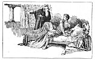
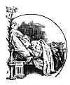

  
[Intangible Textual Heritage](../../../index)  [Sagas &
Legends](../../index)  [England](../index)  [Index](index) 
[Previous](sfq06)  [Next](sfq08) 

------------------------------------------------------------------------

### The Knight forsakes Una

The next morning at daybreak the Knight awoke, sad and unrested after
the unpleasant dreams that had come to him in the night. He did not know
he had been asleep; he thought the things that troubled him had really
happened.

It was scarcely dawn when Archimago rushed up to him in a state of
pretended sorrow and indignation.

"The Lady Una has left you," said this wicked mail. "She is not good as
she pretends to be. She cares nothing at all for you, nor for the noble
work on which you are bound, and she does not mean to go any farther
with you on your toilsome journey."

The Red Cross Knight started up in anger. This

p. 13

was like his dream, and he knew not what was true nor what was false.

"Come," said Archimago, "see for yourself."

He pointed to a figure in the distance whom the Knight took to be Una.
Then, indeed, he was forced to believe what the wicked magician told
him. He now took for granted that Una had been deceiving him all along,
and had seized this moment to escape.

[  
Click to enlarge](img/01300.jpg)

\[paragraph continues\] He forgot all her real sweetness and goodness
and beauty; he only thought how false and unkind she was. He was filled
with anger, and he never paused a moment to reflect if there could be
any possibility of mistake. Calling his servant, he bade him bring his
horse at once, and then these two immediately set forth again on their
journey.

Here the Red Cross Knight was wrong, and we

p. 14

shall see presently into what perils and misfortunes he fell because of
his hasty want of faith. If he had had a little patience he would soon
have discovered that 

<table data-align="LEFT">
<colgroup>
<col style="width: 100%" />
</colgroup>
<tbody>
<tr class="odd">
<td data-valign="CENTER"><a href="img/01400.jpg"> 
Click to enlarge</a></td>
</tr>
</tbody>
</table>

the figure he saw was only a dressed-up imitation. The real Lady Una all
this time was sleeping quietly in her own bower.

When she awoke and found that her two companions had fled in the night
and left her alone behind, she was filled with grief and dismay. She
could not understand why they should do such a thing. Mounting her white
ass, she rode after them with all the speed she could, but the Knight
had urged on his steed so fast it was almost useless to try to follow.
Yet she never stayed to rest her weary limbs, but went on seeking them
over hill and dale, and through wood and plain, sorely grieved in her
tender heart that the one she loved best should leave her with such
ungentle discourtesy.

When the wicked Archimago saw that his cunning schemes had succeeded so
well he was greatly pleased, and set to work to devise fresh mischief.
It was Una whom he chiefly hated, and he took great pleasure in her many
troubles, for hypocrisy always hates real goodness. He had the power of
turning himself into any shape he chose--sometimes he would be a fowl,
sometimes a fish, now like a fox, now like a dragon. On the present
occasion, to suit his evil purpose, it

p. 15

seemed best to him to put on the appearance of the good knight whom he
had so cruelly beguiled.

Therefore, Hypocrisy dressed himself up in imitation armour with a
silver shield and everything exactly like the Red Cross Knight. When he
sat upon his fiery charger he looked such a splendid warrior you would
have thought it was St. George himself.

------------------------------------------------------------------------

[Next: Holiness fights Faithless, and makes Friends with False
Religion](sfq08)
