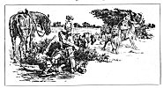
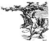

  
[Intangible Textual Heritage](../../../index.md)  [Sagas &
Legends](../../index)  [England](../index)  [Index](index.md) 
[Previous](sfq09)  [Next](sfq11.md) 

------------------------------------------------------------------------

### In the Hands of the Enemy

Una and the Magician (who was disguised as the Red Cross Knight) had not
gone far when they saw some one riding swiftly towards them. The
new-comer was on a fleet horse, and was fully armed; his look was stern,
cruel, and revengeful. On his shield in bold

p. 24

letters was traced the name "Sans Loy," which means *Lawless*. He was
one of the brothers of "Sans Foy," or Faithless, whom the real Red Cross
Knight had slain, and he had made up his mind to avenge his brother's
death.

When he saw the red cross graven on the shield which Hypocrisy carried,
he thought that he had found the foe of whom he was in search, and,
levelling his spear, he prepared for battle. Hypocrisy, who was a mean
coward, and had never fought in his life, was nearly fainting with fear;
but the Lady Una spoke such cheering words that he began to feel more
hopeful. Lawless, however, rushed at him with such fury that he drove
his lance right through the other's shield,

[  
Click to enlarge](img/02400.jpg.md)

and bore him to the ground. Leaping from his horse, he ran towards him,
meaning to kill him, and exclaiming, "Lo, this is the worthy reward of
him that slew Faithless!"

Una begged the cruel knight to have pity on his fallen foe, but her
words were of no avail. Tearing off

p. 25

his helmet, Lawless would 

<table data-align="RIGHT">
<colgroup>
<col style="width: 100%" />
</colgroup>
<tbody>
<tr class="odd">
<td data-valign="CENTER"><a href="img/02500.jpg"> 
Click to enlarge</a></td>
</tr>
</tbody>
</table>

have slain him at once, but he stopped in astonishment when, instead of
the Red Cross Knight, he saw the face of Archimago. He knew well that
crafty Hypocrisy was skilled in all forms of deceit, but that he took
care to shun fighting and brave deeds. Now, indeed, had Hypocrisy's
guile met with a just punishment.

"Why, luckless Archimago, what is this?" cried Lawless. "What evil
chance brought you here? Is it your fault, or my mistake, that I have
wounded my friend instead of my foe?"

But the old Magician answered nothing; he lay still as if he were dying.
So Lawless spent no more time over him, but went over to where Una
waited, lost in amazement and sorely perplexed.

Her companion, whom she had imagined was her own true Knight, turned out
to be nothing but an impostor, and she herself had fallen into the hands
of a cruel enemy.

p. 26

When the brave lion saw Lawless go up to Una and try to drag her roughly
from her palfrey, full of kingly rage he rushed to protect her. He flew
at Lawless and almost tore his shield to pieces with his sharp claws.
But, alas! he could not overcome the warrior, for Lawless was one of the
strongest men that ever wielded spear, and was well skilled in feats of
arms. With his sharp sword he struck the lion, and the noble creature
fell dead at his feet.

Poor Una, what was to become of her now? Her faithful guardian was gone,
and she found herself the captive of a cruel foe. Lawless paid no heed
to her tears and entreaties. Placing her on his own horse, he rode off
with her; while her snow-white ass, not willing to forsake her, followed
meekly at a distance.

------------------------------------------------------------------------

[Next: The House of Pride](sfq11.md)
