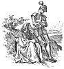

  
[Intangible Textual Heritage](../../../index.md)  [Sagas &
Legends](../../index)  [England](../index)  [Index](index.md) 
[Previous](sfq23)  [Next](sfq25.md) 

------------------------------------------------------------------------

p. 92

[  
Click to enlarge](img/09200.jpg.md)

# "The Good Sir Guyon"

### Sir Guyon meets the Magician

ARCHIMAGO, the wicked magician, who had worked such mischief to Una and
the Red Cross Knight, was very angry when he found that in the end all
his evil wiles were defeated, and that the Knight and the lady were
happily betrothed. He would willingly have brought more trouble on them,
but he was powerless to do any harm to Una, for she was now safely
restored to her own kingdom, and

p. 93

 

<table>
<colgroup>
<col style="width: 100%" />
</colgroup>
<tbody>
<tr class="odd">
<td><a href="img/09300.jpg"> 
Click to enlarge</a> 

''Upon the way him fortuned to meete, 
Faire marching underneath a shadie hill, 
A goodly knight, all armed in harness meete.'' 
</td>
</tr>
</tbody>
</table>

 

p. 95

living in the care of her father and mother. He therefore directed all
his spite against the Knight, who had once more to set forth on his
adventures, as he had promised Queen Gloriana to serve her faithfully
for six years. At the end of that time he hoped to return and marry Una,
and the King, her father, had made him heir to the throne.

Archimago, whose other name you may remember was *Hypocrisy*, set all
his wits to work to see what harm he could do the Knight, for he knew
that, after all the troubles he had fallen into, he would be more than
usually careful. He kept laying snares for him, and placed spies
wherever he went, but the Knight had now become so wise and wary that he
always found out and shunned the danger. Archimago, however, still kept
on hoping he should find some way to hurt him, and at last his
opportunity came.

It happened, one day, that the enchanter saw marching to meet him a
noble knight. The stranger was clad in shining armour and rode a
splendid war-horse; his bearing was very stately, and his face, although
calm and beautiful, was so stern and noble that all his friends loved
him and his foes feared him. He was one of the chief knights of Queen
Gloriana's court, a man of great honour and power in his native land.
His name was Sir Guyon.

As the Red Cross Knight was known as the Champion of *Holiness*, so Sir
Guyon was known as the Knight of *Temperance*.

With him now there was an aged palmer or pilgrim, clad in black; his
hair was grey and he leant on a staff. To judge by his look he was a
wise and grave old

p. 96

man, and he seemed to be acting as guide to the Knight, who carefully
checked his prancing horse to keep pace with his slow footsteps.

The name of the black palmer was *Conscience*, and he went with Sir
Guyon as his companion and adviser, somewhat in the same fashion as
*Prudence* had gone as servant with the Red Cross Knight.

When Archimago saw Sir Guyon, he immediately stopped him, just as on a
former occasion he had stopped the Red Cross Knight.

This time he had a fresh story to tell, which, of course, was perfectly
false. He implored Sir Guyon to come to the help of a beautiful maiden,
cruelly ill-treated by a rough knight, who had cut off her golden locks,
and threatened to kill her with his sharp sword.

"What!" cried Sir Guyon, his gentle nature roused to indignation, "is
the man still alive who could do such a deed?"

"He is alive, and boasts of it," said wicked Hypocrisy. "Nor has any
other knight yet punished him for it."

"Take me to him at once," said Sir Guyon.

"That I can easily do," said Archimago. "I will show you where he is,"
and he hurried off in high glee, because he thought that at last he had
found a way of revenging himself on the Red Cross Knight.

------------------------------------------------------------------------

[Next: Friend or Foe?](sfq25.md)
