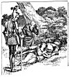

  
[Intangible Textual Heritage](../../../index)  [Sagas &
Legends](../../index)  [England](../index)  [Index](index) 
[Previous](sfq25)  [Next](sfq27) 

------------------------------------------------------------------------

### The Story of the Knight and the Lady

After leaving the Red Cross Knight, Guyon and the Black Palmer (or
*Conscience*) travelled for some distance, fighting and winning many
battles as they went, which brought much honour to the Knight.

But the chief adventure in Sir Guyon's life began in this way:

One day, passing through a forest, they heard sounds of bitter weeping
and lamentation.

p. 100

"If I cannot be revenged for all my misery," cried a voice, "at least
nothing can prevent my dying, Come then, come soon, come, sweetest
death! But, thou, my babe, who hast seen thy father's fall, long mayest
thou live, and thrive better than thy unhappy parents. Live to bear
witness that thy mother died for no fault of her own."

When Sir Guyon heard these piteous words, he dismounted, and rushed into
the thicket, where he found a beautiful lady dying on the ground. In her
arms there was a lovely baby, and the dead body of an armed knight lay
close beside them.

Horrified at the sight, Sir Guyon did all he could to restore the lady
to life, but she begged him to leave her alone to die in peace; her
sorrows, she said, were more than she could bear, and therefore she had
tried to kill herself.

"Dear lady," said Sir Guyon, "all that I wish is to comfort you, and to
bring you some relief, therefore tell me the cause of your misfortune."

"Listen, then," she answered. "This dead man, the gentlest, bravest
knight that ever lived, was my husband, the good Sir Mordant. One day he
rode forth, as is the custom of knights, to seek adventures, and it
chanced most unhappily he came to the place where the wicked Acrasia
lives-Acrasia, the false enchantress, who has brought ruin on so many
knights. Her dwelling is within a wandering island, in Perilous Gulf.
Fair sir, if ever you travel there, shun the hateful place! I will tell
you the name--it is called the *Bower of Bliss*. Acrasia's one aim in
life is

p. 102

\[paragraph continues\] *Pleasure*. In the Bower of Bliss nothing is
thought of but eating and drinking, and every kind of luxury and
extravagance. All those who come within it forget everything good and
noble, and care for nothing but to amuse themselves. When my dear knight
never returned to me, I set forth in search of him, and here I found
him, a captive to the spells of Acrasia. At first he did not even know
me; but by-and-by, with great care, I brought him back to a better state
of mind, and persuaded him to leave the Bower of Bliss. But the wicked
enchantress, angry at losing one of her victims, gave him a parting cup
of poison, and stooping to drink at this well, he suddenly fell dead.
When I saw this--" Here the lady's own words failed, and, lying down as
if to sleep, quiet death put an end to all her sorrow.

Sir Guyon felt such grief at what had happened that he could scarcely
keep from weeping. Turning to the Palmer, he said: "Behold here this
image of human life, when raging passion like a fierce tyrant robs
reason of its proper sway. The strong it weakens, and the weak it fills
with fury; the strong (like this Knight) fall soonest through excess of
pleasure; the weak (like this Lady) through excess of grief. But
Temperance with a golden rule can measure out a medium between the two,
neither to be overcome by pleasure, nor to give way to despair. Thrice
happy man who can tread evenly between them! But, since this wretched
lady did wrong through grief, and not from wickedness, it is not for us
to judge her. Let us give her an honourable burial. Death comes to all,

p. 103

<table data-align="LEFT">
<colgroup>
<col style="width: 100%" />
</colgroup>
<tbody>
<tr class="odd">
<td data-valign="CENTER"><a href="img/10300.jpg"> 
Click to enlarge</a></td>
</tr>
</tbody>
</table>

the good and the bad alike, and, after death, each must answer for his
own deeds. But both alike should have a fitting burial."

So Sir Guyon and the Black Palmer dug a grave under the cypress-trees,
and here they tenderly placed the dead bodies of the Knight and the
Lady, and bade them sleep in everlasting peace. And before they left the
spot, Sir Guyon swore a solemn vow that he would avenge the hapless
little orphan child for the death of his parents.

------------------------------------------------------------------------

[Next: The Three Sisters](sfq27)
