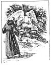

  
[Intangible Textual Heritage](../../../index.md)  [Sagas &
Legends](../../index)  [England](../index)  [Index](index.md) 
[Previous](sfq33)  [Next](sfq35.md) 

------------------------------------------------------------------------

p. 139

### The Champion of Chivalry

During the time that Guyon stayed in the house of Mammon, the Palmer,
whom the maid of the Idle Lake had refused to take in her boat, had
found a passage in some other way. On his journey he came near the place
where Guyon lay in a trance, and suddenly he heard a voice calling loud
and clear, "Come hither, hither! Oh, come quickly!"

He hurried in the direction of the cry, which led him to the shady dell
where Mammon had formerly counted his wealth. Here he found Guyon
senseless on the ground, but watched over by a beautiful angel.

At first he was dismayed, but the angel bade him not be frightened, for
that life and renewed vigour would soon come back to the Knight. He now
handed him over to the charge of the Palmer, and bade him watch with
care, for fresh evil was at hand.

Thus saving, the angel vanished, and the Palmer, turning to look at
Guyon, was rejoiced to find a feeble glimmer of life in him, which he
cherished tenderly.

At last there came that way two Pagan knights in shining armour, led by
an old man, and with a light-footed page far in front, scattering
mischief and enmity wherever he went. These were the two bad brothers,
Pyrocles and Cymocles, the sons of Anger, guided by the false Archimago,
while their servant, Atin (or *Strife*) stirred them up to quarrelling
and vengeance.

When they came to the place where the Palmer sat watching over the
sleeping body of the Knight, they

p. 140

knew the latter at once, for they had both lately fought with him. They
reviled the Palmer, and began

[  
Click to enlarge](img/14000.jpg.md)

heaping abuse on Sir Guyon, whom they thought dead, and declared that
they would strip him of his armour,

p. 141

which was much too good for such a worthless creature. The Palmer
implored them not to do such a shameful and dishonourable deed, but his
entreaties were in vain; one brother laid his hand on the shield, the
other on the helmet, both fiercely eager to possess themselves of the
spoil.

At this moment they saw coming towards them an armed knight of bold and
lofty grace, whose squire bore after him an ebony spear and a covered
shield. Well did the magician know him by his arms and bearing when he
saw his prancing Libyan steed, and he cried to the brothers, "Rise
quickly, and prepare yourselves for battle, for yonder comes the
mightiest knight alive--Prince Arthur, the flower of grace and
chivalry."

The brothers were so impressed that they started up and greedily
prepared for battle. Pyrocles, who had lost his own weapons in the fight
with Fury, snatched a sword from Archimago, although the latter warned
him it was a magic sword, and would do no harm to Prince Arthur, for
whom it had been made long ago, and who was its rightful owner. Pyrocles
only laughed at the magician's warning, and having bound Guyon's shield
to his wrist, he was ready for the fray.

By that time the stranger Knight had come near, and greeted them
courteously. They returned no answer, but looked very disdainful, and
then, turning to the Palmer, Prince Arthur noticed that at his feet lay
an armed man, in whose dead face he read great nobility.

"Reverend sir," he said, "what great misfortune has befallen this
Knight? Did he die a natural death, or did he fall by treason or by
fight?"

p. 142

"Not by one or the other," said the Palmer; "but his senses are drowned
in sleep, and these cruel foes have taken advantage of it to revenge
their spite and rob him of his armour; but you, fair sir, whose
honourable look promises hope of help, may I beseech you to take pity on
his sad plight, and by your power protect him?"

"Palmer," he said, "there is no knight so rude, I trust, as to do
outrage to a sleeping spirit. Maybe, better reason will soften their
rash revenge. Well, chosen words have a secret power in appeasing anger.
If not, leave to me your Knight's last defence."

Then, turning to the brothers, he first tried what persuasion would do.
He took for granted that their wrath was provoked by wrongs they had
suffered, and did not challenge the right or justice of their actions;
but, on behalf of the sleeping man, he entreated pardon for anything he
might have done amiss.

To this gentle speech the brothers made rude and insulting answers, and
Pyrocles, not waiting to set the Prince on guard, lifted high the magic
sword, thinking to kill him. The faithful steel refused to harm its
master, and swerved from the mark, but the blow was so furious it made
man and horse reel. Prince Arthur was such a splendid rider that he did
not fall from the saddle; but, full of anger, he cried fiercely--

"False traitor! you have broken the law of arms by striking a foe
unchallenged, but you shall soon right bitterly taste the fruit of your
treason, and feel the law which you have disgraced."

p. 143

With that he levelled his spear at Pyrocles, and the two were soon
engaged in a fiery battle. Cymocles rushed to his brother's aid, and
they both fell on the Prince with terrific fury, so that he had hard
work to defend himself. So mighty was his power that neither of his foes
could stand against it; but whenever he smote at Pyrocles, the latter
threw in front of him Guyon's shield, on which was portrayed the face of
the Faerie Queene, and when he saw this, the Prince's hand relented, and
he stayed the stroke, because of the love and loyalty he bore the
picture. This often saved the Pagan knight from deadly harm, but at last
Prince Arthur overcame and killed both him and his brother, while false
Archimago and Strife fled fast away.

By this time Sir Guyon had awakened from his trance, and was much
grieved when he found that his shield and sword had disappeared; but
when he saw beside him his faithful companion, whom he had lost some
days before, he was very glad. The Palmer was delighted to see him rise
looking so well, and told him not to trouble about the loss of his
weapons, for they would soon be restored to him. Then he told Guyon all
that had happened, and how the strange Knight had fought for him with
the two wicked brothers.

When he heard this, Sir Guyon was deeply touched, and felt all his heart
fill with affection. Bowing to Prince Arthur with due reverence, as to
the defender of his life, he said, "My lord, my liege, by whose most
gracious aid I live this day and see my foes subdued, what reward would
be sufficient to repay you for your great goodness, unless to be ever
bound--"

p. 144

But the Prince interrupted. "Fair sir, what need is there to reckon a
good turn as a debt to be paid? Are not' all knights bound by oath to
withstand the power of the oppressor? It is sufficient that I have done
my duty properly."

So they both found that a good deed is made gracious by kindness and
courtesy.

------------------------------------------------------------------------

[Next: The House of Temperance](sfq35.md)
