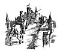

  
[Intangible Textual Heritage](../../../index.md)  [Sagas &
Legends](../../index)  [England](../index)  [Index](index.md) 
[Previous](sfq59)  [Next](sfq61.md) 

------------------------------------------------------------------------

p. 280

[  
Click to enlarge](img/28000.jpg.md)

# The Adventures of Sir Artegall

"*The champion of true Justice, Artegall*."

"*Wise, warlike, personable, courteous, and kind*."

### The Sword of Justice and the Iron Man

ONE of the noblest heroes at the Court of the Faerie Queene was
Artegall, the champion of *Justice*. After his marriage with Britomart,
it may be remembered, he started on a hard adventure, which led him into
much peril. This was to succour a distressed lady whom a strong tyrant
unjustly kept captive, withholding from her the heritage which she
claimed. The lady was called Irene (*Peace*), and the Tyrant, Grantorto
(*Great Wrong*).

p. 281

When Irene came to the Faerie Queene to beg redress, Queen Gloriana,
whose delight it was to aid all poor suppliants, chose Artegall to
restore right to her, because he seemed the best skilled in righteous
learning.

Even from his cradle Artegall had been brought up to justice; for one
day when he was a little child playing with his companions, he had been
found by a great and wonderful lady called Astræa, who, while she dwelt
here among earthly men, instructed them in the rules of justice. Seeing
that the boy was noble and fit for her purpose, she persuaded him to go
with her. She took him far away to a lonely cave, in which she brought
him up, and taught him all the discipline of justice. She taught him, to
weigh equally both right and wrong, and where severity was needed to
measure it out according to the line of conscience. For want of mankind
she caused him to practise this teaching on wild beasts which she found
in the woods wrongfully oppressing others of their own kind. Thus she
trained him, and thus she taught him to judge skilfully wrong and right
till he reached the years of manhood, so that even wild beasts feared
him, and men admired his over-ruling might. Nor was there any living
person who dared withstand his behest, much less match him in fight. To
make him more dreaded, Astræa gave Artegall a wonderful sword, called
"Chrysaor," which excelled all other swords. It was made of most perfect
metal, tempered with adamant, all garnished with gold upon the blade,
whereby it took its name. It was no less powerful than famous, for there
was no substance so firm and hard but it could pierce or cleave, nor any
armour that

p. 282

could guard off the stroke, for wherever it lighted, it cut completely
through.

In course of time Astræa left this world, and went to live among the
stars, from which she had first come. But she left behind her on earth
her servant, an Iron Man, who always attended on her to execute her
Judgments, and she bade him go with Artegall and do whatever he was
told. The man's name was Talus; he was made of iron mould, immovable,
irresistible, unchanging; he held in his hand an iron flail, with which
he threshed out falsehood and unfolded the truth.

Talus, therefore, went with Sir Artegall on this new quest, to aid him,
if he chanced to need aid, against the cruel tyrant who oppressed the
Lady Irene and kept the crown from her. Nothing is more honourable to a
knight, nor better becomes brave chivalry, than to defend the feeble in
their right, and redress the wrongs of those who go astray. So the
heroes of old won their greatest glory, and herein this noble Knight
excelled, who now went forth to dare great perils for the sake of
justice.

As Artegall and Talus went on their way they chanced to meet the servant
of Florimell, who told the good news that his lady was safe and well,
and engaged to be married to her own true knight, Marinell. Sir Artegall
was very glad to hear this, and asked when the wedding was to take
place, for if he had time he would like to be present to do honour to
the occasion.

"The wedding will be within three days," said the man, "at the Castle of
the Strand; at which time, if nothing hinders me, I shall be there to do
her service,

p. 283

 

<table>
<colgroup>
<col style="width: 100%" />
</colgroup>
<tbody>
<tr class="odd">
<td><a href="img/28300.jpg"> 
Click to enlarge</a> 

. . .''For want there of mankind, 
She caused him to make experience 
Upon wyld beasts, which she in woods did find 
With wrongfull powre oppressing others of their kind.'' 
</td>
</tr>
</tbody>
</table>

 

p. 285

as I am bound. But in my way, a little beyond here, dwells a cruel
Saracen who keeps with strong hand the passage of a bridge. He has
killed there many a knight-errant, wherefore all men, out of fear, shun
the passage."

"What sort of person, and how far away, is he who does such harm to
travellers?" asked Artegall.

"He is a man of great defence, expert in battle and in deeds of arms,"
was the answer; "and he is made much bolder by the wicked spells with
which his daughter supports him. He has got large estates and goodly
farms by oppression and extortion, with which he still holds them. His
crimes increase daily, for he never lets any one pass that way over his
Bridge, be he rich or poor, without paying him toll-money. His name is
called Pollenté, because he is so strong and powerful; he: conquers
every one,--some by his strength, and some also he circumvents by
cunning. For it is his custom to fight on the bridge, which is very
narrow, but exceedingly long, and in this bridge are fixed many
trap-falls, through which, not noticing, the rider falls down.
Underneath the bridge flows a swift and dangerously deep river, into
which falls headlong, destitute of help, any one whom the Saracen
overthrows. But the tyrant himself, because of his long practice, leaps
forth into the flood, and there assails his foe, confused by his sudden
fall, so that horse and main are both equally dismayed, and either
drowned or treacherously slain. Then Pollenté robs them at will, and
brings the spoil to his daughter, who dwells hard by. She takes
everything that comes, and

p. 286

fills her wicked coffers, which she has heaped so high by wrong-doing
that she is richer than many a prince, and has purchased all the country
lying near with her ill-gotten revenue. Her name is Munera.

"She is very beautiful and richly attired; her hands are made of gold,
and her feet of silver. Many great lords have wished to marry her, but
she is so proud that she despises them all."

"Now by my life, and with Heaven to guide me," said Sir Artegall, "no
other way will I take this day but by that bridge where the Saracen
abides; therefore lead me thither."

------------------------------------------------------------------------

[Next: The Adventure of the Saracen's Bridge](sfq61.md)
