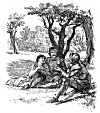

  
[Intangible Textual Heritage](../../../index.md)  [Sagas &
Legends](../../index)  [England](../index)  [Index](index.md) 
[Previous](sfq73)  [Next](sfq75.md) 

------------------------------------------------------------------------

### The Proud Discourteous Knight

As Sir Calidore rode on his way he saw not far off a strange sight--a
tall young man fighting on foot against an armed Knight on horseback;
and beside them he saw a fair lady standing alone on foot, in sad
disarray. Before he could get near to ask what was the matter, the armed
Knight had been killed by the youth.

Filled with amazement, Sir Calidore steadfastly marked the latter, and
found him to be a goodly and graceful youth, still only a slender slip,
not more than seventeen years old, but tall and fair of face, so that
the Knight surely deemed him of noble birth. He was clad in a woodman's
jacket of Lincoln green, trimmed with silver lace; on his head he wore a
hood with spreading points, and his hunter's horn hung at his side. His
buskins were of the costliest leather, adorned with golden points, and
regularly intersected with

p. 370

stripes, as was then the fashion for those of gentle family. In his
right hand he held a quivering dart, and in his left a sharp boar-spear.

Calidore, having well viewed him, at length spoke, and asked him how it
came that he, though not yet a Knight, had dared to slay a Knight, which
was plainly forbidden by chivalry.

"Truly," said the youth, "I was loath to break the law of chivalry, but
I would break it again rather than let myself be struck by any man. He
assailed me first, regardless of what belongs to chivalry."

"By my troth," then said Sir Calidore, "great blame is it for an armed
Knight to wrong an unarmed man. But tell me why this strife arose
between you?"

Then the youth, whose name was Tristram, told him that, as he was
hunting that day in the forest, he chanced to meet this man, together
with the lady. The Knight, as Sir Calidore had seen, was on horseback,
but the lady walked on foot beside the horse, through thick and thin,
unfit for any woman. Yet not content with this, to add to the disgrace,
whenever she lagged behind, as she must needs do, he would thump her
forward with his spear, and force her to go on, while she vainly wept,
and made piteous lament.

"When I saw this, as they passed by," continued Tristram, "I was moved
to indignation, and began to blame him for such cruelty. At this he was
enraged, and disdainfully reviled me, threatening to chastise me as one
would a child. I, no less disdainful, returned his scornful taunts,.
whereupon he struck me with his spear, and I, seeking to avenge myself,
threw a slender

p. 371

dart at him, which struck him, as it seems, underneath the heart, so
that he quickly died."

Sir Calidore inquired of the lady if this were indeed true, and as she
could deny nothing, but cleared Tristram of all blame, then said the
Knight--

"Neither will I charge him with guilt. For what he spoke, he spoke it
for you, Lady; and what he did, he did it to save himself, against both
of whom that Knight wrought unknightly shame."

Then turning back to the gallant boy, who had acquitted himself so well
and stoutly, and seeing his beautiful face, and hearing his wise words,
Sir Calidore was filled with admiration, and felt certain that he came
of heroic blood. Then, because of the affection he bore him, he begged
the youth to reveal who he was, "for since the day when I first bore
arms," added the Knight, "I never saw greater promise in any one."

Then Tristram replied that he was the son of a King, although by fate or
fortune he had lost his country and the crown that should be his by
right. He was the only heir of the good King Meliogras of Cornwall, but
his father dying while he was still a child, his uncle had seized the
kingdom. The widowed Queen, his mother, afraid lest ill should happen to
the boy, sent him away out of the country of Lyonesse, where he was
born, into the land of Queen Gloriana, and here he had dwelt since the
time he was ten years old.

His days had not been spent in idleness, for he had been well trained
with many noble companions in gentle manners and other fitting ways. His
chief

p. 372

delight was in following the chase, and nothing that ranged in the green
forest was unknown to him. But now that he was growing older he felt it
was time to employ his strength in a nobler fashion, and he besought Sir
Calidore to make him a Squire, so that henceforth he might bear arms,
and learn to use them aright.

So Sir Calidore caused him to kneel, and made him swear faith to his
Knight, and truth to all ladies, and never to be recreant for fear of
peril, nor for anything that might befall. So he dubbed him, and called
him his Squire.

Then young Tristram grew full glad and joyous, and when the time came
for Sir Calidore to depart, he prayed that he might go with him on his
adventure, vowing always to serve him faithfully. Sir Calidore rejoiced
at his noble heart, and hoped he would surely prove a doughty Knight,
yet for the time he was obliged to make this answer to him:--

"Glad would I surely be, my courteous Squire, to have you with me in my
present quest, but I am bound by a vow which I swore to my Sovereign,
that in fulfilling her behest I would allow no creature to aid me. For
that reason I may not grant what you so earnestly beg. But since this
lady is now quite desolate, and needs a safeguard on her way, you would
do well to succour her from fear of danger."

Tristram gladly accepted this new service, so, taking a courteous leave,
the two parted.

Not long after this, Sir Calidore came upon a Knight and a lady sitting
in the shade of some trees.

p. 373

\[paragraph continues\] Sir Calidore greeted them courteously, and the
Knight invited him to sit down beside them, so that they might talk over
all their adventures. While they

[  
Click to enlarge](img/37300.jpg.md)

were chatting together, the Lady Serena wandered away into the fields to
pluck some flowers. Then suddenly, from the forest near, the Blatant
Beast rushed forth, and catching up the lady, bore her away in his great

p. 374

mouth. Starting up, both Knights at once gave chase, and Calidore, who
was swiftest of foot, overtook the monster in the midst of his race, and
fiercely charging him, made him leave his prey and take to flight.

Knowing that the Knight was close at hand, Sir Calidore did not pause to
succour the lady, but quickly followed the brute in his flight. Full
many paths and perils he passed; over hill and dale, through forest and
plain; so sharply did he pursue the monster that he never suffered him
to rest, day or night. From the court he chased him to the city, from
the city to the village, from the village into the country, and from the
country back to remote farms.. Thence the Blatant Beast fled into the
open fields, where the herds were keeping the cattle, and the shepherds
were singing to their flocks.

------------------------------------------------------------------------

[Next: Coridon and Pastorella](sfq75.md)
