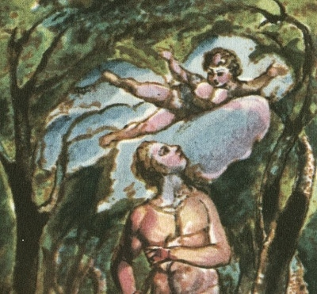

  
[Intangible Textual Heritage](../../../index.md)  [Legends and
Sagas](../../index)  [England](../index.md) 

------------------------------------------------------------------------

[Buy this Book at
Amazon.com](https://www.amazon.com/exec/obidos/ASIN/1854377299/internetsacredte.md)

------------------------------------------------------------------------

<table width="75%">
<colgroup>
<col style="width: 50%" />
<col style="width: 50%" />
</colgroup>
<tbody>
<tr class="odd">
<td width="50%" data-valign="TOP"></td>
<td width="50%" data-valign="CENTER"><h1 id="songs-of-innocence-and-of-experience" data-align="CENTER">Songs of Innocence and of Experience</h1>
<h2 id="by-william-blake" data-align="CENTER">by William Blake</h2>
<h4 id="section" data-align="CENTER">[1789-1794]</h4></td>
</tr>
</tbody>
</table>

------------------------------------------------------------------------

[Contents](#contents)    [Start Reading](sie00.md)    [Page
Index](pageidx)    [Text \[Zipped\]](sie.txt.gz.md)

------------------------------------------------------------------------

|                                                                                                                           |
|---------------------------------------------------------------------------------------------------------------------------|
|  |

This is a fascimile reproduction, along with transcribed text, of
William Blake's masterpiece of bookmaking, Songs of Innocence and of
Experience. These poems are one of the treasures of world literature,
simple enough to resonate with children, but with enough exoteric and
esoteric meaning to keep a gnostic sage pondering for several lifetimes.
Blake's vision of a universe alive on all scales of being is luminously
represented in the hand-colored illustrations, which contain clues to
the overtones of the text. The poems are also firmly rooted in the
misery of 18th century London, and many of them are embued with a
politically radical (but still bardic) outlook on the squalid everyday
life which surrounded Blake. This is a text which needs to be
experienced with both sides of the brain. --John
Bruno Hare, March 11, 2009.

------------------------------------------------------------------------

 

### Songs of Innocence

[Title Page](sie00.md)  
[Frontispiece](sie01.md)  
[Title Page](sie02.md)  
[Introduction](sie03.md)  
[The Shepherd](sie04.md)  
[The Ecchoing Green](sie05.md)  
[The Lamb](sie06.md)  
[The Little Black Boy](sie07.md)  
[The Blossom](sie08.md)  
[The Chimney Sweeper](sie09.md)  
[The Little Boy lost](sie10.md)  
[The Little Boy found](sie11.md)  
[Laughing Song](sie12.md)  
[A Cradle Song](sie13.md)  
[The Divine Image](sie14.md)  
[Holy Thursday](sie15.md)  
[Night](sie16.md)  
[Spring](sie17.md)  
[Nurse's Song](sie18.md)  
[Infant Joy](sie19.md)  
[A Dream](sie20.md)  
[On Anothers Sorrow](sie21.md)  

### Songs of Experience

[Frontispiece](sie22.md)  
[Title Page](sie23.md)  
[Introduction](sie24.md)  
[Earth's Answer](sie25.md)  
[The Clod & The Pebble](sie26.md)  
[Holy Thursday](sie27.md)  
[The Little Girl Lost; The Little Girl Found](sie28.md)  
[The Chimney Sweeper](sie29.md)  
[Nurses Song](sie30.md)  
[The Sick Rose](sie31.md)  
[The Fly](sie32.md)  
[The Angel](sie33.md)  
[The Tyger](sie34.md)  
[My Pretty Rose Tree; Ah! Sun-flower; The Lilly](sie35.md)  
[The Garden of Love](sie36.md)  
[The Little Vagabond](sie37.md)  
[London](sie38.md)  
[The Human Abstract](sie39.md)  
[Infant Sorrow](sie40.md)  
[A Poison Tree](sie41.md)  
[A Little Boy Lost](sie42.md)  
[A Little Girl Lost](sie43.md)  
[To Tirzah](sie44.md)  
[The School-Boy](sie45.md)  
[The Voice of the Ancient Bard](sie46.md)  
[A Divine Image](sie47.md)  
