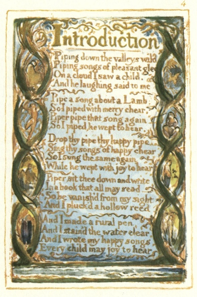

  
[Intangible Textual Heritage](../../../index.md)  [Legends and
Sagas](../../index)  [England](../index)  [Index](index.md) 
[Previous](sie02)  [Next](sie04.md) 

------------------------------------------------------------------------

[Buy this Book at
Amazon.com](https://www.amazon.com/exec/obidos/ASIN/1854377299/internetsacredte.md)

------------------------------------------------------------------------

  
*Songs of Innocence and of Experience*, by William Blake, \[1789-1794\],
at Intangible Textual Heritage

------------------------------------------------------------------------

p. 4

 

### Introduction

Piping down the valleys wild  
Piping songs of pleasant glee  
On a cloud I saw a child.  
And he laughing said to me.

Pipe a song about a Lamb:  
So I piped with merry chear,  
Piper pipe that song again—  
So I piped, he wept to hear.

Drop thy pipe thy happy pipe  
Sing thy songs of happy chear,  
So I sung the same again  
While he wept with joy to hear.

Piper sit thee down and write  
In a book that all may read—  
So he vanish’d from my sight,  
And I pluck’d a hollow reed.

And I made a rural pen,  
And I stain’d the water clear,  
And I wrote my happy songs,  
Every child may joy to hear

------------------------------------------------------------------------

[Next: The Shepherd](sie04.md)
