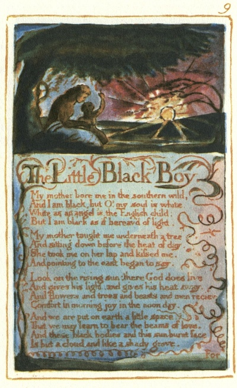
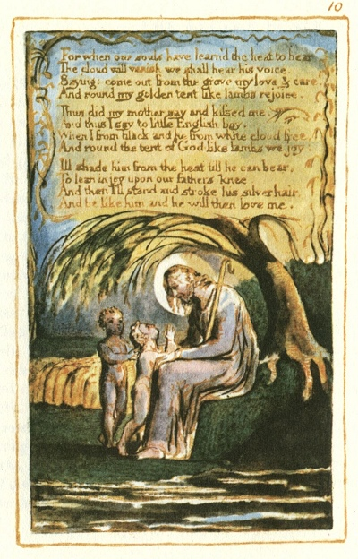

  
[Intangible Textual Heritage](../../../index.md)  [Legends and
Sagas](../../index)  [England](../index)  [Index](index.md) 
[Previous](sie06)  [Next](sie08.md) 

------------------------------------------------------------------------

[Buy this Book at
Amazon.com](https://www.amazon.com/exec/obidos/ASIN/1854377299/internetsacredte.md)

------------------------------------------------------------------------

  
*Songs of Innocence and of Experience*, by William Blake, \[1789-1794\],
at Intangible Textual Heritage

------------------------------------------------------------------------

p. 9

 

### The Little Black Boy.

My mother bore me in the southern wild,  
And I am black, but O! my soul is white,  
White as an angel is the English child:  
But I am black as if bereav’d of light.

My mother taught me underneath a tree  
And sitting down before the heat of day,  
She took me on her lap and kissed me,  
And pointing to the east began to say.

Look on the rising sun: there God does live  
And gives his light, and gives his heat away.  
And flowers and trees and beasts and men recieve  
Comfort in morning joy in the noon day.

And we are put on earth a little space,  
That we may learn to bear the beams of love.  
And these black bodies and this sun-burnt face  
Is but a cloud, and like a shady grove.

*For*

p. 10

 

For when our souls have learn’d the heat to bear  
The cloud will vanish we shall hear his voice,  
Saying: come out from the grove my love & care,  
And round my golden tent like lambs rejoice.

Thus did my mother say and kissed me.  
And thus I say to little English boy.  
When I from black and he from white cloud free,  
And round the tent of God like lambs we joy:

Ill shade him from the heat till he can bear,  
To lean in joy upon our fathers knee.  
And then I'll stand and stroke his silver hair,  
And be like him and he will then love me.

------------------------------------------------------------------------

[Next: The Blossom](sie08.md)
