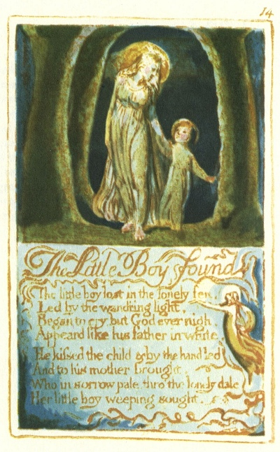

  
[Intangible Textual Heritage](../../../index)  [Legends and
Sagas](../../index)  [England](../index)  [Index](index) 
[Previous](sie10)  [Next](sie12) 

------------------------------------------------------------------------

[Buy this Book at
Amazon.com](https://www.amazon.com/exec/obidos/ASIN/1854377299/internetsacredte)

------------------------------------------------------------------------

  
*Songs of Innocence and of Experience*, by William Blake, \[1789-1794\],
at Intangible Textual Heritage

------------------------------------------------------------------------

p. 14

 

### The Little Boy found

The little boy lost in the lonely fen,  
Led by the wand’ring light,  
Began to cry, but God ever nigh,  
Appeard like his father in white.

He kissed the child & by the hand led  
And to his mother brought,  
Who in sorrow pale, thro’ the lonely dale  
Her little boy weeping sought.

------------------------------------------------------------------------

[Next: Laughing Song](sie12)
