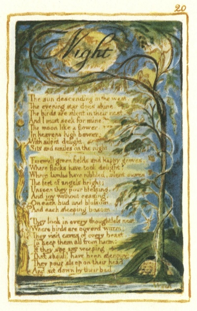
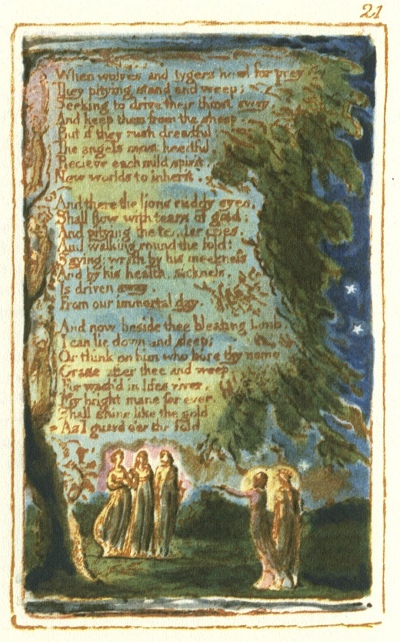

  
[Intangible Textual Heritage](../../../index.md)  [Legends and
Sagas](../../index)  [England](../index)  [Index](index.md) 
[Previous](sie15)  [Next](sie17.md) 

------------------------------------------------------------------------

[Buy this Book at
Amazon.com](https://www.amazon.com/exec/obidos/ASIN/1854377299/internetsacredte.md)

------------------------------------------------------------------------

  
*Songs of Innocence and of Experience*, by William Blake, \[1789-1794\],
at Intangible Textual Heritage

------------------------------------------------------------------------

p. 20

 

### Night

The sun descending in the west,  
The evening star does shine,  
The birds are silent in their nest,  
And I must seek for mine,  
The moon like a flower,  
In heavens high bower;  
With silent delight,  
Sits and smiles on the night.

Farewell green fields and happy groves,  
Where flocks have took delight;  
Where lambs have nibbled, silent moves  
The feet of angels bright;  
Unseen they pour blessing,  
And joy without ceasing,  
On each bud and blossom,  
And each sleeping bosom.

They look in every thoughtless nest,  
Where birds are coverd warm;  
They visit caves of every beast,  
To keep them all from harm:  
If they see any weeping,  
That should have been sleeping  
They pour sleep on their head  
And sit down by their bed.

*When*

p. 21

 

When wolves and tygers howl for prey  
They pitying stand and weep;  
Seeking to drive their thirst away,  
And keep them from the sheep,  
But if they rush dreadful;  
The angels most heedful,  
Recieve each mild spirit,  
New worlds to inherit.

And there the lions ruddy eyes,  
Shall flow with tears of gold:  
And pitying the tender cries,  
And walking round the fold:  
Saying: wrath by his meekness  
And by his health, sickness,  
Is driven away,  
From our immortal day.

And now beside thee bleating lamb,  
I can lie down and sleep;  
Or think on him who bore thy name,  
Grase after thee and weep.  
For wash’d in lifes river,  
My bright mane for ever,  
Shall shine like the gold,

------------------------------------------------------------------------

[Next: Spring](sie17.md)
