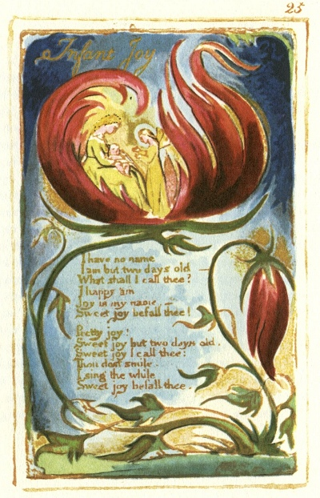

  
[Intangible Textual Heritage](../../../index.md)  [Legends and
Sagas](../../index)  [England](../index)  [Index](index.md) 
[Previous](sie18)  [Next](sie20.md) 

------------------------------------------------------------------------

[Buy this Book at
Amazon.com](https://www.amazon.com/exec/obidos/ASIN/1854377299/internetsacredte.md)

------------------------------------------------------------------------

  
*Songs of Innocence and of Experience*, by William Blake, \[1789-1794\],
at Intangible Textual Heritage

------------------------------------------------------------------------

p. 25

 

### Infant Joy

I have no name  
I am but two days old.—  
What shall I call thee?  
I happy am  
Joy is my name,  
Sweet joy befall thee!

Pretty joy!  
Sweet joy but two days old.  
Sweet joy I call thee:  
Thou dost smile.  
I sing the while  
Sweet joy befall thee.

------------------------------------------------------------------------

[Next: A Dream](sie20.md)
