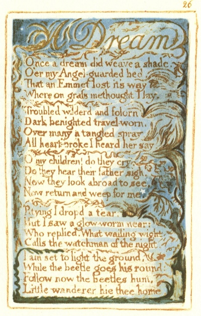

  
[Intangible Textual Heritage](../../../index.md)  [Legends and
Sagas](../../index)  [England](../index)  [Index](index.md) 
[Previous](sie19)  [Next](sie21.md) 

------------------------------------------------------------------------

[Buy this Book at
Amazon.com](https://www.amazon.com/exec/obidos/ASIN/1854377299/internetsacredte.md)

------------------------------------------------------------------------

  
*Songs of Innocence and of Experience*, by William Blake, \[1789-1794\],
at Intangible Textual Heritage

------------------------------------------------------------------------

p. 26

 

### A Dream

Once a dream did weave a shade,  
O’er my Angel-guarded bed,  
That an Emmet lost it's way  
Where on grass methought I lay.

Troubled wilderd and folorn  
Dark benighted travel-worn,  
Over many a tangled spray,  
All heart-broke I heard her say.

O my children! do they cry,  
Do they hear their father sigh.  
Now they look abroad to see,  
Now return and weep for me.

Pitying I drop’d a tear:  
But I saw a glow-worm near:  
Who replied, What wailing wight  
Calls the watchman of the night.

I am set to light the ground,  
While the beetle goes his round:  
Follow now the beetles hum,  
Little wanderer hie thee home.

------------------------------------------------------------------------

[Next: On Anothers Sorrow](sie21.md)
