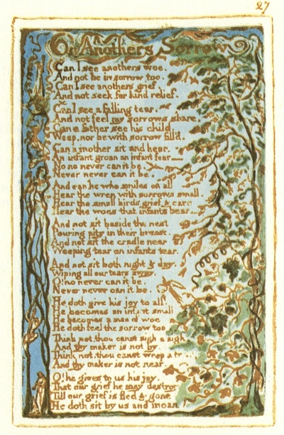

  
[Intangible Textual Heritage](../../../index)  [Legends and
Sagas](../../index)  [England](../index)  [Index](index) 
[Previous](sie20)  [Next](sie22) 

------------------------------------------------------------------------

[Buy this Book at
Amazon.com](https://www.amazon.com/exec/obidos/ASIN/1854377299/internetsacredte)

------------------------------------------------------------------------

  
*Songs of Innocence and of Experience*, by William Blake, \[1789-1794\],
at Intangible Textual Heritage

------------------------------------------------------------------------

p. 27

 

### On Anothers Sorrow

Can I see anothers woe,  
And not be in sorrow too.  
Can I see anothers grief,  
And not seek for kind relief.

Can I see a falling tear,  
And not feel my sorrows share,  
Can a father see his child,  
Weep, nor be with sorrow fill’d.

Can a mother sit and hear,  
An infant groan an infant fear—  
No no never can it be.  
Never never can it be.

And can he who smiles on all  
Hear the wren with sorrows small,  
Hear the small birds grief & care  
Hear the woes that infants bear—

And not sit beside the nest  
Pouring pity in their breast.  
And not sit the cradle near  
Weeping tear on infants tear.

And not sit both night & day,  
Wiping all our tears away.  
O! no never can it be.  
Never never can it be.

He doth give his joy to all.  
He becomes an infant small.  
He becomes a man of woe  
He doth feel the sorrow too.

Think not, thou canst sigh a sigh,  
And thy maker is not by.  
Think not, thou canst weep a tear,  
And thy maker is not near.

O! he gives to us his joy,  
That our grief he may destroy  
Till our grief is fled & gone  
He doth sit by us and moan

------------------------------------------------------------------------

[Next: Frontispiece](sie22)
