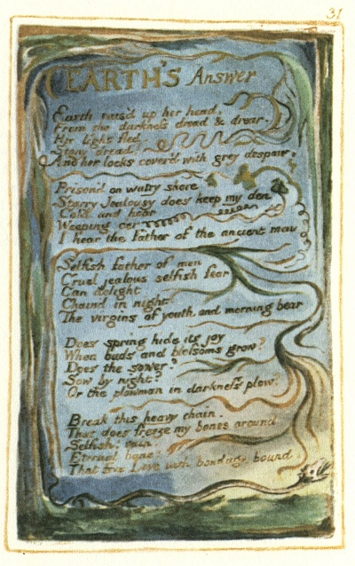

  
[Intangible Textual Heritage](../../../index.md)  [Legends and
Sagas](../../index)  [England](../index)  [Index](index.md) 
[Previous](sie24)  [Next](sie26.md) 

------------------------------------------------------------------------

[Buy this Book at
Amazon.com](https://www.amazon.com/exec/obidos/ASIN/1854377299/internetsacredte.md)

------------------------------------------------------------------------

  
*Songs of Innocence and of Experience*, by William Blake, \[1789-1794\],
at Intangible Textual Heritage

------------------------------------------------------------------------

p. 31

 

### EARTH'S Answer.

Earth rais’d up her head,  
From the darkness dread & drear,  
Her light fled:  
Stony dread!  
And her locks cover’d with grey despair.

Prison’d on watry shore  
Starry Jealousy does keep my den  
Cold and hoar  
Weeping o’er  
I hear the Father of the ancient men

Selfish father of men  
Cruel jealous selfish fear  
Can delight  
Chain’d in night  
The virgins of youth and morning bear.

Does spring hide its joy  
When buds and blossoms grow?  
Does the sower?  
Sow by night?  
Or the plowman in darkness plow?

Break this heavy chain,  
That does freeze my bones around  
Selfish! vain!  
Eternal bane!  
That free Love with bondage bound.

------------------------------------------------------------------------

[Next: The Clod & The Pebble](sie26.md)
