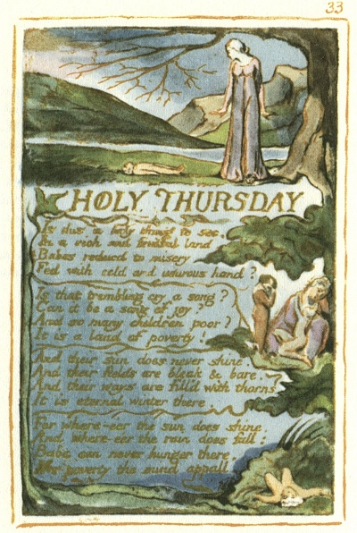

  
[Intangible Textual Heritage](../../../index.md)  [Legends and
Sagas](../../index)  [England](../index)  [Index](index.md) 
[Previous](sie26)  [Next](sie28.md) 

------------------------------------------------------------------------

[Buy this Book at
Amazon.com](https://www.amazon.com/exec/obidos/ASIN/1854377299/internetsacredte.md)

------------------------------------------------------------------------

  
*Songs of Innocence and of Experience*, by William Blake, \[1789-1794\],
at Intangible Textual Heritage

------------------------------------------------------------------------

p. 33

 

### HOLY THURSDAY

Is this a holy thing to see,  
In a rich and fruitful land,  
Babes reducd to misery,  
Fed with cold and usurous hand?

Is that trembling cry a song?  
Can it be a song of joy?  
And so many children poor?  
It is a land of poverty!

And their sun does never shine.  
And their fields are bleak & bare.  
And their ways are fill’d with thorns  
It is eternal winter there.

For where-e’er the sun does shine,  
And where-e’er the rain does fall:  
Babe can never hunger there,  
Nor poverty the mind appall.

------------------------------------------------------------------------

[Next: The Little Girl Lost; The Little Girl Found](sie28.md)
