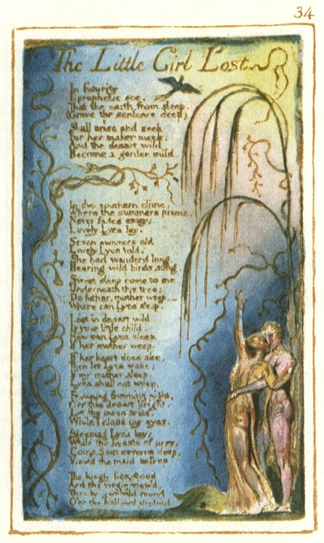
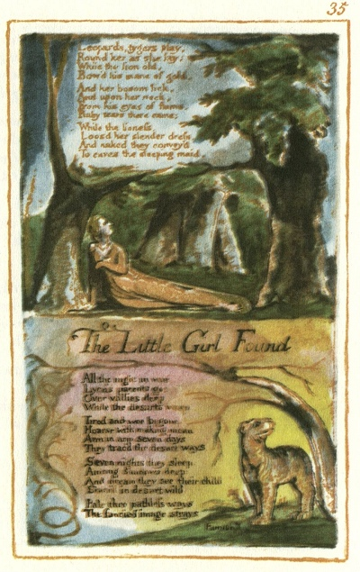
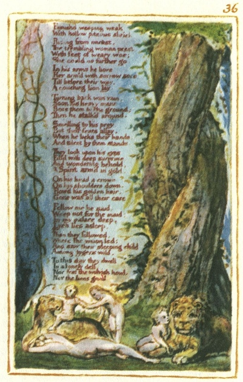

  
[Intangible Textual Heritage](../../../index)  [Legends and
Sagas](../../index)  [England](../index)  [Index](index) 
[Previous](sie27)  [Next](sie29) 

------------------------------------------------------------------------

[Buy this Book at
Amazon.com](https://www.amazon.com/exec/obidos/ASIN/1854377299/internetsacredte)

------------------------------------------------------------------------

  
*Songs of Innocence and of Experience*, by William Blake, \[1789-1794\],
at Intangible Textual Heritage

------------------------------------------------------------------------

p. 34

 

### The Little Girl Lost

In futurity  
I prophetic see,  
That the earth from sleep,  
(Grave the sentence deep)

Shall arise and seek  
For her maker meek:  
And the desart wild  
Become a garden mild.

In the southern clime,  
Where the summers prime,  
Never fades away;  
Lovely Lyca lay.

Seven summers old  
Lovely Lyca told,  
She had wanderd long,  
Hearing wild birds song.

Sweet sleep come to me  
Underneath this tree;  
Do father, mother weep,—  
"Where can Lyca sleep".

Lost in desart wild  
Is your little child.  
How can Lyca sleep,  
If her mother weep.

If her heart does ake,  
Then let Lyca wake;  
If my mother sleep,  
Lyca shall not weep.

Frowning frowning night,  
O’er this desart bright,  
Let thy moon arise,  
While I close my eyes.

Sleeping Lyca lay;  
While the beasts of prey,  
Come from caverns deep,  
View’d the maid asleep

The kingly lion stood  
And the virgin view’d,  
Then he gambold round  
O’er the hallowd ground:

*Leopards*

p. 35

 

Leopards, tygers play,  
Round her as she lay;  
While the lion old,  
Bow’d his mane of gold,

And her bosom lick,  
And upon her neck,

From his eyes of flame,  
Ruby tears there came;

While the lioness  
Loos’d her slender dress,  
And naked they convey’d  
To caves the sleeping maid.

### The Little Girl Found

All the night in woe,  
Lyca's parents go:  
Over vallies deep,  
While the desarts weep.

Tired and woe-begone,  
Hoarse with making moan:  
Arm in arm seven days,  
They trac’d the desart ways.

Seven nights they sleep,  
Among shadows deep:  
And dream they see their child  
Starv’d in desart wild.

Pale thro’ pathless ways  
The fancied image strays,

*Famish’d*

p. 36

 

Famish’d, weeping, weak  
With hollow piteous shriek

Rising from unrest,  
The trembling woman prest,  
With feet of weary woe;  
She could no further go.

In his arms he bore,  
Her arm’d with sorrow sore:  
Till before their way,  
A couching lion lay.

Turning back was vain,  
Soon his heavy mane,  
Bore them to the ground;  
Then he stalk’d around.

Smelling to his prey,  
But their fears allay,  
When he licks their hands:  
And silent by them stands.

They look upon his eyes  
Fill’d with deep surprise:  
And wondering behold,  
A spirit arm’d in gold.

On his head a crown  
On his shoulders down,  
Flow’d his golden hair.  
Gone was all their care.

Follow me he said,  
Weep not for the maid:  
In my palace deep,  
Lyca lies asleep.

Then they followed,  
Where the vision led:  
And saw their sleeping child,  
Among tygers wild.

To this day they dwell  
In a lonely dell  
Nor fear the wolvish howl,  
Nor the lions growl.

------------------------------------------------------------------------

[Next: The Chimney Sweeper](sie29)
