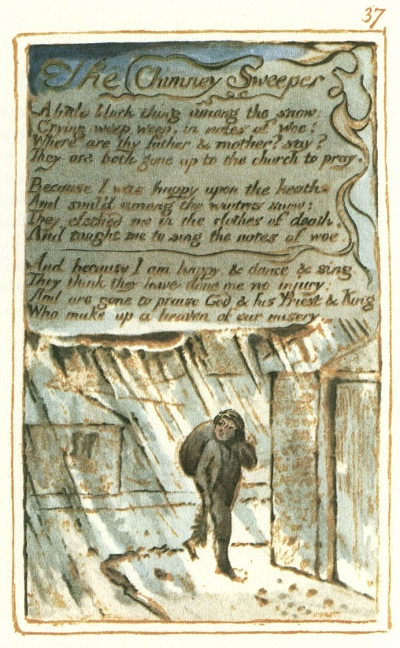

  
[Intangible Textual Heritage](../../../index)  [Legends and
Sagas](../../index)  [England](../index)  [Index](index) 
[Previous](sie28)  [Next](sie30) 

------------------------------------------------------------------------

[Buy this Book at
Amazon.com](https://www.amazon.com/exec/obidos/ASIN/1854377299/internetsacredte)

------------------------------------------------------------------------

  
*Songs of Innocence and of Experience*, by William Blake, \[1789-1794\],
at Intangible Textual Heritage

------------------------------------------------------------------------

p. 37

 

### The Chimney Sweeper

A little black thing among the snow:  
Crying weep, weep, in notes of woe!  
Where are thy father & mother? say?  
They are both gone up to the church to pray.

Because I was happy upon the heath,  
And smil’d among the winters snow:  
They clothed me in the clothes of death,  
And taught me to sing the notes of woe.

And because I am happy, & dance & sing,  
They think they have done me no injury:  
And are gone to praise God & his Priest & King  
Who make up a heaven of our misery.

------------------------------------------------------------------------

[Next: Nurses Song](sie30)
