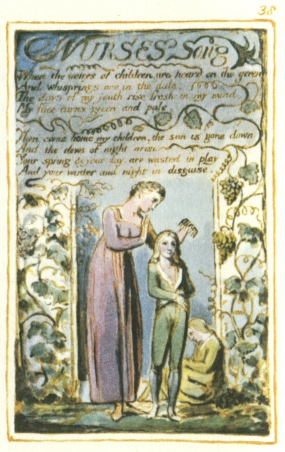

  
[Intangible Textual Heritage](../../../index.md)  [Legends and
Sagas](../../index)  [England](../index)  [Index](index.md) 
[Previous](sie29)  [Next](sie31.md) 

------------------------------------------------------------------------

[Buy this Book at
Amazon.com](https://www.amazon.com/exec/obidos/ASIN/1854377299/internetsacredte.md)

------------------------------------------------------------------------

  
*Songs of Innocence and of Experience*, by William Blake, \[1789-1794\],
at Intangible Textual Heritage

------------------------------------------------------------------------

p. 38

 

### NURSES Song

When the voices of children, are heard on the green  
And whisprings are in the dale:  
The days of my youth rise fresh in my mind,  
My face turns green and pale.

Then come home my children, the sun is gone down  
And the dews of night arise  
Your spring & your day, are wasted in play  
And your winter and night in disguise.

------------------------------------------------------------------------

[Next: The Sick Rose](sie31.md)
