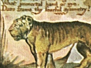
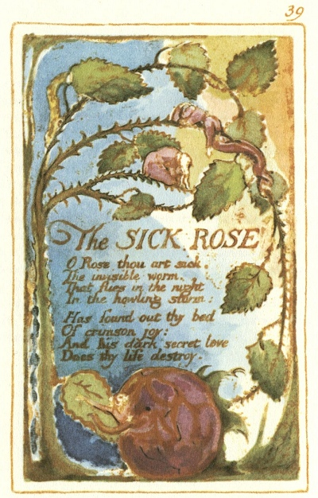

  
[Intangible Textual Heritage](../../../index.md)  [Legends and
Sagas](../../index)  [England](../index)  [Index](index.md) 
[Previous](sie30)  [Next](sie32.md) 

------------------------------------------------------------------------

[Buy this Book at
Amazon.com](https://www.amazon.com/exec/obidos/ASIN/1854377299/internetsacredte.md)

------------------------------------------------------------------------

  
*Songs of Innocence and of Experience*, by William Blake, \[1789-1794\],
at Intangible Textual Heritage

------------------------------------------------------------------------

p. 39

 

### The SICK ROSE

O Rose thou art sick.  
The invisible worm,  
That flies in the night  
In the howling storm:

Has found out thy bed  
Of crimson joy:  
And his dark secret love  
Does thy life destroy.

------------------------------------------------------------------------

[Next: The Fly](sie32.md)
