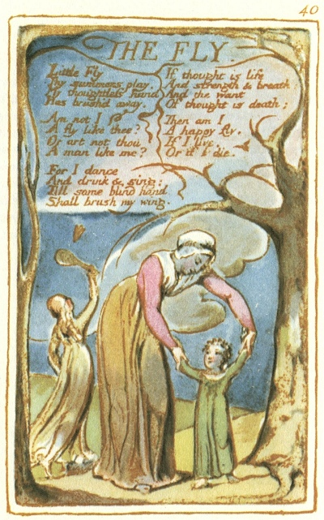

  
[Intangible Textual Heritage](../../../index.md)  [Legends and
Sagas](../../index)  [England](../index)  [Index](index.md) 
[Previous](sie31)  [Next](sie33.md) 

------------------------------------------------------------------------

[Buy this Book at
Amazon.com](https://www.amazon.com/exec/obidos/ASIN/1854377299/internetsacredte.md)

------------------------------------------------------------------------

  
*Songs of Innocence and of Experience*, by William Blake, \[1789-1794\],
at Intangible Textual Heritage

------------------------------------------------------------------------

p. 40

 

### THE FLY.

Little Fly  
Thy summers play,  
My thoughtless hand  
Has brush’d away.

Am not I  
A fly like thee?  
Or art not thou  
A man like me?

For I dance  
And drink & sing:  
Till some blind hand  
Shall brush my wing.

If thought is life  
And strength & breath  
And the want  
Of thought is death;

Then am I  
A happy fly,  
If I live,  
Or if I die.

------------------------------------------------------------------------

[Next: The Angel](sie33.md)
