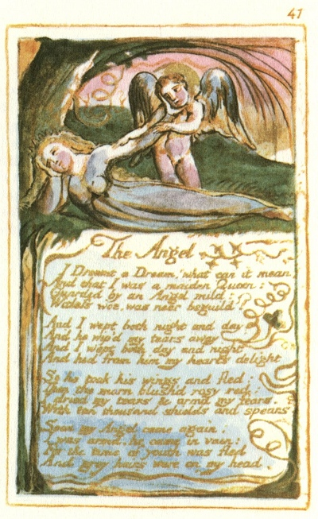

  
[Intangible Textual Heritage](../../../index.md)  [Legends and
Sagas](../../index)  [England](../index)  [Index](index.md) 
[Previous](sie32)  [Next](sie34.md) 

------------------------------------------------------------------------

[Buy this Book at
Amazon.com](https://www.amazon.com/exec/obidos/ASIN/1854377299/internetsacredte.md)

------------------------------------------------------------------------

  
*Songs of Innocence and of Experience*, by William Blake, \[1789-1794\],
at Intangible Textual Heritage

------------------------------------------------------------------------

p. 41

 

### The Angel

I Dreamt a Dream! what can it mean?  
And that I was a maiden Queen:  
Guarded by an Angel mild:  
Witless woe, was neer beguil’d!

And I wept both night and day  
And he wip’d my tears away  
And I wept both day and night  
And hid from him my hearts delight

So he took his wings and fled:  
Then the morn blush’d rosy red:  
I dried my tears & armd my fears,  
With ten thousand shields and spears.

Soon my Angel came again:  
I was arm’d, he came in vain:  
For the time of youth was fled  
And grey hairs were on my head

------------------------------------------------------------------------

[Next: The Tyger](sie34.md)
