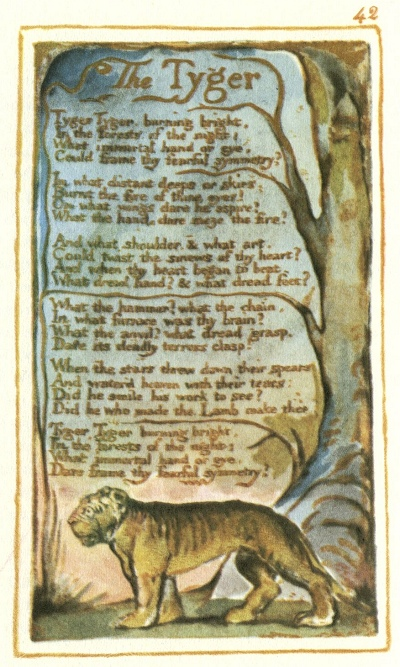

  
[Intangible Textual Heritage](../../../index.md)  [Legends and
Sagas](../../index)  [England](../index)  [Index](index.md) 
[Previous](sie33)  [Next](sie35.md) 

------------------------------------------------------------------------

[Buy this Book at
Amazon.com](https://www.amazon.com/exec/obidos/ASIN/1854377299/internetsacredte.md)

------------------------------------------------------------------------

  
*Songs of Innocence and of Experience*, by William Blake, \[1789-1794\],
at Intangible Textual Heritage

------------------------------------------------------------------------

p. 42

 

### The Tyger

Tyger Tyger, burning bright,  
In the forests of the night;  
What immortal hand or eye,  
Could frame thy fearful symmetry?

In what distant deeps or skies,  
Burnt the fire of thine eyes?  
On what wings dare he aspire?  
What the hand, dare sieze the fire?

And what shoulder, & what art,  
Could twist the sinews of thy heart?  
And when thy heart began to beat,  
What dread hand? & what dread feet?

What the hammer? what the chain,  
In what furnace was thy brain?  
What the anvil? what dread grasp,  
Dare its deadly terrors clasp?

When the stars threw down their spears  
And water’d heaven with their tears:  
Did he smile his work to see?  
Did he who made the Lamb make thee?

Tyger Tyger burning bright,  
In the forests of the night:  
What immortal hand or eye,  
Dare frame thy fearful symmetry?

------------------------------------------------------------------------

[Next: My Pretty Rose Tree; Ah! Sun-flower; The Lilly](sie35.md)
