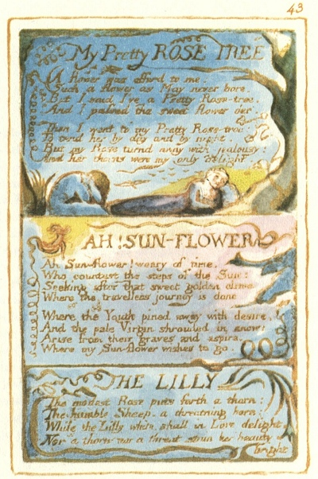

  
[Intangible Textual Heritage](../../../index.md)  [Legends and
Sagas](../../index)  [England](../index)  [Index](index.md) 
[Previous](sie34)  [Next](sie36.md) 

------------------------------------------------------------------------

[Buy this Book at
Amazon.com](https://www.amazon.com/exec/obidos/ASIN/1854377299/internetsacredte.md)

------------------------------------------------------------------------

  
*Songs of Innocence and of Experience*, by William Blake, \[1789-1794\],
at Intangible Textual Heritage

------------------------------------------------------------------------

p. 43

 

### My Pretty ROSE TREE

A flower was offerd to me:  
Such a flower as May never bore.  
But I said I've a Pretty Rose-tree,  
And I passed the sweet flower o’er.

Then I went to my Pretty Rose-tree:  
To tend her by day and by night.  
But my Rose turnd away with jealousy:  
And her thorns were my only delight.

### AH! SUN-FLOWER

Ah Sun-flower! weary of time,  
Who countest the steps of the Sun:  
Seeking after that sweet golden clime,  
Where the travellers journey is done.

Where the Youth pined away with desire,  
And the pale Virgin shrouded in snow:  
Arise from their graves and aspire,  
Where my Sun-flower wishes to go.

### THE LILLY

The modest Rose puts forth a thorn:  
The humble Sheep, a threatning horn:  
While the Lilly white, shall in Love delight,  
Nor a thorn nor a threat stain her beauty bright.

------------------------------------------------------------------------

[Next: The Garden of Love](sie36.md)
